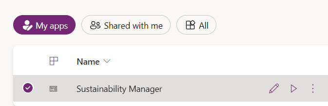
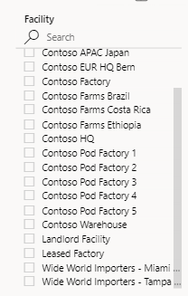
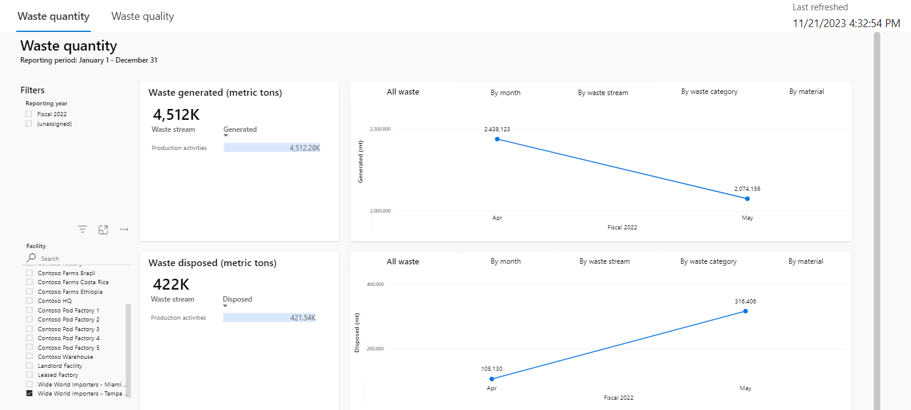

In this exercise, you assume the persona of Amber Rodriguez, sustainability specialist for Contoso Corp, and use the waste quantity dashboards to gain insights. 

##  Access the waste quantity dashboard
To access the waste quantity dashboard, follow these steps:

1.  Use an InPrivate or Incognito window and then go to [Microsoft Power Apps](https://make.powerapps.com/?azure-portal=true).

1.  Select the correct environment from the **Environment** dropdown menu in the upper-right corner. 

1.  Open the **Sustainability Manager** application under **Apps** by selecting the play button. 

	> [!div class="mx-imgBorder"]
	> 

	> [!IMPORTANT]
	> Make sure that you've completed the previous exercise to ensure that the dashboards and reports show meaningful data.   

1.  In the lower-left corner, change the area to **Analytics**.

1.  Select **Waste insights** on the left navigation pane.

1.  Review the dashboards on the following tabs:

	- Waste generated
	
	- Waste disposed
	
	- Waste recovered

1.  The corresponding charts for each tile have these five tabs:

	- All waste

	- By month

	- By waste stream

	- By waste category

	- By material

1. Select **Wide World Importers - Miami Office** or **Wide World Importers - Tampa Office**.

	> [!div class="mx-imgBorder"]
	> 

   The waste data is analyzed with respect to all tabs that are available for each waste quantity transaction.

	> [!div class="mx-imgBorder"]
	> 
