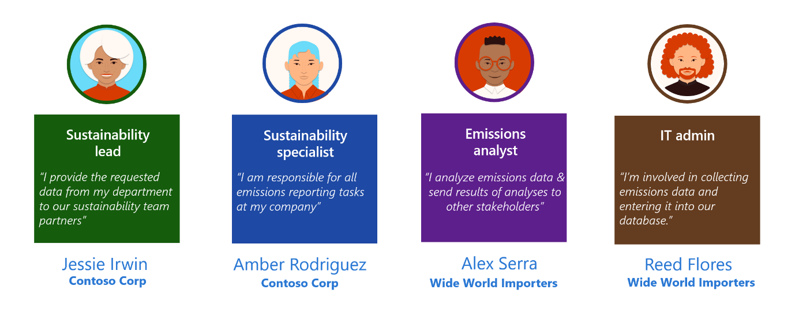
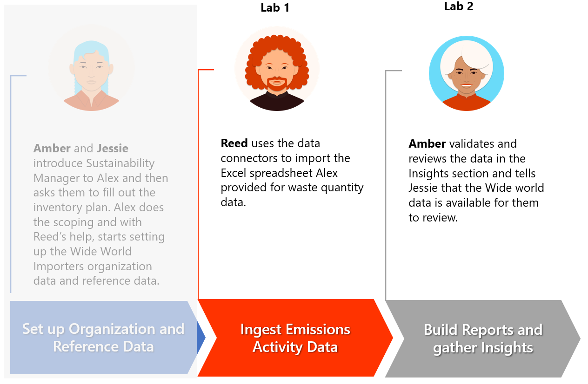

This module focuses on the data ingestion aspect of the solution focus area. It follows the organization and reference data setup, and it forms the basis for the waste quantity data ingestion and the reporting thereafter. Microsoft Sustainability Manager is flexible, with multiple automated options to ingest data, such as connectors and manual inputs for calculations. For scenarios that might require complex data transformation and/or the extract, transform, and load (ETL) process, we recommend that you use tools such as Microsoft Azure Data Factory. For more information, see [Overview of Microsoft Cloud for Sustainability Data Import](/industry/sustainability/import-data/?azure-portal=true).

## Personas and scenarios

In this module's exercise, Reed Flores, IT admin for Wide World Importers, uses waste quantity data in Microsoft Excel spreadsheets from Alex Serra, emissions analyst. These spreadsheets contain waste quantity data for 2022. Reed uses the connector functionality from Microsoft Sustainability Manager to import from the Excel spreadsheets. Next, Reed reviews other connectors that are available for future purposes. Reed uses the built-in Microsoft Power Query functionality to transform the data to match the data schema from Microsoft Sustainability Manager. Then, Reed looks for other potential issues, such as case-sensitive data fields.

> [!div class="mx-imgBorder"]
> 

The exercise in this module focuses on the scenarios that are illustrated in the following diagram.

> [!div class="mx-imgBorder"]
> 
