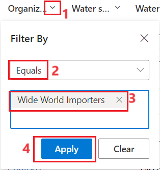

This exercise goes through the steps that Reed takes to ingest the spreadsheets that Alex provided. Data import is a vital task for bringing large volumes of data into Microsoft Sustainability Manager. This exercise uses Excel; however, many prebuilt connectors are available, and partners can build custom connectors to integrate with more data sources.

> [!IMPORTANT]
> To download the sample Excel files to ingest into Microsoft Sustainability Manager, go to [water sample data](https://github.com/MicrosoftDocs/mslearn-developer-tools-power-platform/blob/master/sustainability-cloud/Water%20Sample%20Data.zip). In the GitHub page that appears, select the **Download** button. Extract the two Excel files to a folder on your local computer for use in this exercise.

## Import sample water data
To open sample water data, follow these steps:

1. Open a browser in an InPrivate or Incognito window and then go to [Microsoft Power Apps](https://make.powerapps.com/?azure-portal=true).

1. Select the environment from the **Environment** dropdown menu in the upper-right corner.

1. In the Power Apps portal, under **Apps** on the left navigation pane, open the **Sustainability Manager** application by selecting the play button.

   You're directed to the **Home** page for Microsoft Sustainability Manager.

Area navigation is a common first step in each exercise. The area navigation menu is in the lower-left corner of your screen.

> [!div class="mx-imgBorder"]
> 

## Import water quality data
Follow these steps to import water quality data:

1. In the change area, select **Data**.

1. Select **Data imports** from the navigation pane.

   > [!div class="mx-imgBorder"]
   > 

1. Select **New**.

1. Select **POWER QUERY GUIDED EXPERIENCE**.

   > [!div class="mx-imgBorder"]
   > 

1. Select **Sources > Water**. Select **Add** next to **Water samples**.

   > [!div class="mx-imgBorder"]
   > 

1. Select **Next** after you add the data.

   > [!div class="mx-imgBorder"]
   > 

1. Select **Excel workbook**.

   > [!div class="mx-imgBorder"]
   > 

1. Select **Upload file**. Browse to the **Water Sample Data Wide World Importers 2022.xlsx** file saved on your system. Select **Open**.

   > [!div class="mx-imgBorder"]
   > 

1. Select **Sign in** to sign in with your admin credentials.

1. After you upload the file and the connection is complete, select **Next**.

1. Select the **Water Sample Data** sheet and then select **Transform data**.

   > [!div class="mx-imgBorder"]
   > 

1. You can complete various data and column transformations on the **Transform data** page of the Power Query wizard. As a result, you can adjust data types, update column mappings, and perform advanced transformations that you're familiar with in Microsoft Power Platform dataflows or Microsoft Power BI datasets. Because you don't apply transformations in this exercise, select **Create**.

   > [!div class="mx-imgBorder"]
   > 

1. Go to the **New data connection** wizard on the **Schedule data import** page, where you complete the following actions:

   1. Turn on the **Import data automatically** toggle to allow the option for you to set a schedule for the data to be imported automatically. Selecting this option is beneficial if you use the connector in a scenario where the data changes frequently, such as a web API or FTP server.

   1. Turn on the **Replace previously imported data** toggle to remove all previously imported data and bring in the full dataset that was retrieved. Selecting this option is beneficial if the data source isn't providing data from only the last import or if it always includes a full set of data. For this scenario of importing historical data, leave both options turned off.

1. Select **Next** when you're finished.

   > [!div class="mx-imgBorder"]
   > 

1. On the **Review and name** page, complete the following tasks:

   1. Enter a name for the new connection, such as **Water Sample Data**.

   1. Select **Connect**.

   > [!div class="mx-imgBorder"]
   > 

1. Map your source data to the data model. Data doesn't appear until this step is complete. Select **Map fields**.

   > [!div class="mx-imgBorder"]
   > 

1. Select **Water samples** under **Data source**. Select **Auto map**.

   > [!div class="mx-imgBorder"]
   > 

1. Verify that the **Destination** and **Source** fields are mapped correctly. After reviewing your field mappings, switch the **Ready to import** toggle to **yes**. Select **Save**, select the **back arrow**, and then select **Done**.

   > [!div class="mx-imgBorder"]
   > 

1. On the **Data imports** screen, view the import that you created.

   The **Data import** job runs, and the status displays as **Scheduled**. In a moment, the status switches to **Processing**. You might need to refresh your page to view the change.

1. After a minute or two, select **Refresh** above the list to view the updated status, which should be **Complete**.

   > [!div class="mx-imgBorder"]
   > 

1. Select **Water data** from the left navigation pane.

1. Select **Water samples** under **Water quality data**.

   > [!div class="mx-imgBorder"]
   > 

1. Under **Organization**, filter by **Wide World Importers**.

   > [!div class="mx-imgBorder"]
   > 

After a few moments, the view refreshes and the activity data records that were imported during this exercise are displayed.

## Import water quantity data

This exercise goes through the steps that Reed takes to ingest the water quantity data for 2022 that Alex provided. This exercise uses Excel; however, many prebuilt connectors are available, and partners can build custom connectors to integrate with more data sources.

1. Select **Data imports** from the left navigation pane.

1. Select **New**.

1. Select **POWER QUERY GUIDED EXPERIENCE**.

   > [!div class="mx-imgBorder"]
   > 

1. Select **Add** next to **Water quantities**.

   > [!div class="mx-imgBorder"]
   > 

1. After you select **Add**, select **Next**.

   > [!div class="mx-imgBorder"]
   > 

1. Select **Excel workbook**.

   > [!div class="mx-imgBorder"]
   > 

1. Select **Upload file**. Browse to the **Water Quantity Data Wide World Importers 2022.xlsx** file saved on your system. Select **Open**.

1. Select **Sign in**, and you're signed in with your admin credentials.

1. After the file is uploaded and the connection is complete, select **Next**.

1. Select the **Water Quantity Data** sheet and then select **Transform data**.

   > [!div class="mx-imgBorder"]
   > 

1. You can complete various data and column transformations on the **Transform data** page of the Power Query wizard. As a result, you can adjust data types, update column mappings, and perform advanced transformations that you're familiar with in Microsoft Power Platform dataflows or Microsoft Power BI datasets. Because you don't apply transformations in this exercise, select **Create**.

   > [!div class="mx-imgBorder"]
   > 

1. Go to the **New data connection** wizard on the **Schedule data import** page, where you complete the following actions:

   1. Turn on the **Import data automatically** toggle to allow the option for you to set a schedule for the data to be imported automatically. Selecting this option is beneficial if you use the connector in a scenario where the data changes frequently, such as a web API or FTP server.

   1. Turn on the **Replace previously imported data** toggle to remove all previously imported data and bring in the full dataset that was retrieved. Selecting this option is beneficial if the data source isn't providing data from only the last import or if it always includes a full set of data. For this scenario of importing historical data, leave both options turned off.

1. Select **Next** when you're finished.

   > [!div class="mx-imgBorder"]
   > 

1. On the **Review and name** page, complete the following tasks:

   1. Enter a name for the new connection, such as **Water Quantities data**.

   1. Select **Connect**.

   > [!div class="mx-imgBorder"]
   > 

1. Map your source data to the data model. Data doesn't appear until this step is complete. Select **Map fields**.

   > [!div class="mx-imgBorder"]
   > 

1. Select the **Data source** to map. For this exercise, select **Water quantities**. Select **Auto map**.

   > [!div class="mx-imgBorder"]
   > 

1. Verify that the **Destination** and **Source** fields are mapped correctly. Select **Save**.

   > [!div class="mx-imgBorder"]
   > 

1. Select the **Ready to import** toggle and then select the back arrow.

1. Select **Done**.

1. On the **Data imports** page, view the import that you created.

   The **Data import** job runs, and the status displays as **Scheduled**. In a moment, the status switches to **Processing**. You might need to refresh your page to view the change.

1. After a minute or two, select **Refresh** above the list to view the updated status, which should be **Complete**.

   > [!div class="mx-imgBorder"]
   > 

1. Select **Water data** from the left navigation pane.

   > [!div class="mx-imgBorder"]
   > 

1. Select **Water quantities** under **Water quantity data**.

   > [!div class="mx-imgBorder"]
   > 

1. Under **Organization**, filter by **Wide World Importers**.

   > [!div class="mx-imgBorder"]
   > 

After a few moments, the view refreshes and the activity data records that were imported during this exercise are displayed.

  > [!div class="mx-imgBorder"]
  > 
