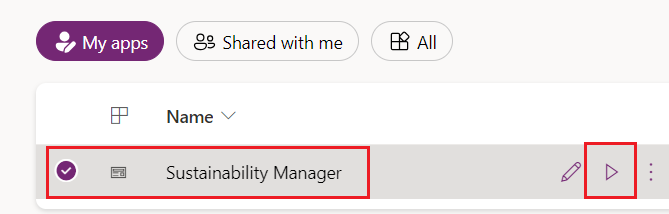

In this exercise, you assume the role of Amber Rodriguez, sustainability specialist for Contoso Corp. Your task is to use the **Water quality** and **Water quantity** dashboards to gain insights.

## Access the water sustainability dashboards

To access the water sustainability dashboards, follow these steps:

1. Use an InPrivate or Incognito window and then go to [Microsoft Power Apps](https://make.powerapps.com/?azure-portal=true).

1. Select the correct environment from the **Environment** dropdown menu in the upper-right corner.

1. Open the **Sustainability Manager** application under **Apps** by selecting the play button.

   > [!div class="mx-imgBorder"]
   > 

   > [!IMPORTANT]
   > Make sure that you've completed the previous exercise to ensure that the dashboards and reports show meaningful data.  

1. In the lower-left corner of the screen, change the area to **Analytics**.

1. Select **Water insights** from the left navigation pane.

   > [!div class="mx-imgBorder"]
   > 

1. Review the dashboards in the following two tabs:

   - **Water quantity** (the default view)

   - **Water quality**

   > [!div class="mx-imgBorder"]
   > 

## Review the Water quantity dashboard

To review the **Water quantity** dashboard, follow these steps:

1. Select the **Water quantity** tab.

   The **Water quantity** tab opens by default.

2. To filter this dashboard, select a reporting period. The dashboard is divided into the following categories:

   - Water withdrawn

   - Water discharged

   - Water consumed

   - Water recycled

    In the dashboard, the **Water withdrawn** and **Water discharged** tiles have five tabs:

     - By month (comparison)

     - By source

     - By facility

     - By country/region

     - By organizational unit

    The **Water consumed** and **Water recycled** tiles have four tabs:

     - By month (comparison)

     - By facility

     - By country/region

     - By organizational unit

    For the **By month (comparison)**, **By source**, **By facility**, **By country/region**, and **By organization unit** tabs, when you select a specific option, data for the selected reporting period shows accordingly. When you select the water quantity transaction again, the details around each tab in the top tile are as follows:

     - **By month (comparison)** - This tab shows the water quantity transaction breakdown by each month to compare.

     - **By source** - This tab shows a breakdown of the water quantity transaction by source.

     - **By facility, By country/region, and By organization unit** - These tabs show the water quantity transaction filtered by facility, country/region, and organization unit respectively.

3. Select the **Wide World Importers - Miami Office** and **Wide World Importers - Tampa Office** options.

   > [!div class="mx-imgBorder"]
   > 

The **Water quantity** report now shows water data analyzed with respect to all tabs that are available for each water quantity transaction.

   > [!div class="mx-imgBorder"]
   > 

## Review the water quality dashboard

Select the **Water quality** tab. You need to filter with **Facility** to view and analyze the data.

> [!div class="mx-imgBorder"]
> 
