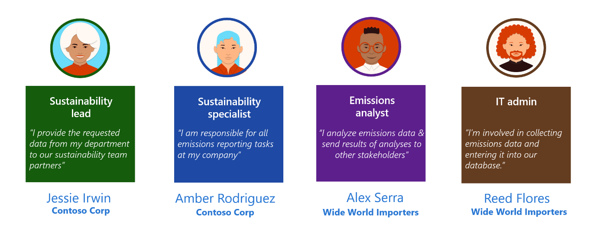
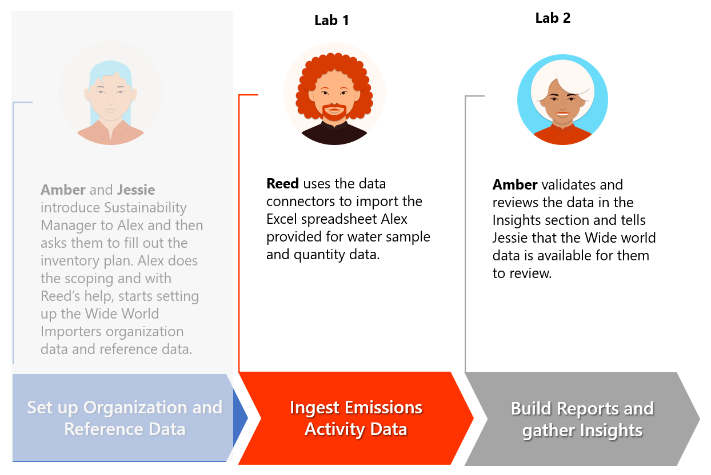

In this module, the focus is on the data ingestion aspect of the solution focus area. It follows the organization and reference data setup and then forms the basis for water sample and quality data ingestion and reporting.

Microsoft Sustainability Manager is flexible, with multiple automated options to ingest data, such as connectors and manual inputs for calculations. For scenarios that might require complex data transformation and/or the extract, transform, and load (ETL) process, we recommend that you use tools such as Microsoft Azure Data Factory. For more information, see [Overview of Microsoft Cloud for Sustainability Data Import](/industry/sustainability/import-data/?azure-portal=true).

## Personas and scenarios

In this exercise, Reed Flores, an IT admin for Wide World Importers, uses the water sample and quantity Microsoft Excel spreadsheets that Alex Serra, emissions analyst, sources. The spreadsheets contain water sample data and water quantity data collected for 2022. Reed uses the Microsoft Sustainability Manager connector functionality to import from Excel spreadsheets and then reviews other connectors that are available for future purposes. Reed uses the built-in Microsoft Power Query functionality to transform the data to match Microsoft Sustainability Manager's data schema and then looks for other potential issues, such as case-sensitive data fields.

> [!div class="mx-imgBorder"]
> 

This module's exercise focuses on the scenarios that are illustrated in the following diagram.

> [!div class="mx-imgBorder"]
> 
