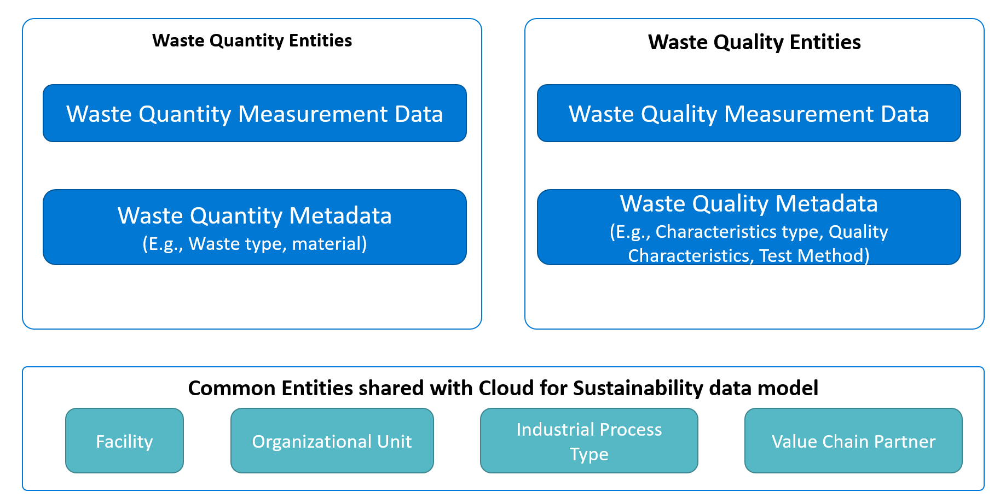
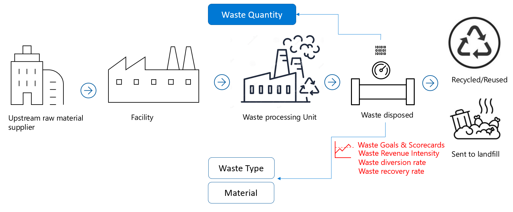

The Cloud for Sustainability waste data model is designed to help users and organizations unify, standardize, and prepare waste sustainability data. This model aids in tracking and achieving net zero waste sustainability goals. The model provides the schema required for storing and integrating waste quality and quantity measurement data with sustainability waste reference data. As a result, the waste sustainability data is available for use cases such as regulatory disclosures for waste generated and disposed, and for compliance monitoring of hazardous/radioactive waste quality characteristics.

The following terms are used in waste management:

## Waste quantity data

The waste quantity data includes measured waste data such as weight or volume of waste disposed, recovered, or recycled, and total waste generated by waste stream and material. This data enables organizations to understand, analyze, and report on the total waste generated and amount of waste disposed to landfills at a facility and organization level.

## Waste quality data

Waste quality or characteristics data help to track and monitor hazardous and radioactive properties in the waste disposed of. It also helps to ensure that the measured values are within permissible limits as defined by regulatory standards.

## Waste quantity and quality entities

The model consists of three categories of entities that support storing waste quantity, quality characteristics, and sustainability reference data. It shares common entities, such as industrial process type, facility, and organization information, with the Cloud for Sustainability data model.

Waste quantity-related entities store data on waste quantity measurements, such as waste disposed to landfill or recycled. The model also stores sustainability reference data such as information on the waste type and the waste material to add context to the quantity measurements.

Entities related to waste quality data store measurements related to the chemical or hazardous properties of the waste disposed. The model also stores sustainability reference data, such as sampling procedures, testing methods, and the metadata for the measured properties. This helps in monitoring the level of contaminants or hazardous chemicals in the waste to ensure they are within permissible limits according to regulations.

> [!div class="mx-imgBorder"]
> 

## Waste quantity entities in data model

> [!div class="mx-imgBorder"]
> 

The diagram illustrates the waste quantity entities in the waste data model:

- **Upstream Raw Material Supplier**: This entity represents the source of the raw materials that are used in the facility. These materials can generate waste during the production process.

- **Facility**: This entity is where the raw materials are processed and waste is generated. The facility is responsible for managing this waste.

- **Waste Processing Unit**: This entity is the part of the facility where waste is processed. This could involve sorting waste, separating recyclable materials, and preparing waste for disposal or recovery.

- **Waste Disposed**: This entity represents the waste that is disposed of after processing. This waste could be sent to a landfill, incinerated, or otherwise disposed of.

- **Recycled/Reused Waste**: This entity represents the waste that is recovered during the processing stage. This waste is then recycled or reused, reducing the amount of waste that needs to be disposed of.

Insights and reporting on the quantity entities are provided in Microsoft Sustainability Manager through the following metrics:

- **Waste Goals and Scorecards**: These are tools used to measure progress towards waste reduction goals. They track key metrics like waste generated, waste disposed, and waste recovered.

- **Waste Revenue Intensity**: This metric is a measure of the cost of waste disposal relative to the revenue generated by the facility.

- **Waste Diversion Rate**: This metric is the percentage of waste that is diverted from disposal through recycling or recovery.

- **Waste Recovery Rate**: This metric is the percentage of waste that is recovered during the processing stage.

- **Waste Type and Material**: This metric represents the different types of waste generated by the facility, such as plastic, metal, or organic waste.

## Key metrics for tracking sustainable waste management

The following key metrics on waste sustainability are provided by Microsoft Sustainability Manager:

| Metric | GRI-306 | SASB |
|--------|---------|------|
| Total amount of waste generated (metrics tons) | Yes | Yes |
| Amount by weight diverted from disposal by recovery operation type | Yes | Yes |
| Amount by weight averted to disposal by recovery operation type | Yes | Yes |
| Amount and percentage of non-recycled waste | Yes | Yes |
| Amount of hazardous waste and radioactive waste | Yes | Yes |
| Targets for reuse and diversion rates | Yes | Yes |
