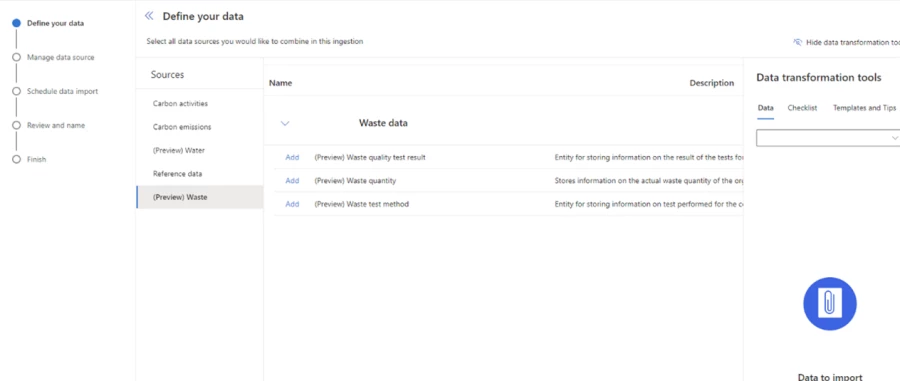
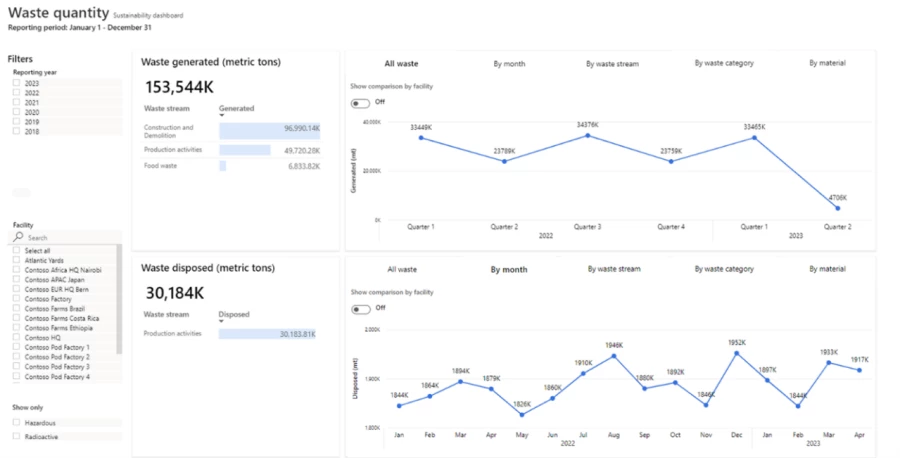
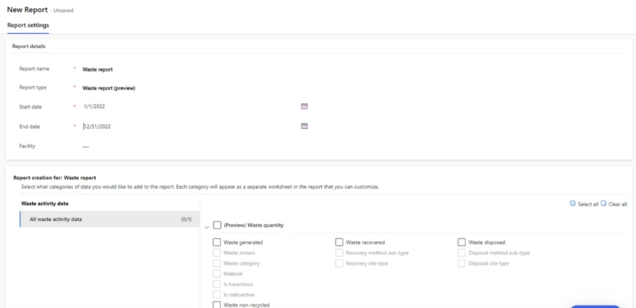

The following are the waste sustainability capabilities in Microsoft Sustainability Manager

## Waste data management

Organizations have lots of waste quantity and quality data from different sources, and they need to be able to efficiently enter that data and prepare it for waste sustainability use cases. They can link new and previously entered waste data to relevant waste categorization and disposal reference data that iss entered into Microsoft Sustainability Manager. They can account for undigitized data sources, such as utility invoices and email or paper-based lab test reports, using waste data entry forms.  

> [!div class="mx-imgBorder"]
> 

## Waste quantity data visualization

Organizations need detailed, current waste quantity data to drive accurate insights and reporting. They can now visualize up-to-date historical waste quantity data and filter, roll up, and drill down on the data at facility or organization levels, by time, waste type, and material granularity.

> [!div class="mx-imgBorder"]
> 

## Waste sustainability disclosure using standard reports

Organizations that need to drive corporate waste sustainability goals and meet external waste reporting requirements can generate custom and regulatory waste sustainability reports in Microsoft Sustainability Manager. This helps organizations to disclose periodic waste quantity data.

> [!div class="mx-imgBorder"]
> 
