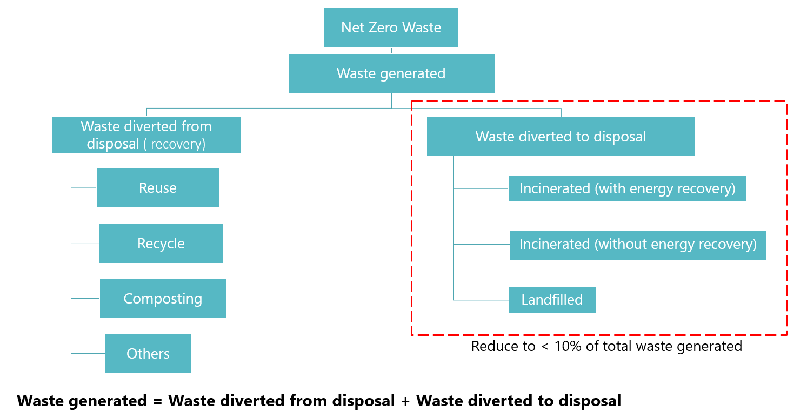

The following image shows how waste sustainability is calculated:

> [!div class="mx-imgBorder"]
> 

The following equation is used to ensure all waste is accounted for:

***Waste Generated = Waste Diverted from Disposal + Waste Diverted to Disposal***

where

- **Waste Generated** is calculated as the total amount of waste produced by the organization. It includes all waste, regardless of how it's disposed of.

- **Waste Diverted from Disposal (Recovery)** is the portion of the waste that is diverted from disposal, such as through recycling or composting. The goal is to maximize this amount to reduce the environmental impact.

- **Waste Diverted to Disposal** is the waste that ends up being disposed of, either through incineration (with or without energy recovery) or land filling. The goal is to minimize this amount.

The sustainability goal is to reduce the **Waste Diverted to Disposal** to less than 10% of the total waste generated, aiming for a **Net Zero Waste** scenario.
