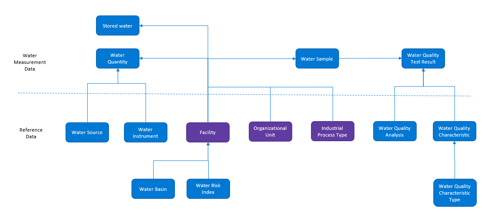

The Cloud for Sustainability water data model supports organizations in streamlining and achieving their water sustainability objectives. An extension of the Cloud for Sustainability data model, this specialized model offers a comprehensive schema that organizes and interlinks water quality and quantity metrics with essential water sustainability reference data.

The Cloud for Sustainability water data model empowers organizations to unify, store and prepare water measurement data from facilities across their organizations into a single data model to help meet water sustainability goals.

The Cloud for Sustainability water data model consists of three types of entities:

- Water quantity entities

- Water quality entities

- Water reference data

The following diagram depicts the water data model:

> [!div class="mx-imgBorder"]
> 

For more information on the entity relationship diagram, see the [Entity Relationship Diagram](/industry/sustainability/water-data-model-intro?azure-portal=true#entity-relationship-diagram).

The following terms are used in water management:

## Water quantity data

Water quantity data includes water volume measurements such as water withdrawal and discharges that are linked to water sources. This data helps organizations analyze and report the balance between water withdrawn, consumed, and discharged in their facilities from various water sources at the organization and facility levels.

## Water quality data

Water quality data includes facility-level measurements related to the chemical, physical, and biological properties of water that are linked to reference data, such as sampling procedures and testing methods. This data helps organizations address use cases such as effluent quantities and their reference ranges in wastewater for regulatory water quality reporting.

## Water intensity factor-based calculations

Water estimations and calculations enable organizations with partial measured data or facilities without sufficient instrumentation to estimate and report their water usage volume using water intensity factors. With this methodology, you can estimate the water withdrawn or discharged based on water intensity formulas.

This method uses the following equation to estimate water volume:

***Estimated Water Volume = Factor x Input***

This formula applies to a facility and water transaction type (withdrawal or discharge) combination with the following descriptions:

- **Factor**: The water intensity factor used for converting an input into a water volume for a facility. It represents the volume of water withdrawn or discharged per unit of the input per time period. The factor is typically based on a factor mapping, such as the number of kGallons withdrawn from water sources per square foot of an office facility.

- **Input**: The numerical value for a facility to use with the factor to estimate water withdrawn or discharged from the facility. For example, you can multiply the total square feet of an office facility by kGallons per square foot per month to estimate the water withdrawn by a facility. It can also be the water withdrawn or discharged by the facility. For example, the water discharged by a facility can be a percentage of the water withdrawn.

- **Time period**: Monthly, biannual, or annual.

- **Factor mapping**: The determinant for the numerical value to use as a factor based on a descriptor of the facility such as facility type (for example, manufacturing, office, or factory). You configure the factor mapping.
