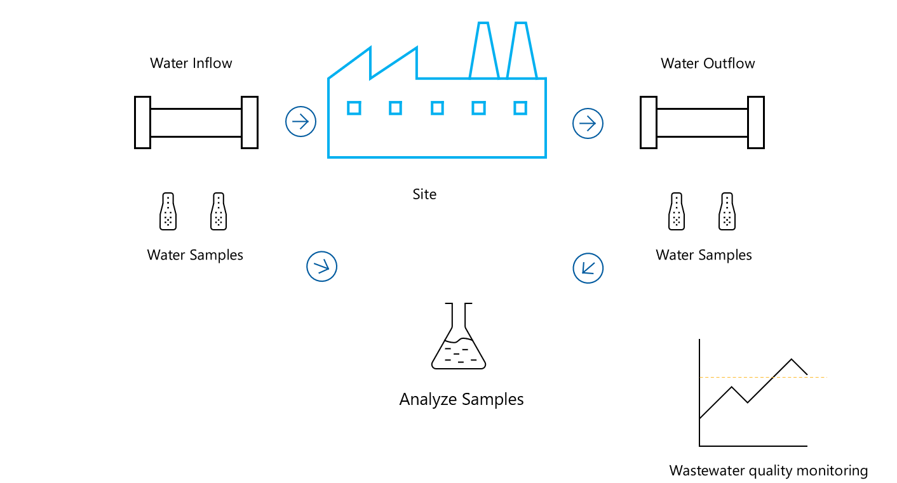

Microsoft Sustainability Manager's water sustainability enable organizations to record, analyze, and report on water quantity and quality data. This helps in maintaining a balance between water withdrawn, consumed, and discharged from various sources at different levels.

It also aids in regulatory water quality reporting as follows:

- Water data ingestion

- Water quantity estimations

- Water flow and quality metrics

- Water sustainability insights

- Water sustainability reporting

## Water data ingestion

Organizations can automatically or manually ingest water quantity and quality data from diverse sources. Regardless of the spread or connectivity level of their facilities, organizations can utilize Microsoft Sustainability Manager to harness water-related data towards achieving their sustainability objectives. It enables them to seamlessly collect and integrate data on water usage and quality, as well as benchmarking data on water sustainability from a diverse range of sources. It supports widely used data formats including Microsoft Excel, CSV, and XML, and accommodates storage within Microsoft Azure's data services like [Azure Data Lake Storage](https://azure.microsoft.com/products/storage/data-lake-storage/?azure-portal=true) and [Azure SQL Database](https://azure.microsoft.com/services/sql-database/campaign/?azure-portal=true).

Using Microsoft Sustainability Manager, organizations can integrate both historical and current water data, including manual entries from paper records. The data is then organized within a water data model that tracks consumption, withdrawal, discharge, and water quality, along with sustainability metadata, to support water management and sustainability analysis.

## Estimate water usage volumes with factor-based computation

Organizations can perform computations such as Water intensity-based quantity estimations and Stored water tracking. Organizations lacking direct measurements for water usage can estimate volumes using Microsoft Sustainability Manager's water intensity feature. It allows calculation of estimated water usage, such as gallons per square foot, by applying standard factors. This is useful for companies with a mix of sensor-equipped and non-instrumented facilities, or those just beginning to track water metrics, providing a means to approximate total water inflow and outflow to help advance their sustainability goals.

In the following image, an organization overcomes a gap in digital water measurement data by estimating water withdrawn and discharged at a non-instrumented facility. The solution shows a return of only 40 percent of withdrawn water to local water sources, making it a water-intensive facility.

> [!div class="mx-imgBorder"]
> 

## Visualize, filter, and share detailed water-usage data using Water sustainability Insights, reporting and goal tracking

Microsoft Sustainability Manager offers interactive dashboards, powered by Microsoft Power BI analytics, to visualize and interact with water usage data. These dashboards support detailed tracking and reporting needs at the facility level and for other specific attributes. Organizations can use them to review both current and historical data on water quantity and quality, tailored for sustainability tasks like mass, balance, and compliance monitoring. You can filter the using time periods, water types, and specific assets, allowing for both a broad overview and in-depth analysis, which can be shared as needed.

The following image shows the Water quantity dashboard in Microsoft Sustainability Manager.

> [!div class="mx-imgBorder"]
> 

The water quantity dashboard provides insights into the total water withdrawn, consumed, and discharged by Contoso Corp, a fictitious company, across its facilities over a period of one year. This includes water received from surface and seawater sources as well as treated waste and water that's discharged to groundwater and a utility company's storm drains. The dashboard also shows the water that's consumed by Contoso Corp as water withdrawn into facilities but not discharged back into local water ecosystems.

Considering the increasing ESG reporting requirements, organizations can use Microsoft Sustainability Manager to create water usage and waste and water quality reports that meet specific ESG disclosure criteria. It allows visualization and report generation at detailed levels, such as wastewater effluent per facility, in accordance with established monitoring standards.

## Site specific water accounting

The following diagram represents the process of water accounting at the organization's site level in Microsoft Sustainability Manager:

> [!div class="mx-imgBorder"]
> 

**Local water body** represents the source of water for the site. Water is withdrawn from this source for use at the site. The **site** where the water is used and stored. The site has goals and scorecards to measure water revenue intensity and the amount of water stored. Water is withdrawn from the local water body for use at the site. After use, water is discharged back into the local water body.

Water Consumed is calculated using the formula:

***Water Consumed = Water Withdrawn - Water Discharged***

It represents the net amount of water used by the site.

This model helps organizations understand their water usage patterns, set goals for water conservation, and measure their progress towards these goals. It's a crucial part of sustainable water management.

## Site-specific water quality

The following diagram represents how Microsoft Sustainability Manager reports water quality at an organization's site level:

> [!div class="mx-imgBorder"]
> 

Water Inflow and Outflow represent the entry and exit points of water at the site. Water samples are taken from these points for analysis. These samples are then analyzed to determine the quality of the water. The analysis helps determine the chemical, physical, and biological properties of the water, which can be monitored through the Water Quality dashboard in Microsoft Sustainability Manager.

Microsoft Sustainability Manager provides the following metrics water sustainability:

| Water Sustainability Metric | GRI-303 | SASB | CDP |
|-----------------------------|---------|------|-----|
| 1. Total water consumption in m3​ | Yes | Yes | Yes |
| 2. Total water consumption in high water-stress regions in m3​ | Yes | Yes | Yes |
| 3. Total water withdrawal in m3​ | Yes | Yes | Yes |
| 4. Total water withdrawal in high water-stress regions in m3​ | Yes | Yes | Yes |
| 5. Total water discharge in m3​ | Yes | Yes | Yes |
| 6. Total water discharge in high water-stress regions in m3​ | Yes | Yes | Yes |
| 7. Total water recycled in m3​ | Yes | | Yes |
| 8. Total water recycled in high water-stress regions in m3​ | Yes
| 9. Total water stored in m3​ | Yes | | |
| 10. Total water stored in high water-stress regions in m3​​ | Yes | | |
| 11. Total changes in stored water in m3​ | Yes | | |

Here's a sample user's water conservation journey:

> [!div class="mx-imgBorder"]
> 
