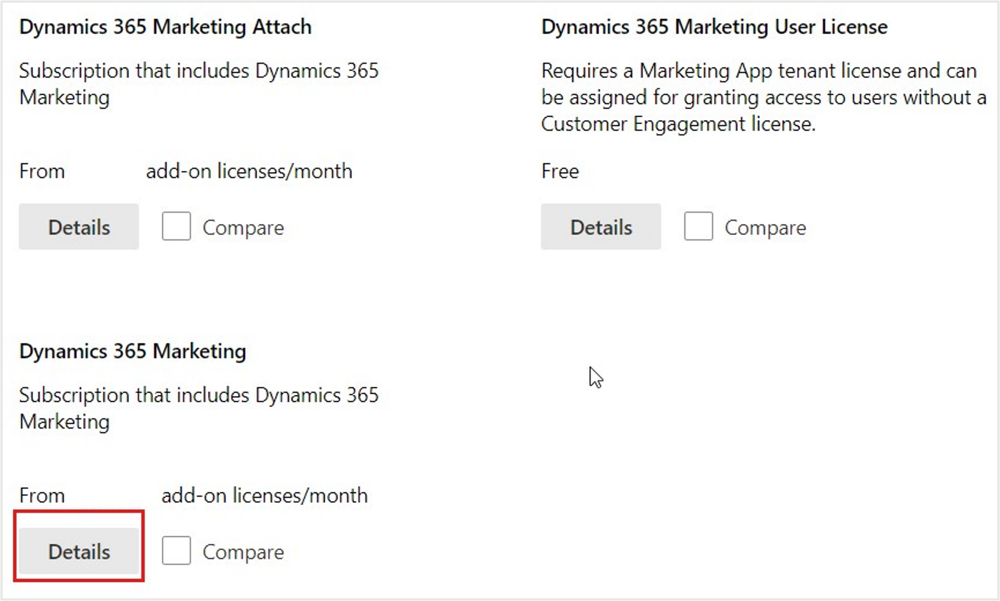

Microsoft Cloud for Healthcare solutions relies on various components and hence you must obtain the following other trial licenses. In this unit, you also learn about validating product licenses, assigning them to a user account, and creating a free Microsoft Azure account.

Then, complete the following tasks:

- Obtain the Dynamics 365 Customer Service Enterprise trial
- Obtain the Dynamics 365 Customer Service Digital Messaging add-on trial
- Obtain the Dynamics 365 Sales Premium trial
- Obtain the Dynamics 365 Field Service trial
- Obtain the Dynamics 365 Marketing trial
- Obtain the Microsoft Cloud for Healthcare trial
- Validate and assign the licenses to the global administrator
- Obtain the Power Pages trial
- Get a Microsoft Azure trial subscription

> [!NOTE]
> To perform these tasks, you must make sure that you’re signed in with the global administrator user account that you created in the previous unit.

## Task: Obtain the Dynamics 365 Customer Service Enterprise trial

In this task, you obtain the Dynamics 365 Customer Service Enterprise Trial license, which is a core component of Microsoft Cloud for Healthcare.

1. Launch a browser and sign in to  [Microsoft 365 admin center](https://admin.microsoft.com/?azure-portal=true) with your credentials.

1. Go to **Billing** > **Purchase services** or **Marketplace** and then select only **Dynamics 365** under the **View by category** section.

   > [!div class="mx-imgBorder"]
   > 

1. Find **Dynamics 365 Customer Service Enterprise** and then select **Details.**

   > [!div class="mx-imgBorder"]
   > 

1. On the **Product details** page, select **Start free trial.**

   > [!div class="mx-imgBorder"]
   > 

1. On the **Check out** page, select **Try now.**

   > [!div class="mx-imgBorder"]
   > 

    If you haven't updated the billing account details in the previous unit, you see the **Information required** pop-up window displays. Select **Continue** and enter the billing account details before you check out the order for the **Dynamics 365 Customer Service Enterprise Trial** license.

    > [!div class="mx-imgBorder"]
    > 

1. On the **order receipt** page, select **Continue.**

    > [!div class="mx-imgBorder"]
    > 

## Task: Obtain the Dynamics 365 Customer Service Digital Messaging add-on trial

In this task, you obtain **Dynamics 365 Customer Service Digital Messaging add-on Trial** license. This license adds multiple digital conversation channels within **Omnichannel for Customer Service.**

1. On the left navigation pane, go to  **Billing > Purchase services**, and then select **Add-ons** under the **View by category** section.

   > [!div class="mx-imgBorder"]
   > 

1. Use the search box to search for the string **Digital**.

1. On the **Dynamics 365 Customer Service Digital Messaging add-on** card, select **Details**.

   > [!div class="mx-imgBorder"]
   > 

1. On the **Product details** page, select **Start free trial**.

   > [!div class="mx-imgBorder"]
   > 

1. On the **Check out** page, select **Try now**.

   > [!div class="mx-imgBorder"]
   > 

1. On the **order receipt** page, select **Continue**.

   > [!div class="mx-imgBorder"]
   > 

> [!NOTE]
> After you obtain the trial license, it might take up to 24 hours for **Omnichannel for Customer Service** to become available in your **Dynamics 365 apps**.

## Task: Obtain the Dynamics 365 Sales Premium trial

In this task, you obtain the **Dynamics 365 Sales Premium Trial** license, which is used by the Health Assistant feature in Microsoft Cloud for Healthcare.

1. On the left navigation pane, go to  **Billing > Purchase services or Marketplace**, then select **Dynamics 365** under the **View by category** section.

1. Find **Dynamics 365 Sales Premium**, and then select **Details**.

   > [!div class="mx-imgBorder"]
   > 

1. On the **Product details** page, select **Start free trial**.

   > [!div class="mx-imgBorder"]
   > 

1. On the **Check out** page, select **Try now**.

   > [!div class="mx-imgBorder"]
   > 

1. On the **order receipt** page, select **Continue**.

   > [!div class="mx-imgBorder"]
   > 

## Task: Obtain the Dynamics 365 Field Service trial

In this task, you obtain the **Dynamics 365 Field Service Trial** license, which the Home health solution uses in Microsoft Cloud for Healthcare.

1. On the left navigation pane, go to **Billing > Purchase services or Marketplace**, and then select **Dynamics 365** under the **View by category** section.

1. Use the search box to search for the string **Field**.

1. On the **Dynamics 365 Field Service** card, select **Details**.

   > [!div class="mx-imgBorder"]
   > 

1. On the **Product details** page, select **Start free trial**.

   > [!div class="mx-imgBorder"]
   > 

1. On the **Check out** page, select **Try now**.

   > [!div class="mx-imgBorder"]
   > 

1. On the **order receipt** page, select **Continue**.

   > [!div class="mx-imgBorder"]
   > 

## Task: Obtain the Dynamics 365 Marketing trial

In this task, you obtain the **Dynamics 365 Marketing Trial** license used by Patient Outreach solution in Microsoft Cloud for Healthcare. As **Dynamics 365 Marketing** is a tenant-based license, it’s not required, or available to be assigned to each user.

1. On the left navigation pane, go to  **Billing > Purchase services or Marketplace**, select **Dynamics 365** under the **View by category** section.

1. Use the search box to search for the string **Marketing**.

1. On the **Dynamics 365 Customer Insights - Journeys** card, select **Details**.

   > [!div class="mx-imgBorder"]
   > 

1. On the **Product details** page, select **Start free trial**.

   > [!div class="mx-imgBorder"]
   > 

1. On the **Check out** page, select **Try now**.

   > [!div class="mx-imgBorder"]
   > 

1. On the **order receipt** page, select **Continue**.

   > [!div class="mx-imgBorder"]
   > 

## Task: Obtain a Microsoft Cloud for Healthcare trial

In this task, you obtain a trial license for Microsoft Cloud for Healthcare.

1. Sign in to the [Solution Center](https://aka.ms/solutioncenter/?azure-portal=true) with your Office credentials.

   > [!div class="mx-imgBorder"]
   > 

1. Select **Healthcare** under **Industry Clouds** from the left navigation pane. Select the **Try now** button to enable the trial license.

   > [!div class="mx-imgBorder"]
   > 

1. Select **Start your free trial**.

   > [!div class="mx-imgBorder"]
   > 

1. After approximately 1-2 minutes, the trial is enabled successfully.

   > [!div class="mx-imgBorder"]
   > 

   > [!div class="mx-imgBorder"]
   > 

## Task: Enable Power Pages trial license

1. Open a new tab in the browser and open [Power Pages](https://powerpages.microsoft.com), and then select **Try it for free**.

   > [!div class="mx-imgBorder"]
   > 

1. Select **Start your free trial**.

1. Enter the **username** and **password** and select **Sign-in**.

1. Enter the **Country/region** and **phone number** and then select **Submit**.

   > [!div class="mx-imgBorder"]
   > 

1. You're redirected to Power Pages Home page.

   > [!div class="mx-imgBorder"]
   > 

## Task: Validate and assign licenses to global administrator

In this task, you validate if the product licenses obtained are available in the tenant. You assign these trial licenses to a user account. The following steps show how you can assign trial licenses to a global administrator account.

1. Go back to [Microsoft 365 admin center](https://admin.microsoft.com/?azure-portal=true).

1. On the left navigation pane, go to  **Billing > Your products**.

   > [!div class="mx-imgBorder"]
   > 

1. In the right pane, under **Products from Microsoft and others**, you can view all the product licenses you obtained.

   > [!div class="mx-imgBorder"]
   > 

1. After you've validated that all the product licenses are available, go to **Users > Active users** to assign these product licenses to the global administrator account.

1. In the right pane, under **Display name**, select a user who has a global administrator role. Select **Licenses and apps** and select the product licenses and then select  **Save changes.**

   > [!div class="mx-imgBorder"]
   > 

> [!NOTE]
> **Dynamics 365 Marketing** is a tenant-based license; hence, it’s not visible under the **Licenses and apps** section to be assigned to a specific user.

## Task: Get Microsoft Azure trial subscription

In this task, you obtain a trial Azure subscription.

> [!NOTE]
> The Terms of Use agreement in Azure limits free trial activation only for a user who’s new to Azure. If you’ve already had any other type of Azure subscription, you won’t be able to activate a free trial.

1. While signed in to your **Microsoft 365 tenant** as global administrator, open a new tab in the browser and go to the [Create free Azure account](https://azure.microsoft.com/free/) page and then select  **Start free**.

   > [!div class="mx-imgBorder"]
   > 

1. You’re taken to the sign-up page. Fill in all required information, verify your identity by selecting the **Text me** or **Call me** button, and then select **Next.**

   > [!div class="mx-imgBorder"]
   > 

   > [!div class="mx-imgBorder"]
   > 

1. On the **Identity verification by card** page, provide your credit card details and then select  **Sign up**.

   > [!div class="mx-imgBorder"]
   > 

> [!NOTE]
> A credit card is only required for verifying your identity. You won't be charged unless you upgrade your subscription. For more information, see [Avoid charges with your Azure free account](/azure/cost-management-billing/manage/avoid-charges-free-account).

You've added the necessary trial licenses to your **Microsoft 365 tenant** and have successfully obtained an **Azure** trial subscription.
