A security role defines how users, such as a clinician, field service agent, or knowledge base creator, can access different types of resources. To work with Microsoft Cloud for Healthcare solutions, make sure that you assign correct security roles to users. In this unit, you learn about the required security roles that you need to assign to a user and a Microsoft Entra ID app. For more information, see [Security roles and privileges](/power-platform/admin/security-roles-privileges/?azure-portal=true) in Microsoft Power Platform.

| Security roles                   | Description |
|----------------------------------|-------------|
| Basic User                       | Allows the user to run an app within the Dataverse environment and perform common tasks for the records that they own. |
| Field Service - Resource         | This role is designed for frontline workers who can read and update their assigned work orders. |
| Knowledge Manager                | Allows the user to create/read/write/delete/append knowledge base records. |
| Omnichannel agent                | Allows the user to perform agent tasks. |
| Productivity tools administrator | Required by administrators of Dynamics 365 productivity tools. Allows the administrator to create/read/write/append/delete agent script, script step, and workflow. |
| Productivity tools user          | Required by users of Dynamics 365 productivity tools. Allows the user to read agent script, script step, and workflow. |
| System Administrator             | Grants full permission for the user to customize or administer a Dataverse environment. |
| Customer service manager         | Allows a user to review customer service performance and enable the customer service process. |
| Customer service representative  | Allows a user to document customer service events and respond to customer service inquiries. |

## Task: Assign a security role to a global administrator

In this task, you go through the steps to assign security roles to a global administrator account.

1. While signed in to your Microsoft 365 tenant, go to [Power Platform admin center](https://admin.powerplatform.microsoft.com/?azure-portal=true).

1. On the left navigation pane, select **Environments**. In the right pane, select the **Microsoft Cloud for Healthcare** environment. On the command bar, select **Settings**, as shown in the following screenshot.

   > [!div class="mx-imgBorder"]
   > [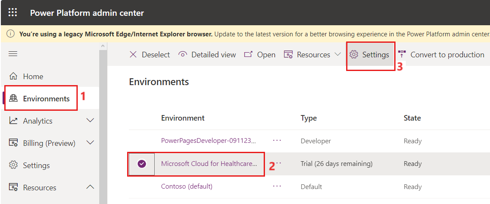](../media/security-roles-users.png#lightbox)

1. On the **Settings** page, select **Users + permissions > Users**.

   > [!div class="mx-imgBorder"]
   > [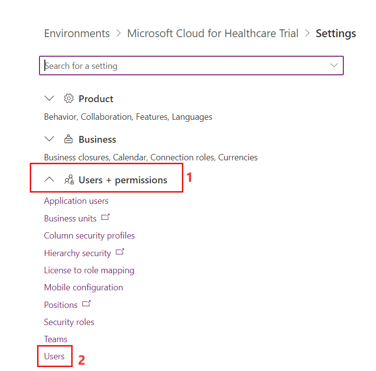](../media/security-user-permission.png#lightbox)

1. Select a user who you want to assign security roles to. Select **Manage security roles**.

   > [!div class="mx-imgBorder"]
   > [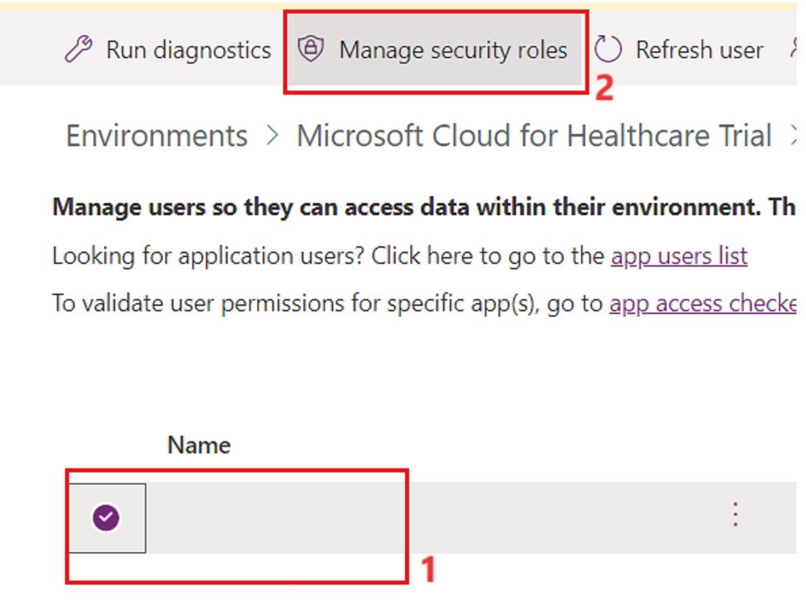](../media/security-users.png#lightbox)

1. Assign the following security roles:

   - Basic User

   - Field Service-Resource

   - Knowledge Manager

   - Omnichannel agent

   - Productivity tools administrator

   - Productivity tools user

   - System Administrator

1. When you're finished selecting security roles, select **Save**.

   > [!div class="mx-imgBorder"]
   > [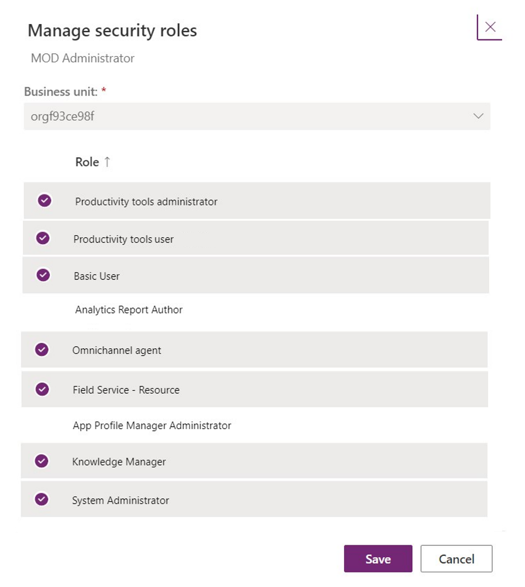](../media/security-manage-roles.png#lightbox)

## Task: Assign a security role to an application user

In this task, you go through the steps to assign security roles to the Demo Health Bot app that you registered in Microsoft Entra ID in the previous unit.

1. Select **Settings**.

   > [!div class="mx-imgBorder"]
   > [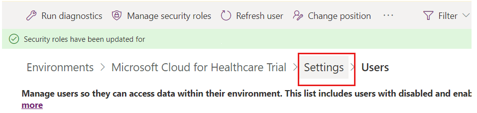](../media/settings.png#lightbox)

1. On the **Settings** page, select **Users + permissions > Application users**.

   > [!div class="mx-imgBorder"]
   > [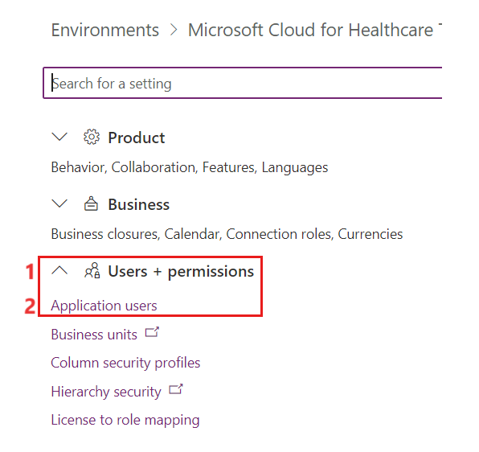](../media/security-application-users.png#lightbox)

1. Before you can assign a security role to an application, you need to add it as an application user. On the **Application users** page, select **+New app user**.

   > [!div class="mx-imgBorder"]
   > 

1. In the **Create a new app user** panel, select **+ Add an app**.

   > [!div class="mx-imgBorder"]
   > [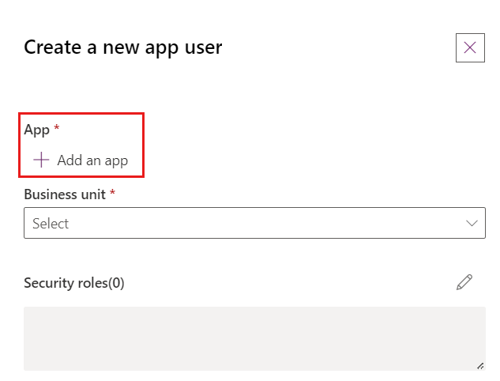](../media/security-add-application.png#lightbox)

1. In the **Add an app from Microsoft Entra ID** panel, select the app that you created and registered in Microsoft Entra ID in the previous task. Select **Add**.

   > [!div class="mx-imgBorder"]
   > [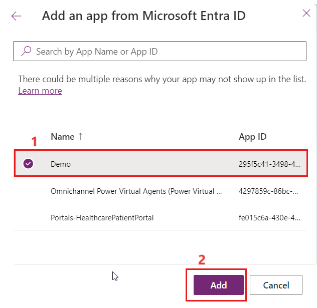](../media/security-add-active-directory.png#lightbox)

1. After adding the Microsoft Entra ID app, you'll be redirected to the **Create a new app user** panel. From the **Business unit** dropdown menu, select the default business unit. Select the **edit** icon beside the **Security roles** option.

   > [!div class="mx-imgBorder"]
   > [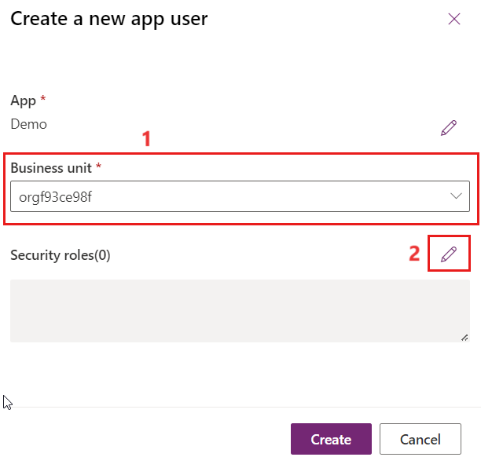](../media/security-create-new-application.png#lightbox)

1. In the **Add security roles** pane, select **Omnichannel agent** and then select **Save**.

   > [!div class="mx-imgBorder"]
   > [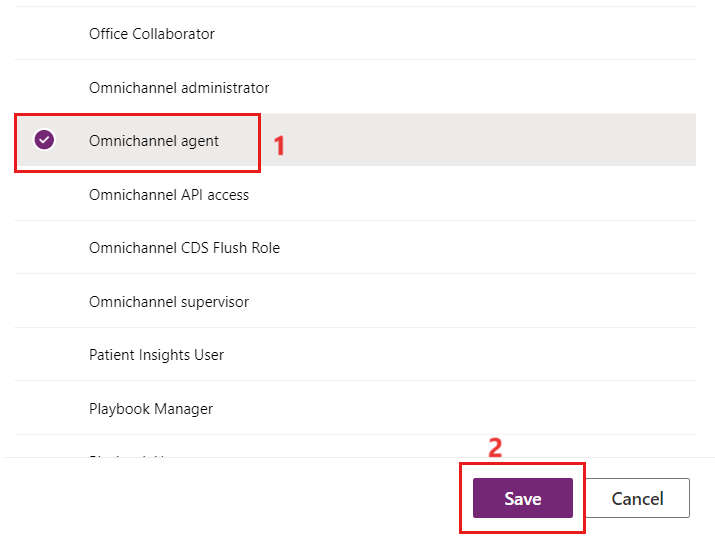](../media/security-add-roles.png#lightbox)

1. You're redirected to the **Create a new app user** panel, which should appear as shown in the following screenshot. Select **Create** to add Health Bot as an application user and assign it the Omnichannel agent security role.

   > [!div class="mx-imgBorder"]
   > [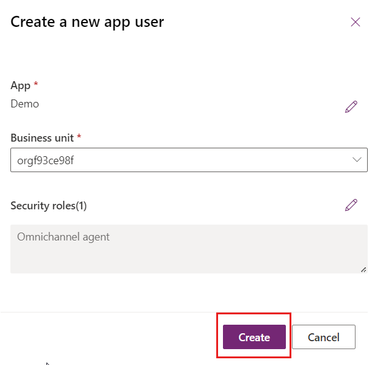](../media/security-create-new-app-user.png#lightbox)

   > [!div class="mx-imgBorder"]
   > [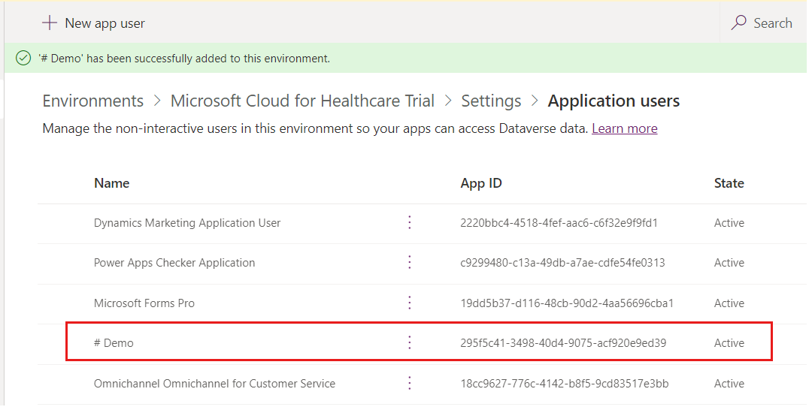](../media/demo.png#lightbox)

You've successfully assigned all security roles to the global administrator account and Microsoft Entra ID app.
