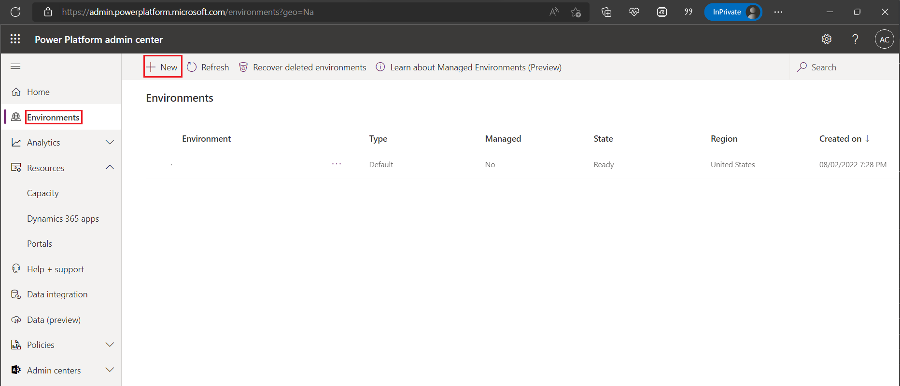
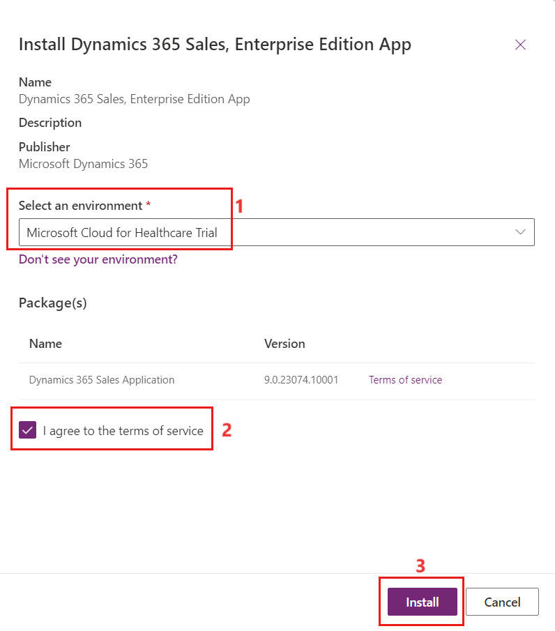
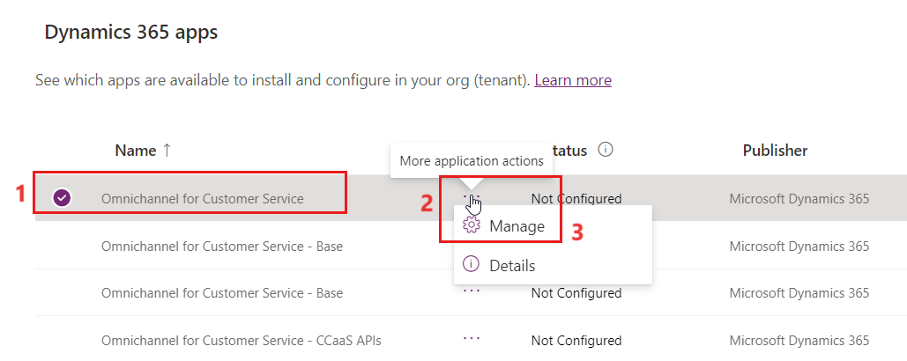
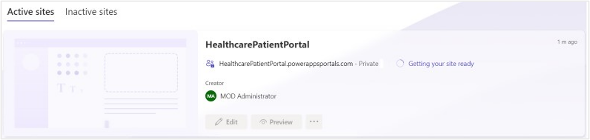

In this exercise, you learn about several configurations that are required to successfully deploy and use Microsoft Cloud for Healthcare. You can make all major configuration changes by using the following four tools:

- Microsoft Azure portal

- Microsoft Power Platform admin center

- Microsoft Power Apps portals

- Microsoft Cloud Solution Center

> [!NOTE]
> Setting up Omnichannel for Customer Service and Power Apps portals will take several hours to complete (estimated at 3-4 hours to complete for each). We recommend that you set up both applications concurrently. You'll need to complete all configuration steps before deploying **Microsoft Cloud for Healthcare**.

## Task: Register an app in Microsoft Entra ID

In this task, you learn how to register a new application in Microsoft Entra ID, grant delegated and application permissions, and create a client secret.

1. While signed in to your **Microsoft 365 tenant**, open a new browser tab, and then go to the [Azure portal](https://portal.azure.com). In the upper-left corner of the page, select the hamburger icon (three horizontal lines) and then select **Microsoft Entra ID**.

   > [!div class="mx-imgBorder"]
   > 

1. On the left navigation pane, select **App registrations** and then select **+ New registration** in the right pane.

   > [!div class="mx-imgBorder"]
   > 

1. On the **Register an application** page, set the name for the bot to **MCH Application ID** and then select the **Accounts in any organizational directory (Any Microsoft Entra ID directory - Multitenant)** option under the **Supported account types** section. Then, select **Register**.

   > [!div class="mx-imgBorder"]
   > 

   > [!NOTE]
   >  You'll need to register the application as multitenant because it enables Microsoft Azure Bot Service (in the botframework.com tenant) to authenticate requests that are coming from the bot that's registered in your tenant. This requirement is part of the service-to-service authentication protocol that's used by Azure Bot Service. Single tenant application registration is also supported by Azure bot created using Bot Framework version 4.15 or later. However, for this learning path, you'll register the application as multitenant.

1. Select **API permissions** on the left navigation pane. On the right pane, select **+ Add a permission**.

   > [!div class="mx-imgBorder"]
   > 

1. On the **Request API permissions** page, select **APIs my organization** **uses**. Use the search box to search for the string
    **Dataverse**. From the search result, select **Dataverse**.

   > [!div class="mx-imgBorder"]
   > 

1. Select **Delegated permissions**. Under the **Select permissions** section, select the checkbox beside  **user_impersonation**. Then, select **Add permissions**.

   > [!div class="mx-imgBorder"]
   > 

1. Select **API permissions** on the left navigation pane. On the right pane, select **+ Add a permission**. Select **Microsoft APIs** and then select **Microsoft Graph**.

   > [!div class="mx-imgBorder"]
   > 

1. On the **Request API permissions** page, select **Application permissions**. Use the search box to search for the string **calendars**. Select the checkbox beside **Calendars.ReadWrite**.

   > [!div class="mx-imgBorder"]
   > 

1. On the **Request API permissions** page, select **Application permissions**. Use the search box to search for the string **user.read**. Select the checkbox beside **User.Read.All**.

1. On the **Request API permissions** page, select **Delegate permissions**. Use the search box to search for the string **user.read**. Select the checkbox beside **User.Read.All** and then select **Add permissions**.

   > [!div class="mx-imgBorder"]
   > 

1. Select **Grant admin consent**, as shown in the following screenshot.

    > [!div class="mx-imgBorder"]
   > 

1. On the **Grant admin consent confirmation** pop-up window, select **Yes**.

   > [!div class="mx-imgBorder"]
   > 

    The status for each added permission changes to **Granted**, as shown in the following screenshot.

    > [!div class="mx-imgBorder"]
    > 

1. On the left navigation pane, select **Certificates & secrets**, and then in the right pane, select **+ New client secret**. In **Add a client secret**, set the **Description** to **Demo Health Bot**, leave the **Expires** value at its default setting, and then select **Add**.

   > [!div class="mx-imgBorder"]
   > 

   > [!NOTE]
   > You'll need to create an application secret so that you can use it along with this application ID to authenticate the bot.

1. Copy the secret value and then save it in a notepad so that you can use it later in this learning path.

   > [!div class="mx-imgBorder"]
   > 

   > [!NOTE]
   > After you've created the secret and the page has refreshed, the secret value will no longer be available to copy.

1. On the left navigation pane, select the **Overview** tab. From the right pane, copy the **Application (client) ID** and then save it in a notepad so that you can use it later in this learning path.

   > [!div class="mx-imgBorder"]
   > 

## Task: Create a subscription-based trial Dataverse environment

In this task, you create a subscription-based, trial Dataverse environment with a database.

1. While signed in to your Microsoft 365 tenant, open a new tab, and then go to [Power Platform admin center](https://admin.powerplatform.microsoft.com/).

1. On the left navigation pane, select **Environments**. In the right pane, select **+ New**.

   > [!div class="mx-imgBorder"]
   > 

1. On the **New environment** form, provide the following details and then select **Next**.

    - **Name** - Lamna Healthcare

    - **Region** - United States

    - **Type** - Trial (subscription-based)

   > [!div class="mx-imgBorder"]
   > 

1. On the **Add database** form, select **Click** **here**, provide details as shown in the following screenshot, and then select
   **Save**.

    - **URL** - lamnahealthcare

    - **Enable Dynamics 365 apps?** - Yes

    - **Automatically deploy these apps** - None

   > [!div class="mx-imgBorder"]
   > 

    > [!div class="mx-imgBorder"]
    > 

1. After the environment has been created successfully, it should appear as shown in the following screenshot.

    > [!div class="mx-imgBorder"]
    > 

## Task: Enable the Dynamics 365 Field Service app in the Dataverse environment

In this task, you install the **Dynamics 365 Field Service** app in the **Lamna Healthcare** environment.

1. While signed in to your Microsoft 365 tenant, open a new tab and then go to [Power Platform admin center](https://admin.powerplatform.microsoft.com/?azure-portal=true).

1. Select **Environment** from the left-navigation pane. Select the **Microsoft Cloud for Healthcare Trial** environment from the list.

1. Select **Resources** > **Dynamics 365 apps**.

   > [!div class="mx-imgBorder"]
   > 

1. Search and select **Dynamics 365 for Field Service** and then select **Install app**. Select **Next** as shown in the following screenshot.

   > [!div class="mx-imgBorder"]
   > 

1. Select the **I agree to the terms of service** checkbox and then select **Install**.

   > [!div class="mx-imgBorder"]
   > 

Wait for the installation to complete by refreshing the page. As the installation takes time to complete, you can proceed to further tasks.

## Task: Enable the Dynamics 365 Sales app in the Dataverse environment

In this task, you install the **Dynamics 365 Sales app** in the **Microsoft Cloud for Healthcare** trial environment.

1. On the left navigation pane, select **Resources** > **Dynamics 365 apps**.

1. In the upper-right corner of the page, use the search box to search for the string **Sales**.

1. In the right pane, select **Dynamics 365 Sales, Enterprise Edition App** and then select **Install**, as shown in the following screenshot.

   > [!div class="mx-imgBorder"]
   > 

1. Select **Microsoft Cloud for Healthcare Trial** as the environment to install the app. Select the **I agree to the terms of service** checkbox and then select **Install**.

   > [!div class="mx-imgBorder"]
   > 

Wait for the installation to complete by refreshing the page. As the installation takes time to complete, you can proceed to further tasks.

## Task: Enable the Dynamics 365 Marketing app in the Dataverse environment

In this task, you go through the steps that are involved in setting up the Dynamics 365 Marketing app in the Microsoft Cloud for Healthcare environment.

1. Select **Environments** from the left-navigation pane. Select the **Microsoft Cloud for Healthcare Trial** environment. Select **Resources** and then **Dynamics 365 apps**.

   > [!div class="mx-imgBorder"]
   > 

1. Search for **Dynamics 365 Marketing Application** and check that the status is **Installed**.

   > [!div class="mx-imgBorder"]
   > 

## Task: Enable the Omnichannel for Customer Service app in the Dataverse environment

In this task, you go through the steps that are involved in setting up the **Omnichannel for Customer Service** app in the **Microsoft Cloud for Healthcare** environment. In this learning path, you enable chat and **Microsoft Teams** channels only.

1. On the left navigation pane, select **Resources** > **Dynamics 365 apps**.

1. In the upper-right corner of the page, use the search box to search for the string **omni**.

1. In the right pane, select **Omnichannel for Customer Service** and then select **Manage**, as shown in the following screenshot.

   > [!div class="mx-imgBorder"]
   > 

1. Select **OK** in the **Manage Omnichannel for Customer Service** dialog.

1. Select your credentials to sign in.

   > [!div class="mx-imgBorder"]
   > 

1. On the **Permissions requested** pop-up window, select **Accept**.

1. You're redirected to Dynamics 365 Administration Center. Select **+ Add environment**.

   > [!div class="mx-imgBorder"]
   > 

1. On the **Omnichannel set up** screen, select **Microsoft Cloud for Healthcare Trial** as the environment and then select **Next**.

   > [!div class="mx-imgBorder"]
   > 

1. Set the **Add chat** toggle to **Yes** and then select **Next**.

   > [!div class="mx-imgBorder"]
   > 

1. Leave the **SMS** and **Social** settings to their default and then select **Next**.

1. Enable the Microsoft Teams channel and then select **Next**.

1. On the **Confirm your selections** screen, select **Finish**.

   > [!div class="mx-imgBorder"]
   > 

   > [!NOTE]
   > It might take a few hours to complete the setup of Omnichannel.

After Omnichannel setup has finished successfully, the **Summary** screen will appear, as shown in the following screenshot.

> [!div class="mx-imgBorder"]
> 

## Task: Create the Healthcare Patient Portal app

In this task, you create a **Microsoft Power Apps** portal in the **Microsoft Cloud for Healthcare** environment. This portal app becomes the patient access portal that is used by **Microsoft Cloud for Healthcare**.

1. Open a new tab and sign in to [Power pages portal](https://make.powerpages.microsoft.com/?azure-portal=true) with your credentials. Change the **Environment** on the top-right corner of the home page to **Microsoft Cloud for healthcare trial**.

   > [!div class="mx-imgBorder"]
   > 

1. Select **Create a site** on the home page.

   > [!div class="mx-imgBorder"]
   > 

1. Enter **Customer** in the **Search** area. Select the **Customer Self Service Portal**.

   > [!div class="mx-imgBorder"]
   > 

1. Select **Choose this template**.

   > [!div class="mx-imgBorder"]
   > 

1. Enter the **Name** of the site and the **Web address** as **Healthcare patient portal**. You can provide the name and address of your choice. Once provided, select **Done**.

    > [!div class="mx-imgBorder"]
    > 

1. The portal takes some time to configure.

    > [!div class="mx-imgBorder"]
    > 

1. The site is ready in 5-10 minutes.

1. Open a new tab and you're able to see the newly created portal in [Power Apps portal](https://make.powerapps.com/?azure-portal=true). Select **Microsoft Cloud for healthcare trial** environment on the top-right corner of the home page.

1. Once you sign in to the Power Apps portal, navigate to **Apps** on the left-navigation pane.

   > [!div class="mx-imgBorder"]
   > 

## Task: Deploy Microsoft Cloud for Healthcare solutions

In this task, you go through the steps to deploy the necessary Microsoft Cloud for Healthcare solutions to complete this training course.

You need to complete all previous steps before you can deploy Microsoft Cloud for Healthcare solutions.

1. While signed in to your Microsoft 365 tenant, open a new tab and go to [Microsoft Solution Center](https://solutions.microsoft.com).

1. On the left navigation pane, select **Solutions** > **Healthcare** to view all solution modules that are available in Microsoft Cloud for Healthcare.

1. Select **Healthcare** under Industry Clouds on the left-navigation pane. Select:

   - Patient Access

   - Patient Service center

   - Patient Outreach

   - Life sciences data model(preview)

   - Unified patient view

   - Care management

   - Patient insight cards

   - Payor data model(preview)

   - Patient service center

   - Home health

   - Provider data model

   After adding all the above solutions, select **Deploy**.

   > [!div class="mx-imgBorder"]
   > 

1. On the **Set up solutions** page, select the **Name**, **Sample data**, and **Codeable concepts** options to add them as extra components and then select **Next**.

   > [!div class="mx-imgBorder"]
   > 

1. On **Select an existing Power Platform environment** select **Microsoft Cloud for Healthcare Trial environment** and select **Next**.

   > [!div class="mx-imgBorder"]
   > 

1. In the **Name this new deployment** box, enter a name for the deployment. Select the **Terms of service** checkbox and then select **Next**.

   > [!div class="mx-imgBorder"]
   > 

1. The **Configure pre-deployment dependencies** page displays a list of all dependencies, and their statuses are marked green to confirm that you can proceed with deployment. Select **Deploy**.

   > [!div class="mx-imgBorder"]
   > 

    The **Deploy solution** page shows the progress of the Microsoft Cloud for Healthcare solutions deployment. Because the deployment process can take several hours to complete, you can close this page or keep it open to track the deployment.

    > [!div class="mx-imgBorder"]
    > 

1. The deployment takes a few hours to complete. The **Success** page appears when the deployment of Microsoft Cloud for Healthcare solutions has completed successfully. Select the **Open** option beside any listed solution to open it.

   > [!div class="mx-imgBorder"]
   > 

## Task: Update environment variables in Power Apps portal

In this task, you go through the steps to update the environment variables that are used by the virtual visit feature in Microsoft Cloud for Healthcare.

1. While signed in to your Microsoft 365 tenant, open a new tab and go
    to [Power Apps portal](https://make.powerapps.com/?azure-portal=true).

1. On the left navigation pane, select **Apps**. In the right pane, select the **See environment variables** option, as shown in the following screenshot.

   > [!div class="mx-imgBorder"]
   > 

1. On the **Environment variables** form, populate the **Virtual Visit Secret** and **Virtual Visit Client ID** boxes with the client secret and client ID respectively that you’ve copied in the previous task of this exercise. Specify the currently signed-in global administrator account as the value for the **Virtual Appointment Scheduler Email** variable.

   > [!div class="mx-imgBorder"]
   > 

   > [!NOTE]
   > The Virtual Visit Secret, Virtual Visit Client ID, and Virtual Appointment Scheduler Email environment variables are used to set up the virtual appointments in the subsequent modules.

You've successfully set up the **Microsoft Cloud for Healthcare Dataverse** environment and have deployed **Microsoft Cloud for Healthcare** solutions.
