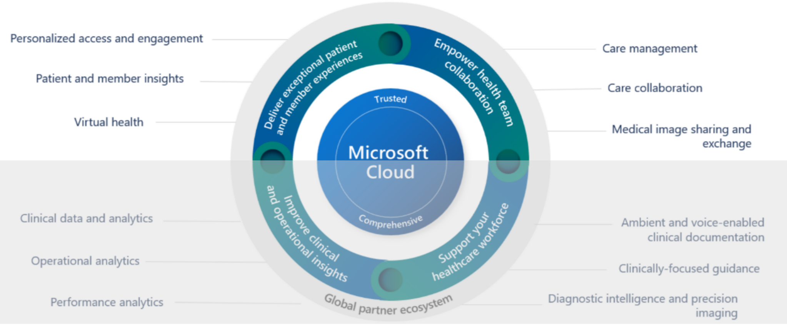
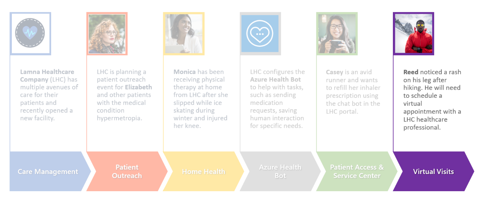

Microsoft Cloud for Healthcare's virtual health allows clinicians to use video conferencing to provide high-quality, personalized, and affordable consultations. Using the entire meetings platform in Microsoft Teams, providers can schedule, manage, and conduct virtual consultation with patients. With the Microsoft Teams integration, practitioners get a full view of their patient's information and history.

## Industry priority scenarios

Virtual care focuses on the **Enhance patient engagement** and **Empower health team collaboration** priority scenarios by providing a virtual health solution for scheduling and following up on virtual consultation between patients, providers, and care managers.

> [!div class="mx-imgBorder"]
> 

## Healthcare story

This lab focuses on the healthcare story of Reed Flores.

> [!div class="mx-imgBorder"]
> 

After coming home from hiking, Reed noticed a new rash on the right arm and leg. Reed decides to schedule a virtual appointment to get a diagnosis.

In this lab, you'll first play the role of a Lamna Healthcare system administrator. You'll configure the Microsoft Cloud for Healthcare to be used for virtual appointments. Then you'll play the role of Reed by scheduling a virtual appointment with Reed's practitioner. Following this, you'll be able to join the virtual appointment from the view of a practitioner to observe the complete end-to-end experience.
