In this exercise, you'll configure the Microsoft Cloud for Healthcare to allow practitioners to use video conferencing in Microsoft Teams to provide high-quality, personalized, and affordable consultations for their patients.

## Task: Create a new Codeable Concept for practitioner specialty type

In this task, you’ll create a new Codeable Concept of type **practitioner specialty** to use on the **Patient Portal**. Practitioner specialty is used to define a reason why a patient is booking the virtual appointment.

As the first step in the booking process, the user must select a reason, which includes the practitioners' specialties.

> [!NOTE]
> The Codeable Concept is one of the most important data items in HL7’s Fast Healthcare Interoperability Resources (FHIR) and is defined in the FHIR specification as a value that is usually supplied by providing a reference to one or more terminologies or ontologies, but may also be defined by the provision of text. 
> Practitioner covers all individuals who are engaged in the healthcare process and healthcare-related services as part of their formal responsibilities and this resource is used for attribution of activities and responsibilities to these individuals.Practitioners include (but are not limited to):
> - physicians, dentists, pharmacists 
> - physician assistants, nurses, scribes
> - midwives, dietitians, therapists, optometrists, paramedics
> - medical technicians, laboratory scientists, prosthetic technicians, radiographers
> - social workers, professional homecare providers, official volunteers
> - receptionists handling patient registration
> - IT personnel merging or unmerging patient records
> - Service animal (for example, ward assigned dog capable of detecting cancer in patients)

Following is an example of the appointment booking screen in the Patient Portal, which displays the practitioner’s specialties defined as Codeable Concepts.

> [!div class="mx-imgBorder"]
> [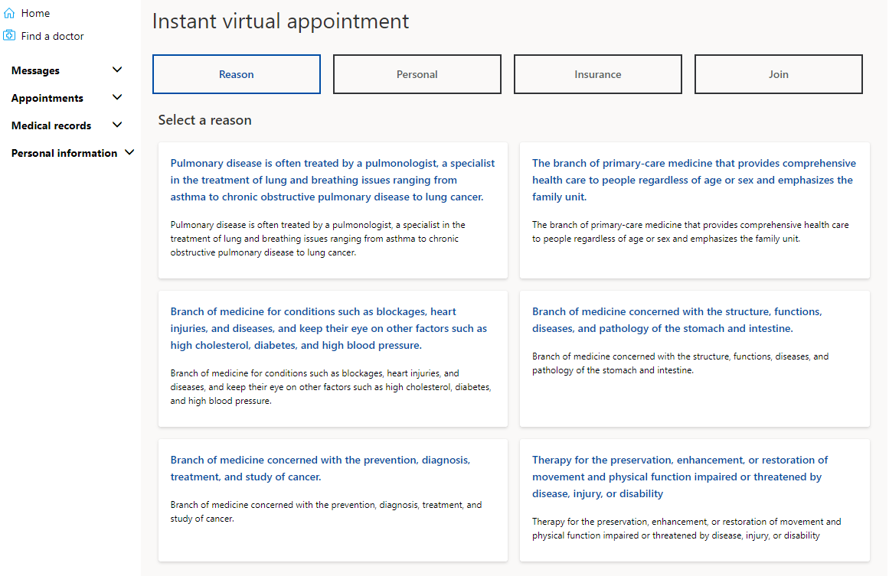](../media/appointment.png#lightbox)

For an entity that isn’t shown directly on an application’s navigation, you can add a new record for those entities through Power Apps. To create a new practitioner specialty, you’ll create a new Codeable Concept record through Power Apps.

1. While signed into your Microsoft 365 tenant, open a new tab, go to [Power Apps](https://make.powerapps.com/?azure-portal=true).

1. Select **Environment** as Lamna Healthcare.

1. On the left navigation pane, select **Tables**.

1. In the right pane, select **All** tables.

1. Use the search box in the upper right corner to search for the string **codeable**.

1. Select the **Codeable Concept** table from the search results and then select **Edit**.

    > [!div class="mx-imgBorder"]
    > [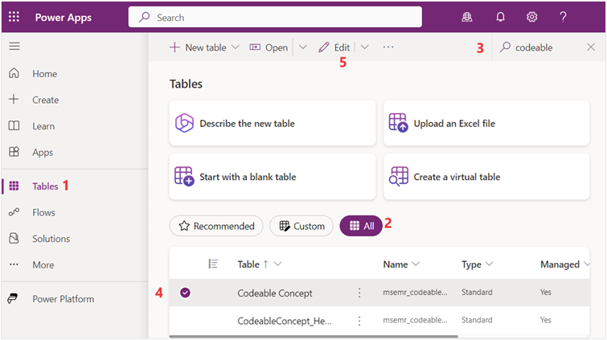](../media/managed.png#lightbox)

1. Select **+New row** dropdown and then select **New row using form**.
 
    > [!div class="mx-imgBorder"]
    > [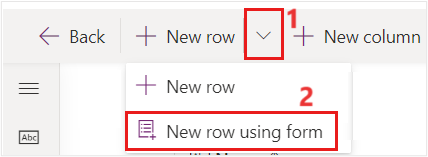](../media/codeable.png#lightbox)

1. In the **New Codable Concept** form, fill in the following details.

    - **Name** - General Medicine

    - **Text** - General Medicine

    - **Type** - Practitioner Specialty

    - **Code** - general
 
    > [!div class="mx-imgBorder"]
    > [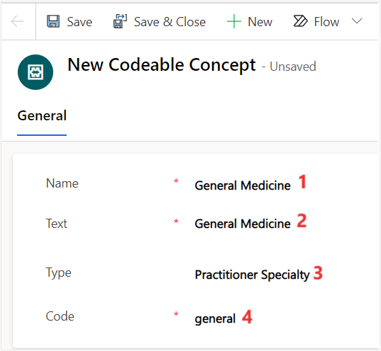](../media/new-record.png#lightbox)

1. Select **Save & Close**.

1. After saving and closing the new **Codeable Concepts** form, select **Done** on the **Currently adding a new row** pop-up to refresh the **Codeable Concepts** table.

1. Once the **Codeable Concepts** table is refreshed, select the **Name** column, and then select **Filter by**.

    1. In the **Filter by** pane, use the below expression and select **Apply**.

    - **Operator**: Contains

    - **Value**: General

    > [!div class="mx-imgBorder"]
    > [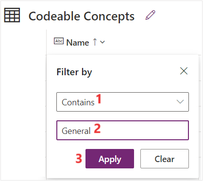](../media/apply-filter.png#lightbox)

1. You can now verify that a new codeable concept of type **Practitioner Specialty** is successfully created.

    > [!div class="mx-imgBorder"]
    > [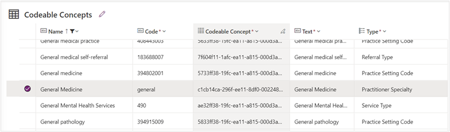](../media/practitioner.png#lightbox)

You've created a new practitioner specialty that will now be available for selection as an appointment visit reason in the Patient Portal.

## Task: Enable a practitioner's schedule

In this task, you'll configure the practitioner's schedule to allow patients to book appointments with them in the Patient Portal.

1. While on [Power Apps](https://make.powerapps.com/?azure-portal=true), on the left navigation pane, select **Tables**.

1. In the right pane, select **All** tables.

1. Use the search box in the upper right corner to search for the string **schedule**.

1. Select the **Schedule** table.

    > [!div class="mx-imgBorder"]
    > [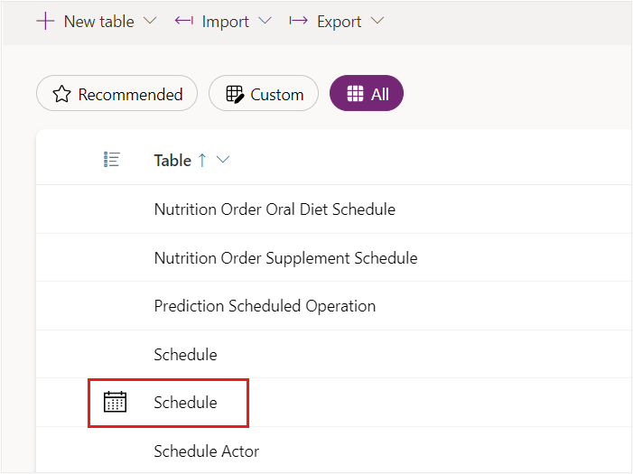](../media/enable-schedule.png#lightbox)

1. In the **Schedule columns and data** section, select the dropdown to add an existing column to the editable view. Search  and then select **Active** to add the column. You may also remove the columns that have no data. Select **Save**.

    > [!div class="mx-imgBorder"]
    > [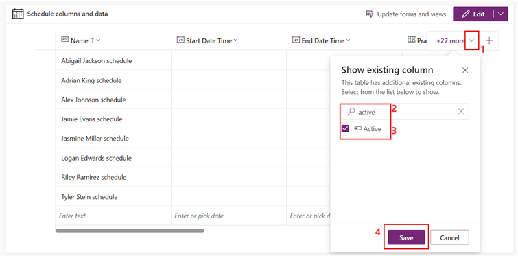](../media/schedules.png#lightbox)

1. Select **Alex Johnson schedule** under the **Name** column and then change the value of **Active** column from **No** to **Yes**. You may need to scroll right in the grid.

    > [!div class="mx-imgBorder"]
    > [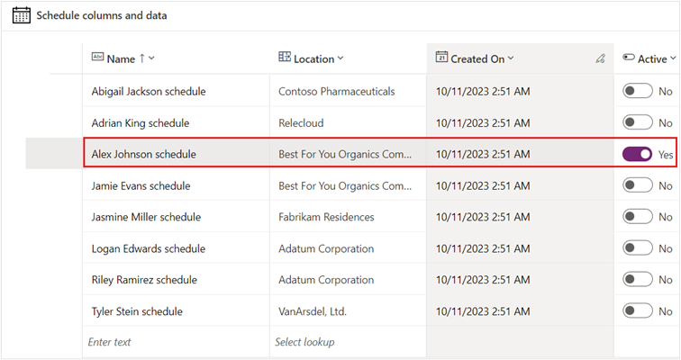](../media/active.png#lightbox)

You've enabled a practitioner's schedule to be used for booking virtual appointments.

## Task: Configure slots for appointments

In this task, you'll configure a new appointment slot to show practitioner's availability. This configuration will allow patients to select an available appointment time slot when booking with a practitioner. Enable Reed's practitioner, Alex Johnson, to be available today at a set time for virtual appointments.

1. Go to [Power Apps](https://make.powerapps.com/?azure-portal=true).

1. Select **Apps** on the left navigation.

1. Select **Healthcare Administration** app in the right pane. Select the **Play** button to launch the app.

    > [!div class="mx-imgBorder"]
    > [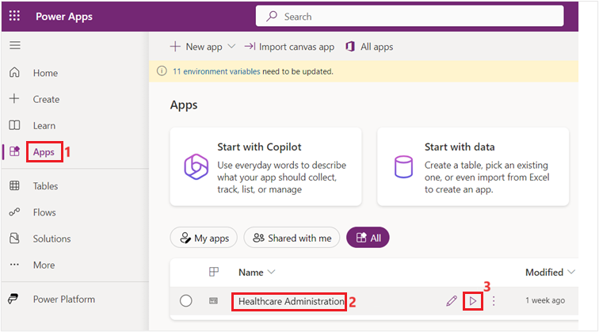](../media/virtual-clinic.png#lightbox)

1. In the Healthcare Administration app, select **Schedule** on the left navigation pane. 
    
1. Select the Alex Johnson schedule from the **Active Schedules** list.

   > [!div class="mx-imgBorder"]
   > [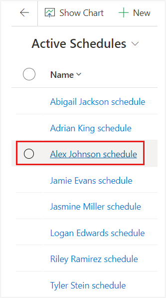](../media/active-schedules.png#lightbox)

1. Scroll down and under select **Associated slots**, select **+ New Slot**.

1. Fill in the following details in the **New Slot** form and select **Save & Close**. 

    1. **Name** - Alex Johnson Slot

    1. **Start** - Today, at a later time

    1. **End** - Today, an hour after the Start

    1. **Schedule** - Alex Johnson schedule

    1. **Status** - Free

    1. **isVirtual** - Yes

    1. **Specialty** - General Medicine (the practitioner specialty record you created)

    1. **Service** **Category** - General Medicine (same as specialty)

    > [!div class="mx-imgBorder"]
    > [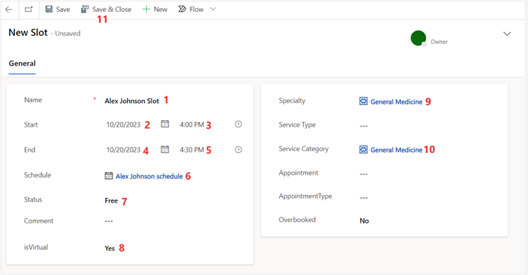](../media/new-slot.png#lightbox)

You've created a new virtual slot for Reed to book with the practitioner, Alex Johnson.

## Task: Configure Mapped System User on Practitioner Record

In this task, you'll configure the Mapped System User field on the Practitioner record. This field should be set to the system user that maps to the contact record. Set this field to our logged-in user record.

- The Teams meeting is created on this mapped user's calendar (for a Virtual appointment).

- For an Instant appointment, the meeting is created on the Organizer (organizer email for virtual appointments) specified in the Admin settings.

1. Select and open the **Healthcare Administration** application.

1. Select **Practitioners** on the left navigation pane.

1. Select the **Alex Johnson** record and select **Edit**.

    > [!div class="mx-imgBorder"]
    > [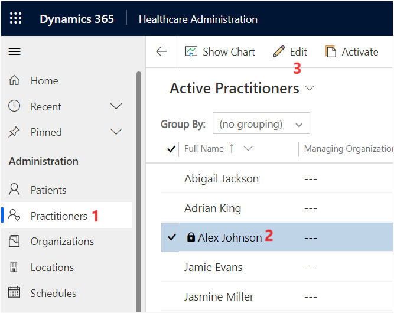](../media/people.png#lightbox)

1. In the **Summary tab**, select your logged-in user as the **Mapped System User**. Select **Save & Close**.

You've mapped the practitioner record to your logged in user so that you can accept the video call when the patient has a virtual visit.

## Task: Enable cloud flow

In this task, you’ll create connection references and enable the cloud flow for virtual care.

1. While signed into your Microsoft 365 tenant, open a new tab, go to [Power Apps](https://make.powerapps.com/?azure-portal=true).

1. Select **Solutions** and then select **+ New Solution**.

    > [!div class="mx-imgBorder"]
    > [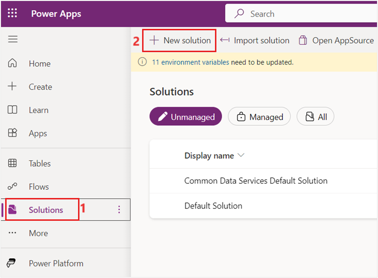](../media/solutions.png#lightbox)

1. Use the below information to create a new solution and select **Create**.

    - **Display name** - Lamna Healthcare

    - **Name** - LamnaHealthcare

    - **Publisher** - CDS Default Publisher

    > [!div class="mx-imgBorder"]
    > [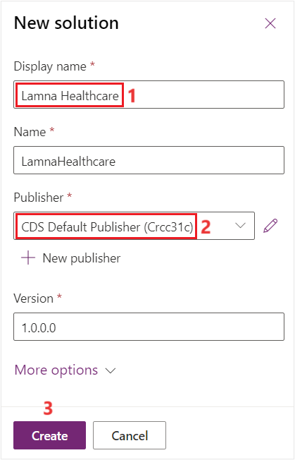](../media/new-solution.png#lightbox)

1. On the Lamna Healthcare solution page, select **+ Add existing** and then select **Cloud flow** under **Automation**.

	> [!div class="mx-imgBorder"]
	> [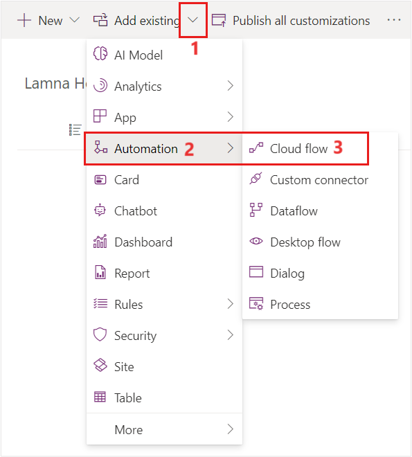](../media/solution-edit.png#lightbox)

1. On the **Add existing cloud flows** page, select **CF -> Schedule Teams Meeting for instant and virtual, update record with url and status to booked** and select **Add**.

    > [!div class="mx-imgBorder"]
    > [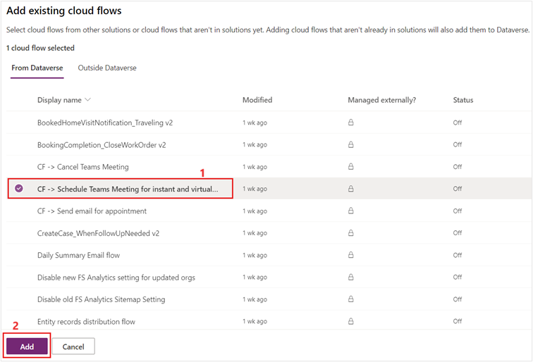](../media/cloud.png#lightbox)

1. Select the cloud flow. Select **Details** dropdown and then select **Details in a new tab**.

    > [!div class="mx-imgBorder"]
    > [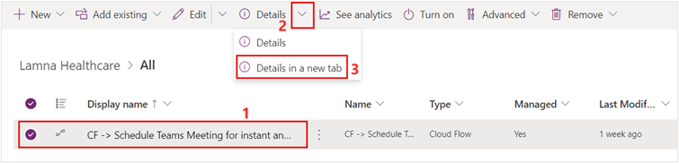](../media/flow.png#lightbox)

1. Select **Edit** on the cloud flow page.

    > [!div class="mx-imgBorder"]
    > [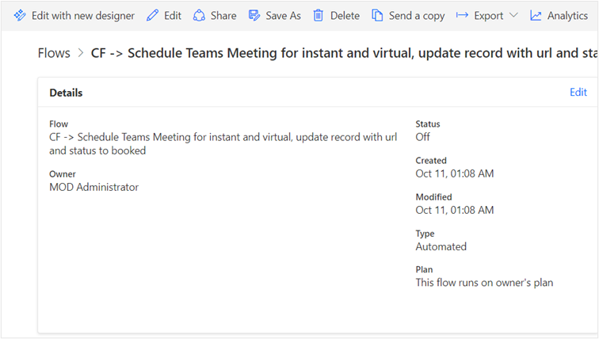](../media/connection.png#lightbox)

1. Select **Sign in** for **Microsoft Dataverse** and **Office 365 Users** connectors to sign in with the currently logged-in user and create a connection reference.

    > [!div class="mx-imgBorder"]
    > [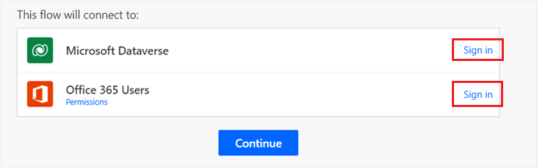](../media/dataverse.png#lightbox)

1. Select **Continue**.

   > [!div class="mx-imgBorder"]
   > [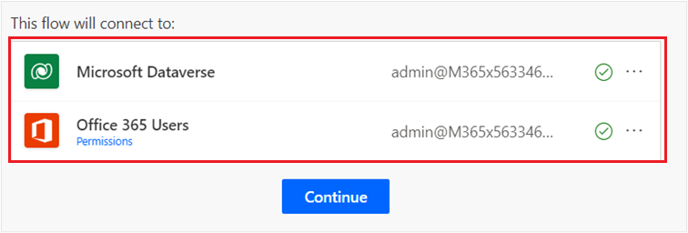](../media/continue.png#lightbox)

1. Select **Save** to commit your updates.

   > [!div class="mx-imgBorder"]
   > [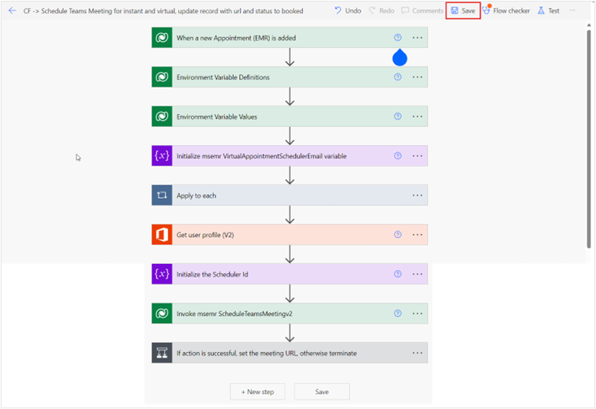](../media/save.png#lightbox)

1. After the flow is saved successfully, select the **Back arrow** to return to the flow’s main page.

1. The status of the flow is **Off**. At the upper right corner, select **Turn on** to enable the flow.

    > [!div class="mx-imgBorder"]
    > [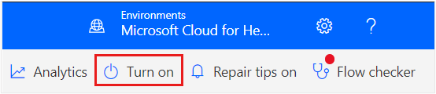](../media/turn-on.png#lightbox)

1.	Close the **Power Automate** tab to go back to Lamna Healthcare solution page and select **Publish all customizations**.

    > [!div class="mx-imgBorder"]
    > [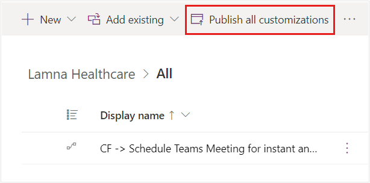](../media/publish.png#lightbox)

You’ve created connection references to Microsoft Dataverse and Office 365 Users connectors and turned on the cloud flow for creating virtual appointments.
