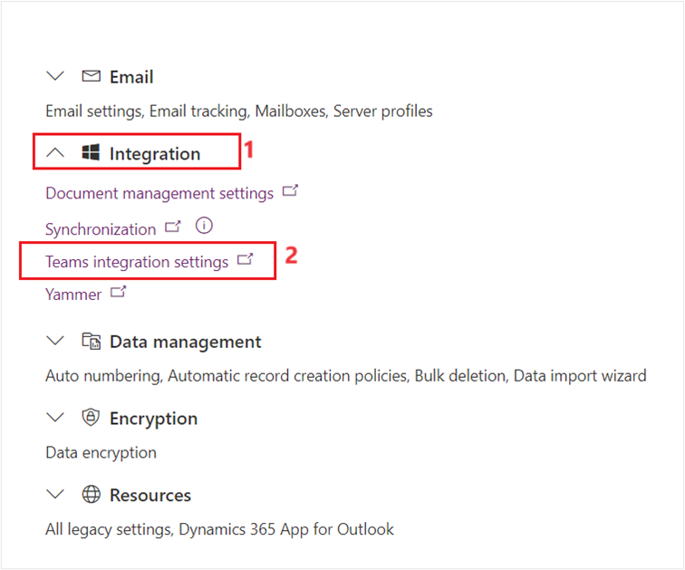
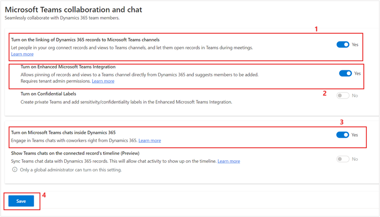

In this exercise, you’ll configure Microsoft Teams to integrate with Lamna Healthcare Company. Microsoft Teams offers several features useful for hospitals and other healthcare organizations. By integrating Microsoft Cloud for Healthcare with Microsoft Teams, you can enhance patient care and improve the collaboration between your care team staff. You can quickly schedule and conduct virtual consultation with patients.

Additionally, your care team can use Microsoft Teams internally to:

- Chat, call, post messages, and communicate as a team

- Store and share files and documents to collaborate

- Use Shifts to create, manage, and share schedules among your staff

## Task: Enable Microsoft Teams integration

By default, Microsoft Teams collaboration and chat features are disabled for Dynamics 365. In this task, you’ll use the Power Platform admin center to enable the Microsoft Teams integration for Dynamics 365.

1. While signed into your Microsoft 365 tenant, open a new tab, go to [Power Platform admin center](https://admin.powerplatform.microsoft.com/?azure-portal=true).

1. On the left navigation, select **Environments**. In the right pane, select **Lamna Healthcare** environment. Next, select **Settings**.

1. Select **Integration** and then select **Teams integration settings**.

   > [!div class="mx-imgBorder"]
   > 

1. Under **Microsoft Teams collaboration and chat**, switch **Turn on the linking of Dynamics 365 records to Microsoft Teams channels** to **Yes**

1. Switch **Turn on Enhanced Teams Integration** to **Yes**.

1. On the pop-up, select the currently signed-in user to grant the necessary permissions.

1. Select **Accept**.

1. Switch **Turn on Microsoft Teams chats inside Dynamics 365** to **Yes**, and then select **Save**.

   > [!div class="mx-imgBorder"]
   > 

You've enabled Microsoft Teams integration for Dynamics 365.

