In this final exercise, you'll use the items that you configured in the previous exercises to schedule a virtual visit between Reed Flores and the practitioner, Alex Johnson.

## Task: Schedule an instant virtual appointment

In this task, you'll sign in to the Patient Portal as Reed Flores and schedule an instant virtual appointment. First you need to register Reed on the patient portal.

1. Go to [Power Apps](https://make.powerapps.com/?azure-portal=true).

1. Select **Apps** on the left navigation pane.

1. Select and open **Healthcare Administration** app and select the play button. 

1. Select **Patients** app in the left navigation pane. 

1. In the right pane, on the **Active Patients** view, select the record **Reed Flores** and then select **Edit**.

   > [!div class="mx-imgBorder"]
   > [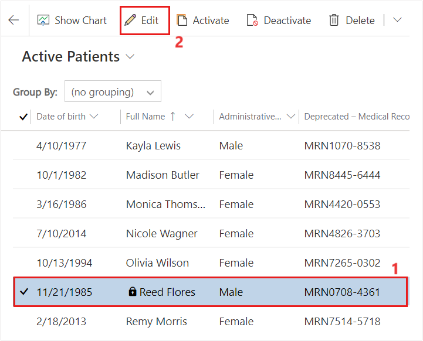](../media/active-patients.png#lightbox)

1. Select ellipsis (⋮), and then select **Create Invitation** from the pop-up.

   > [!div class="mx-imgBorder"]
   > [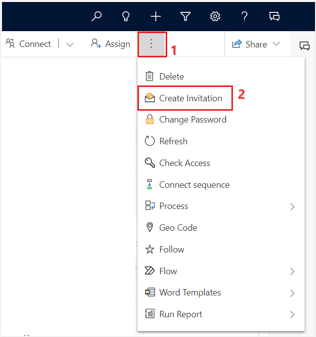](../media/create-invitation.png#lightbox)

1. Select **Save** on the **New Invitation** form.

   > [!div class="mx-imgBorder"]
   > [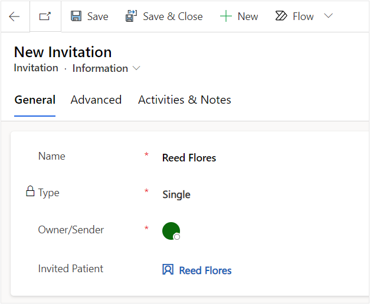](../media/invitation.png#lightbox)

1. Go to the **Advanced** tab and copy the **Invitation Code** to use on the patient portal.

   > [!div class="mx-imgBorder"]
   > [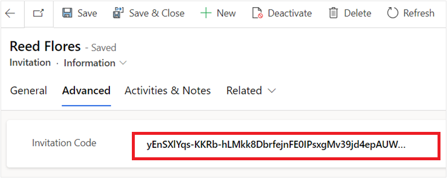](../media/code.png#lightbox)

1. Go to [Power Pages](https://powerpages.microsoft.com/?azure-portal=true). Launch your Lamna Healthcare Patient Portal in the Desktop view. 

   > [!div class="mx-imgBorder"]
   > [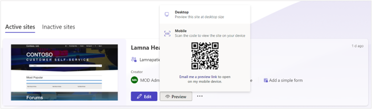](../media/portal.png#lightbox)

1. Select **Sign in** on the landing page.

   > [!div class="mx-imgBorder"]
   > [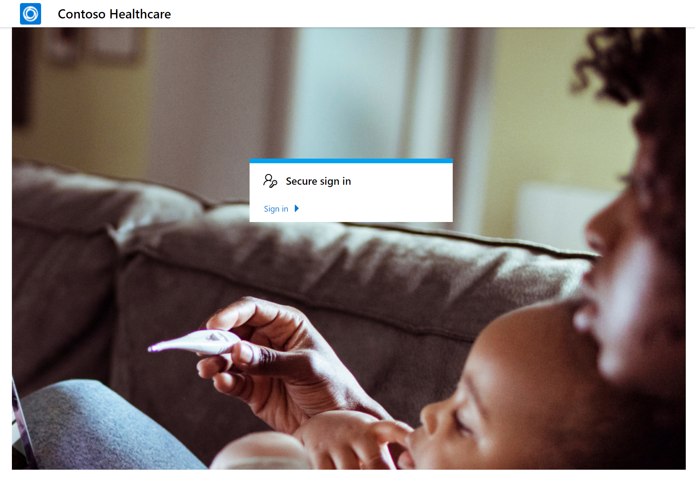](../media/sign-in.png#lightbox)

1. Go to the **Redeem invitation** tab. Paste the **Invitation Code** you retrieved in the previous task. Leave the box unchecked for returning customer. Select **Register**.

1. Enter a username and password for **Reed Flores**. Something you'll remember. Select **Register**.

   > [!div class="mx-imgBorder"]
   > [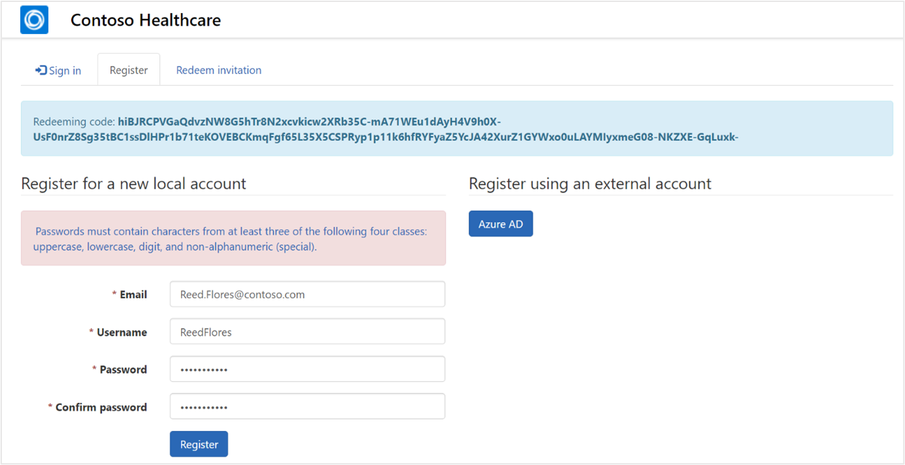](../media/user-name.png#lightbox)

1. You may land on the profile page. Select the logo in the upper right to go to the **homepage**.

   > [!div class="mx-imgBorder"]
   > [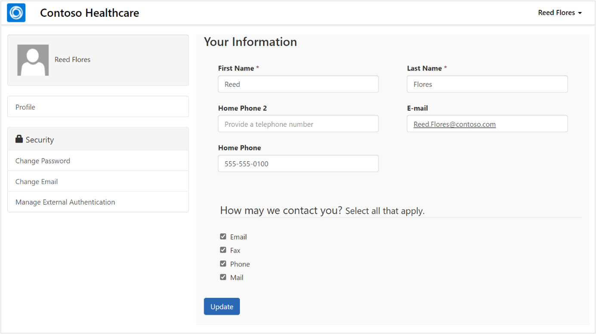](../media/profile.png#lightbox)

1. Go to **Appointments** and select **Schedule new**.

   > [!div class="mx-imgBorder"]
   > [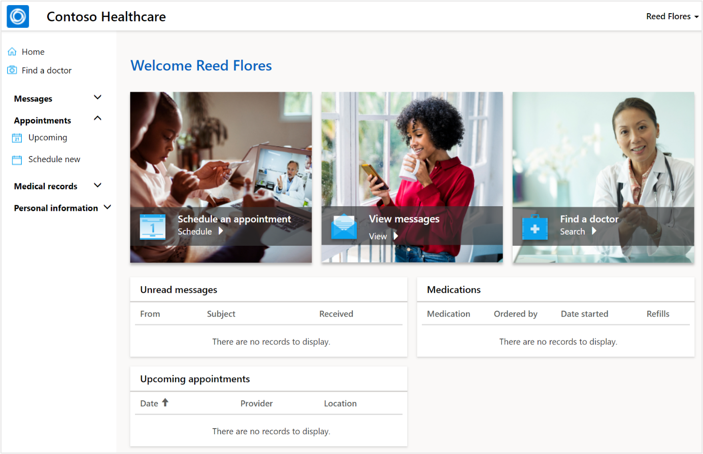](../media/appointments.png#lightbox)

1. Select **Instant virtual appointment**.

   > [!div class="mx-imgBorder"]
   > [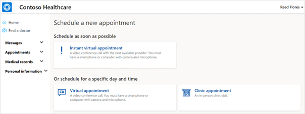](../media/instant.png#lightbox)

1. Select the **General Medicine** option that you created earlier in the exercise as the reason for the visit.

   > [!div class="mx-imgBorder"]
   > [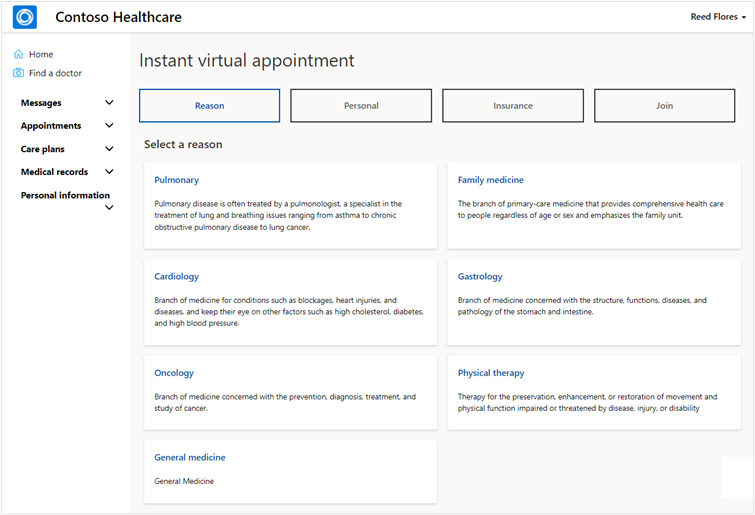](../media/reason.png#lightbox)

1. In the **Personal** section, scroll down and select **Next**.

1. In the **Insurance** section, select **+ Add Insurance**.

   > [!NOTE]
   > If you encounter an error when adding the insurance, ensure the environment variables and API permissions are set up as mentioned in the [Configure environment](/training/modules/training-environment-preparation-healthcare/4a-azure-trial). For more information on these settings, see [Set up and configure a Patient access portal](/dynamics365/industry/healthcare/configure-portals#known-issue).

   > [!div class="mx-imgBorder"]
   > [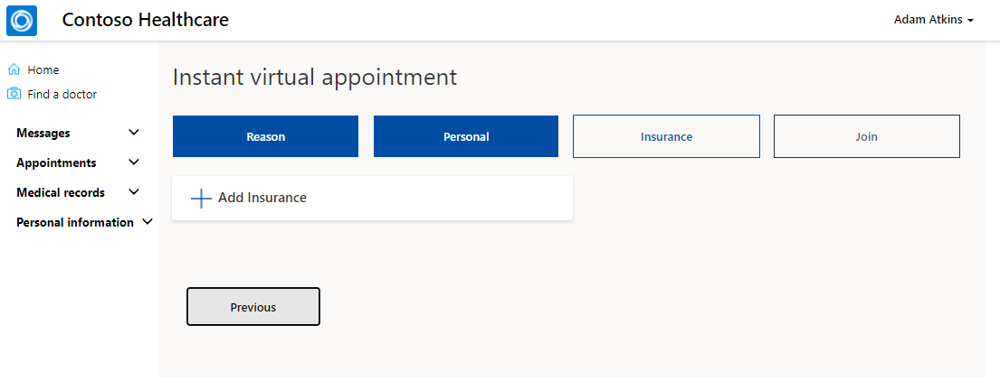](../media/insurance.png#lightbox)

1. Fill out the required fields with any information and select **Next**.

   > [!div class="mx-imgBorder"]
   > [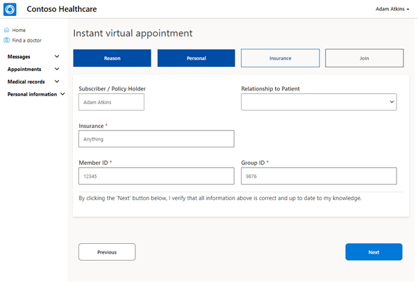](../media/insurance-details.png#lightbox)

1. Select **Next**.

1. **Check the box** for Consent Terms and then select **Join queue**.

   > [!div class="mx-imgBorder"]
   > [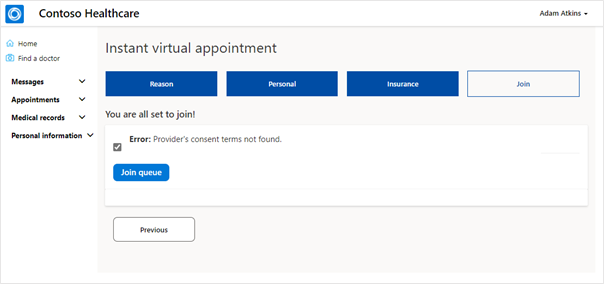](../media/consent-terms.png#lightbox)

1. A new internet browser tab opens and may be blank. **Select the link** provided to join the appointment.

   > [!div class="mx-imgBorder"]
   > [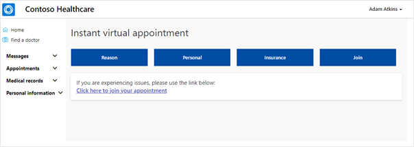](../media/join.png#lightbox)

You've scheduled an instant virtual appointment using the patient portal. 
