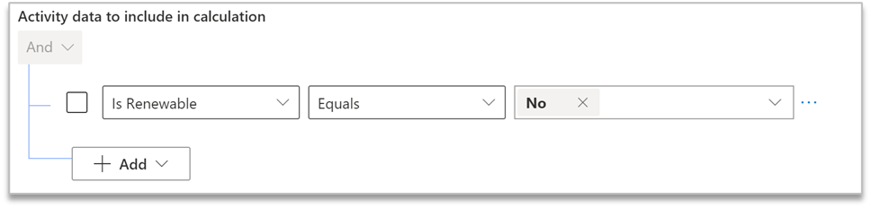

You can use a calculation profile to connect activities, including live data ingestion, to models. Models don’t run the calculations on their own; they provide the definitions. A profile connects those definitions to real data. 

> [!div class="mx-imgBorder"]
> 

A calculation profile is a job setup that will run when a recent activity is refreshed or will run on demand. You can also limit a profile to specific datasets, or ranges of data, so that only data within that range is run through the model. This feature is beneficial when you’re getting started with Sustainability Manager because it allows you to test your models on small sets of data to help make validation easier. 
