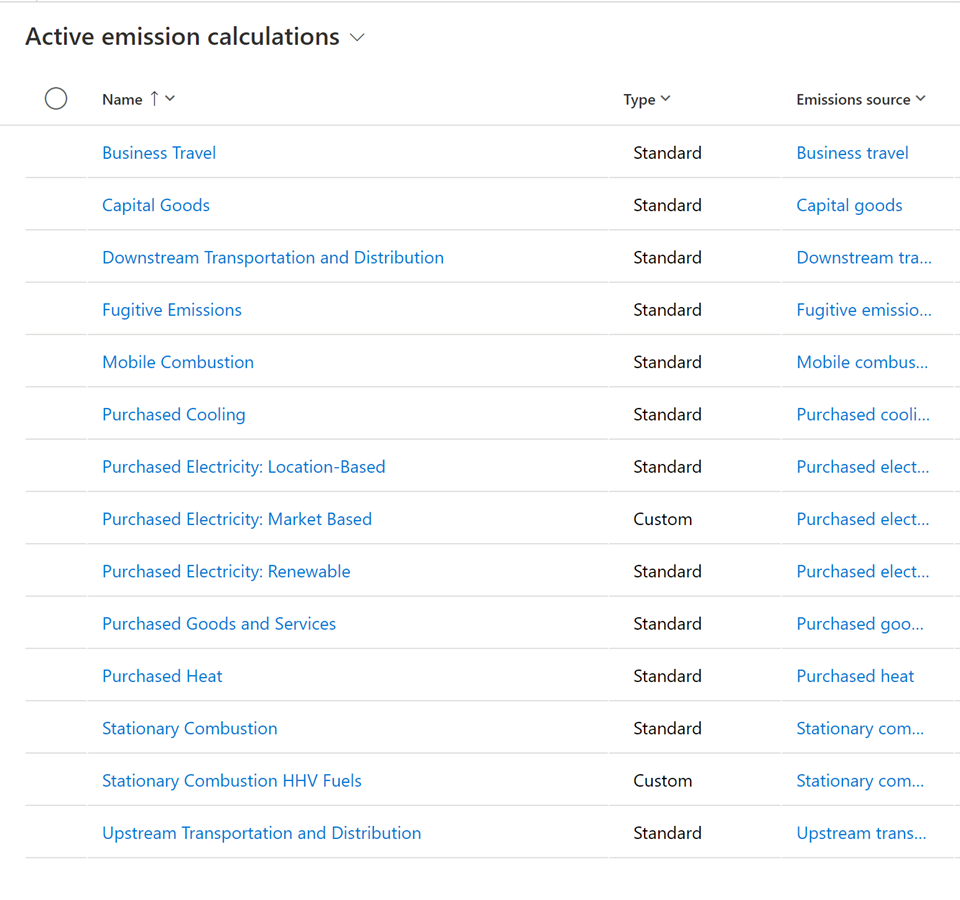
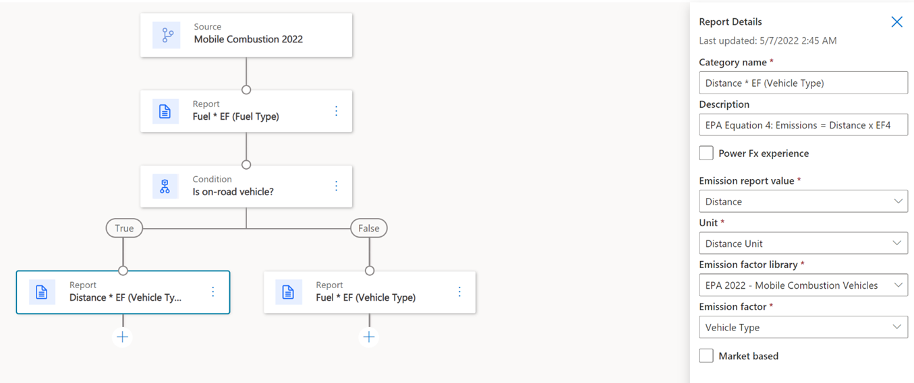

The lack of global standards for calculating carbon emissions is one of the greatest challenges that customers face. However, Sustainability Manager uses dynamic calculation models based on the Greenhouse Gas (GHG) Protocol to calculate Scopes 1, 2, and 3 carbon emissions. 

More sophisticated organizations can generate more accurate results by customizing the emission factors and formulas that they use in the solution to convert raw data into calculated emissions. 

Currently, Sustainability Manager has been verified with Environmental Protection Agency (EPA) default calculations and factor sets only. Organizations can add any factor set based on their own business needs and regional requirements. 

At launch, Sustainability Manager includes prebuilt calculation methods for Scope 1 and Scope 2 activities and several Scope 3 categories. They’re primarily based on the Greenhouse Gas Protocol. Included models are purchased goods and services, capital goods, upstream and downstream transportation and distribution, and business travel. 

> [!div class="mx-imgBorder"]
> 

Other default calculation models are available within Sustainability Manager. You can copy these models if you want to edit them based on organizational need or a specific function, while retaining the out-of-the-box industry standard.

The steps to copy calculation models from Sustainability Manager are illustrated in the following diagram.

> [!div class="mx-imgBorder"]
> 

> [!NOTE]
> Each step, which is shown by a node in the model, has different metadata. The metadata is listed on the right side of the screen. The variety of metadata within each step of the calculation, and the solution’s ability to connect to outside sources, is what makes Sustainability Manager so flexible, dynamic, and prominent in the user interface.

## Build a calculation

The process of building a calculation from end to end results in a more accurate measurement of greenhouse gas emissions. 

The process that has been set up to calculate emissions from combustion vehicles will continuously produce accurate reporting. These calculations will continue as the customer replaces older vehicles with new ones, changes gas-powered vehicles to electric, or adds new regions to their operations. 

The process of building a calculation from end to end is as follows: 
- **Model** - Begin by enabling models, which contain formulas and connect to specific emission factors based on the activity or scenario. You won’t run the calculation from the model; rather, it’s where you’ll build specifications for the formulas. 

- **Library** - Models connect to a library, which makes it possible to consume emission or estimation factors. In this case, the factors are a fleet of gasoline-consuming vehicles. 

- **Factor and factor mappings** - The library also contains factor mapping, which connects a factor to specific reference data based on a specific data pattern. Mapping simplifies the models to be created. 

- **Profiles** - Models are inputs to profiles. Profiles are where the calculation is implemented. Profiles put formulas into action, connect to data outside of libraries, and calculate the emissions that resulted from the activity. Emission measurements are generated by profiles. When a profile has been set up, it can dynamically calculate recent activity as it comes in. 

- **Greenhouse gases (GWPs)** - One great aspect of Sustainability Manager is that it can produce CO2-equivalent emissions data. Multiple gases are emitted by human activity that contribute to global warming, including carbon dioxide (CO2), methane (CH4), and nitrous oxide (N2O). These gases trap heat at various levels of efficacy and remain in the atmosphere for different lengths of time. These complexities can make describing the true impact of global warming economic activity difficult, which is why it can be helpful to have a unified metric.

    Sustainability Manager multiplies the emissions of CH4 and N2O by the respective global warming potential (GWP) to calculate CO2-equivalent emissions. As a result, it creates a unified and user-friendly figure. GWPs are preloaded into Sustainability Manager.

## Recommended practices for emissions calculations	

Keep the following important considerations in mind when you’re setting up emission calculations: 
- Pay special attention to factor mapping to optimize the number of required models.

- Consider special naming conventions to support specialized calculations for facilities that have specific operations that require different emission factors.

- Test with a small set of data first and remove emissions data that produces errors. You can remove data in bulk directly in the emissions form or from the [Microsoft Power Apps](https://make.preview.powerapps.com/environments/839eace6-59ab-4243-97ec-a5b8fcc104e4/home/?azure-portal=ture).

- Observe conversion units based on activity and model units because missing conversions will cause errors during import.

## Models – Formula-in-action

After your emission factors and other reference data are in place, you can start to design the calculations that you’ll use to calculate the emissions that are produced by your activity data. The setup of the calculations breaks down into two concepts: factors mappings and calculation models. 

Another common example that many organizations will use is a model of Scope 2 emissions from purchased electricity. In other words, the amount of carbon, methane, and other gases that an organization emits by using electricity that’s generated by coal or natural gas-powered power plants.

You can build this model in three steps:

1. Determine the amount of electricity that the organization has purchased.

2. Determine emission factors, which will be datasets on the power-generation mix-in relevant regions and times of day.

3. Calculate emissions in the profile. 

You might have to repeat some milestones and steps many times to enable all scenarios. However, you should focus on enabling one scenario first. 

For example, if you decide to begin calculating emissions for purchased electricity under Scope 2, then you’ll follow the whole configuration process once to bring in the reference data that’s connected to that activity (including contractual instrument types, if they’re applicable) and to bring in the models, emission factors, profiles, and so on. Then, you’ll view the results of this process in the automatically generated analysis reports. By observing the end-to-end process in action with minimal data, you can expand your solution for other sources of emissions. Start simple and keep expanding.

## Steps to build a model

Now that you’ve learned about the basics of what a model is and where it sits within the calculation, you can build a model.

> [!div class="mx-imgBorder"]
> 

Always start the model by defining the source, which means the source of the emissions. In this example, you’ll use activity data for Purchased Electricity. 

Some fields are mandatory in these formula descriptions. A flag will appear next to the source if fields are incomplete. These fields will document important references for the formulas, so the information is available to everyone. 

Part of setting up the action involves defining the steps. Different calculation method nodes are available to the user. Each node has specific purposes to build robust calculations, as described in the following table. 

|     **Calculation method nodes**    |     **Purpose**    |
|---|---|
|     **Calculation**    |     Calculation directly done in   the formula without the need to consume emission factors from the library.   Rather, the output is stored on a defined variable.    |
|     **Report**    |     Calculation using emission   factors from the library dynamically, based on the context that’s defined. You   can use an output value from a previous calculation. Market-based can be   flagged so that analytics will consider this emission.          |
|     **Report   gas**    |     This method doesn’t use the   factor library. It calculates greenhouse gases by using global warming   potential (GWP).    |
|     **Estimation factors**    |     This node is a combination of   the calculate and report nodes. In this node, you’ll collect activity data,   apply an estimation factor to convert the data, and then store the output in   a variable. This variable can be pulled into the report node to calculate   emissions. It enables you to calculate real activity data from proxy data,   such as converting square footage to kwh.    |

You can use these methods together to create complex formulas. 

Different data requires different calculations, even within one calculation model. This scenario is where you can create a condition. This juncture in the formula is where you can create a true/false decision path. You can enable multiple scenarios for each calculation model with conditions. These decision paths add nodes to your formulas and make calculations flexible based on real activity data.
