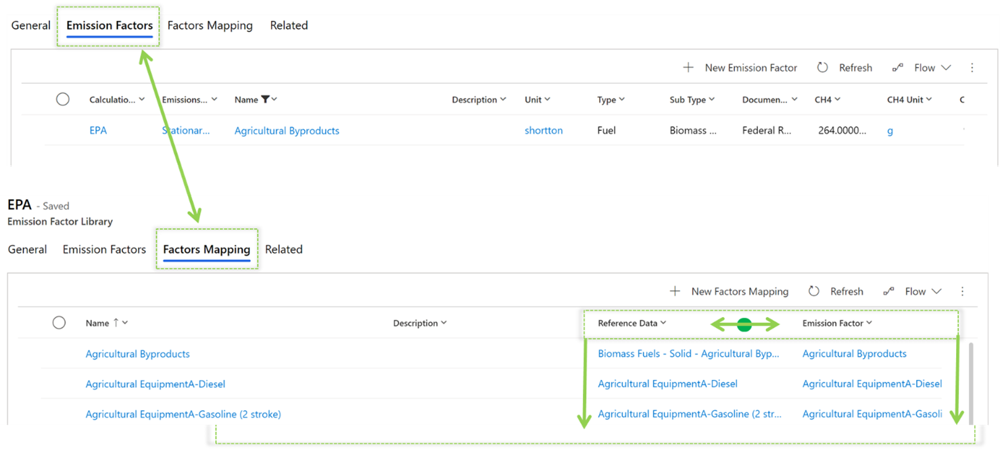

Consider a scenario where you need to calculate mobile combustion for gas-powered passenger vehicles of all model years. 

You can identify the correct emission factors by:
- Mapping directly to specific emission factors by fuel type.
- Mapping in advance by using the library for all fuel types and emission factors.

**Example Scenario 1**

You can set emission factor directly in the formula as Gasoline Passenger Car 2000 and then use its calculations in this formula, working only for this combination.
This approach requires you to create several formulas according to available fuel types, resulting in a complex setup.

**Example Scenario 2**

When you select a factors mapping of Fuel Type (reference data), the formula will use the library to dynamically search for the factor, and to find a match with the correct emission factor and fuel type for the activity. This approach simplifies the number of formulas but requires you to define a factors mapping in the library.

Before factors mapping can occur, you’ll need to set up emission factors and reference data. Make sure that you include a factors mapping for each piece of reference data in a category. If a calculation is based on factors mapping, but you haven’t mapped one piece of reference data, the calculation will fail because the factors mapping can’t be assigned.

> [!div class="mx-imgBorder"]
> 

