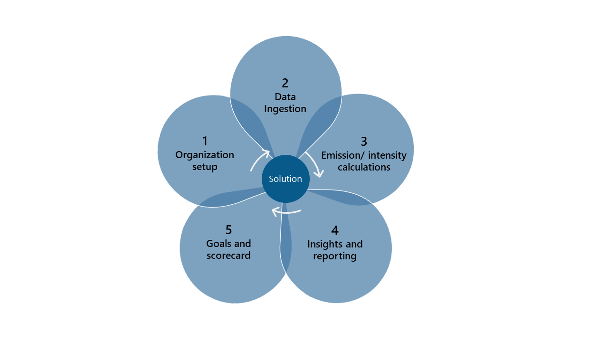
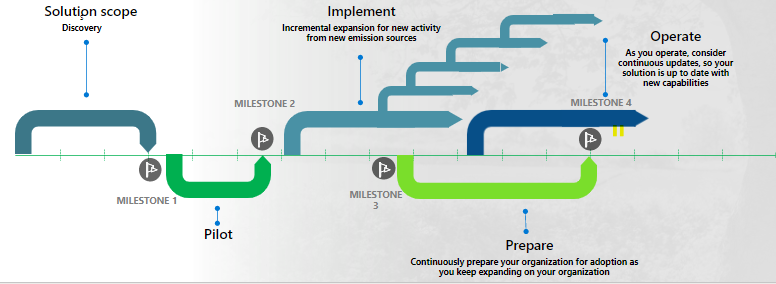

Microsoft Sustainability Manager solution unifies data intelligence to help organizations monitor and manage their sustainability performance at any stage of their sustainability journey. This solution enables organizations to record, report, and reduce carbon emissions and water or waste impact.
 
## Solution focus areas

The key solution focus areas for Sustainability Manager, and what different professionals within your organization will be prioritizing, are:

1. Organization setup

1. Data ingestion

1. Emission, water, and waste calculations

1. Insights and reporting

1. Goals and scorecard 

Organization setup and data ingestion can be of interest to IT-focused professionals. Operations managers will be instrumental in defining the organization, providing data, and using the intelligence that they gain about their own operations.

Calculations for emission and  water intensity, insights and reporting, scorecards, and goals are important for sustainability officers. Business leaders will also be interested in the analytics, reports, and insights that are generated.

## Recommendations for implementing Sustainability Manager

> [!div class="mx-imgBorder"]
> 

Consider the following recommendations when implementing Sustainability Manager:

- **Discovery** - Start simple and define a strategy that considers organization and operational boundaries and data availability and formats. 

- **Pilot** - Enable a pilot that allows you to visualize an end-to-end full cycle and demonstrate the value of the solution. Then, refine your strategy based on what you’ve learned. Connect it to specific scenarios so that configuration and adoption can scale in future iterations as you bring in more activity from emissions sources and organization units/facilities.

- **Implement** - Start small and keep growing. Take an incremental approach.

- **Prepare** - Take advantage of the in-app configuration guide that gives contextual and actionable guidance with assets for every step of the configuration journey. The guide provides the Microsoft-recommended configuration path to support success in adoption, helping organizations realize value faster.

- **Operate** - Continue to improve your approach to reduce, replace, or remove your footprint across how your products and facilities are sourced, manufactured, operated, and managed at end-of-life.
