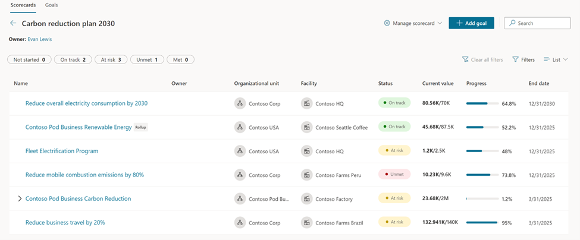
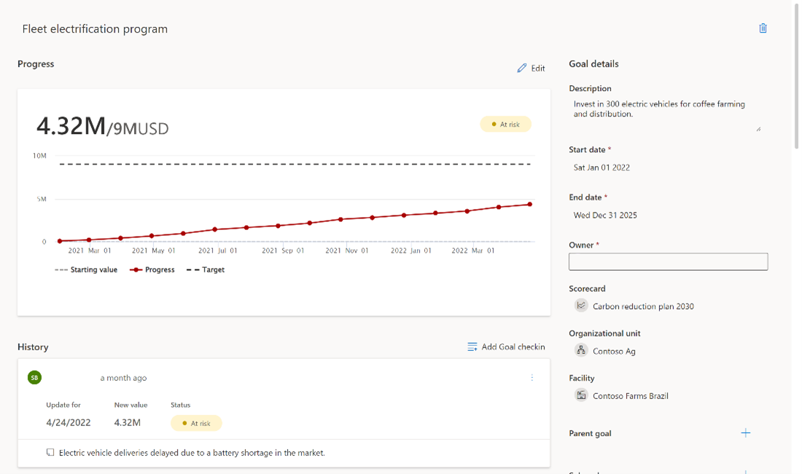

Scorecards and Goals allow organizations to monitor progress against data-driven goals. They can help you curate sustainability metrics and track them against your company's key business objectives. After you’ve created a scorecard that includes some goals, you can periodically check on the scorecard’s progress and make required adjustments.

Additionally, you can have manual goals with the ability to connect to data and set rules for automatic status updates. You can enable several scorecards and goals and subgoals.

Scorecards and goals are manually updated or connected to data for automatic check-ins with optional Microsoft Teams collaboration.

## Scorecards

When goals are connected to data, the service will run periodically and manage updates. 

The status updates can be data-driven and dynamic, and they’ll continue to adjust if you connect goals to data and set rules to determine the status as data is collected. You can compare the goals and progress on the **Scorecards** page.

> [!div class="mx-imgBorder"]
> 

In this case, it’s showing that the Fleet Electrification Program Europe is at risk, based on these values. 

> [!div class="mx-imgBorder"]
> 

## Goals

Review the details of the goal. As you review the details of the goal, you can add notes to record your observations. This step is useful for stakeholders when they’re reviewing goals to help understand why they might be behind and to inform them of what they should do next. 

You can use the Microsoft Teams for collaboration and chat feature to allow primary Sustainability Manager users, such as facility managers to CFOs, to collaborate with anyone who contributes to sustainability goals. This feature allows stakeholders to communicate and make decisions about data or insights. 

The Microsoft Teams integration feature also tracks and stores the conversation in context for ease of reference later. The integration feature is built on Microsoft Dynamics 365 capabilities, and it was made available in preview when Microsoft Sustainability Manager was released in GA (general availability). 

You can enable the Microsoft Teams integration feature in Settings. You can also select the type of records for which you want to enable Teams collaboration, such as the Emissions data record. 

To initiate a conversation, create a new linked chat, find the team member that you want to contact, and then add a message. 

This record will be tracked in Teams, so whenever you open a linked record, the conversation will be available. All participants have access to the specific record in context. 
