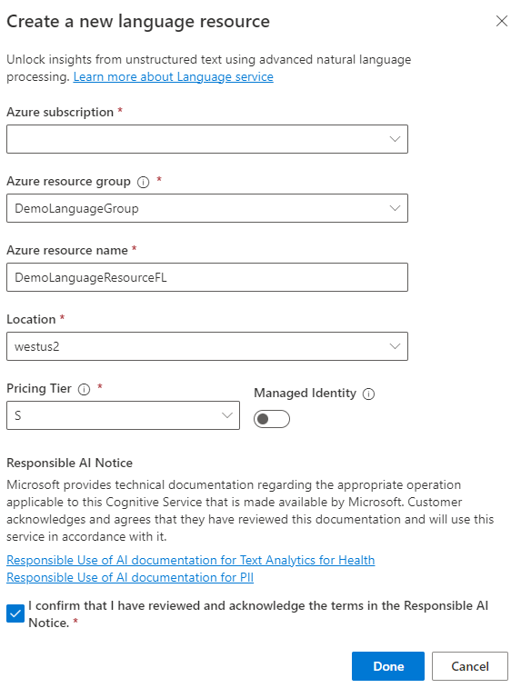
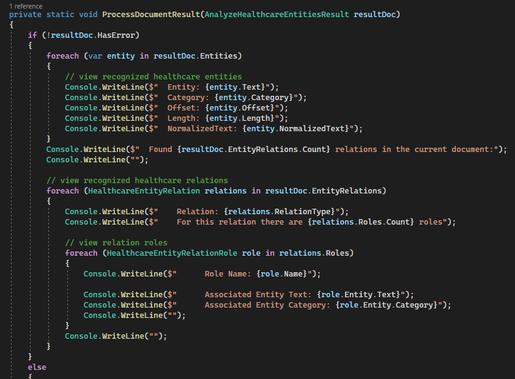
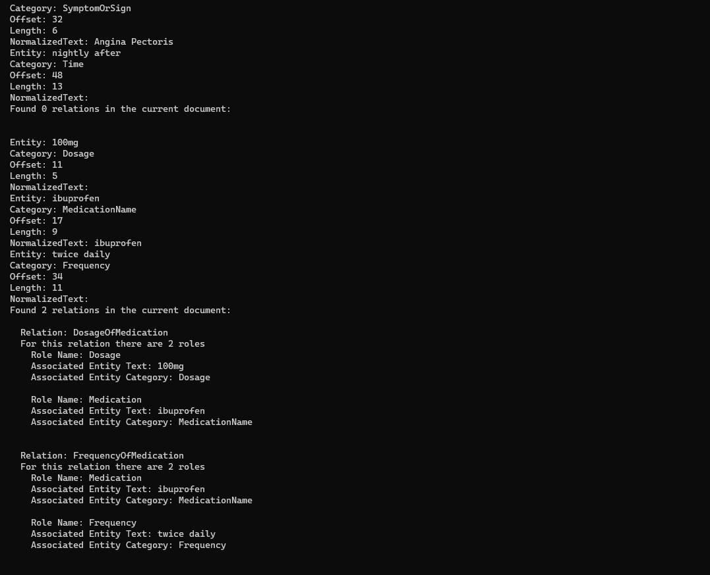

In these exercises, you'll set up the resources to use Text Analytics for health and the steps to create a .NET application.

## Exercise - Set up resources to use Text Analytics for health

In this exercise, you'll create an Azure subscription and language resource, and then you'll copy the key and endpoint of the language resource. 

### Task - Create an Azure subscription and resource group

If you already have an Azure subscription, skip to the next task.

1. Go to [Discover AI services with an Azure free account](https://azure.microsoft.com/free/ai/?azure-portal=true) and **Sign in**.

1. Select **Start free**.

1. Enter the details in the form and then select **Next**.

1. Provide payment information and then select **Sign up**.

1. After creating the Azure subscription, select **Resource groups**.

   > [!div class="mx-imgBorder"]
   > 

1. Select **Create**.

   > [!div class="mx-imgBorder"]
   > 

1. Select the subscription that you created, enter **DemoLanguageGroup** in the **Resource group** field, select your **Region**, and then select **Review + create**.

   > [!div class="mx-imgBorder"]
   > 

1. Select **Create**.

### Task - Create a language resource

If you've already created a language resource, skip to the next task.

1. Go to [Language Studio](https://aka.ms/languageStudio/?azure-portal=true) in Azure Cognitive Services and sign in.

1. Select your **Azure directory** and **Azure subscription** and then select **Create a new language resource**.

   > [!div class="mx-imgBorder"]
   > 

1. Select your **Azure subscription**, select the **Azure resource group** that you created, enter **DemoLanguageResourceFL** (replace **FL** with your initials) for the **Azure resource name**, select your **Location**, select **S** for **Pricing Tier**, and then select **Done**.

   > [!div class="mx-imgBorder"]
   > 

1. After you've created the language resource, select **Done**.

### Task - Copy the key and endpoint
In this task, you'll copy the key and endpoint by following these steps:

1. Go to the [Microsoft Azure portal](https://portal.azure.com/?azure-portal=true) and sign in.

1. Locate and open the language resource that you created.

   > [!div class="mx-imgBorder"]
   > [](../media/resources.png#lightbox)

1. Select **Keys and Endpoint**.

1. Copy **Key 1** to the clipboard.

   > [!div class="mx-imgBorder"]
   > [](../media/copy-key.png#lightbox)

1. Save the key that you copied on a notepad. You'll need this key in subsequent tasks.

1. Copy the **Endpoint** URL.

1. Save the URL on a notepad. You'll need this URL in the subsequent steps.

## Exercise - Create a .NET application

In this exercise, you'll create a console application that analyzes documents by using Azure AI Text Analytics.

### Task - Create an application
In this first task, you'll create an application:

1. Start Visual Studio 2022.

1. Select **File > New > Project**.

1. Select **Console App** and then select **Next**.

1. Enter **LanguageApp** for the **Project name** and then select **Next**.

1. Select the **Do not use top-level statements** checkbox and then select **Create**.

   > [!div class="mx-imgBorder"]
   > 

1. Right-click the project and then select **Manage NuGet Packages**.

1. Select the **Browse** tab, search for and select **Azure.AI.TextAnalytics**, select the stable version, and then select **Install**.

   > [!div class="mx-imgBorder"]
   > [](../media/install.png#lightbox)

1. Close the **NuGet Package Manager** tab.

1. Open the **Program.cs** page and then add the following **using** statements.

   ```csharp
   using Azure;
   using System;
   using Azure.AI.TextAnalytics;
   using System.Collections.Generic;
   using System.Threading.Tasks;
   ```

1. Add the following code inside the **Program** class. Replace **KEY** with the key that you copied from Azure and then replace the **ENDPOINT** URL with the one that you copied from Azure.

   ```csharp
   private static readonly AzureKeyCredential _credentials = new AzureKeyCredential("KEY");
   private static readonly Uri _endPoint = new Uri("ENDPOINT");
   ```

   > [!div class="mx-imgBorder"]
   > 

1. Add the following method to the **Program** class.

   ```csharp
   static async Task ProcessDocuments(TextAnalyticsClient client, List<string> batchInput)
   {
       AnalyzeHealthcareEntitiesOperation healthOperation = await client.StartAnalyzeHealthcareEntitiesAsync(batchInput);
       await healthOperation.WaitForCompletionAsync();

       await foreach (AnalyzeHealthcareEntitiesResultCollection resultDocs in healthOperation.Value)
       {
           Console.WriteLine($"Results of Azure Text Analytics for health async model, version: "{resultDocs.ModelVersion}"");
           Console.WriteLine("");

           foreach (AnalyzeHealthcareEntitiesResult resultDoc in resultDocs)
              ProcessDocumentResult(resultDoc);
       }
   }
   ```

1. Add the following method to the **Program** class. This method checks if the document had errors; if not, the method will display all identified entities and relations that have been discovered between those entities.

   ```cs
   private static void ProcessDocumentResult(AnalyzeHealthcareEntitiesResult resultDoc)
   {
   }
   ```

1. Add the following **if** statement to the **ProcessDocumentResult** method. The **if** statement checks for errors and shows an error message if errors have occurred.

   ```csharp
   if (!resultDoc.HasError)
   {

   }
   else
   {
       Console.WriteLine("  Error!");
       Console.WriteLine($"  Document error code: {resultDoc.Error.ErrorCode}.");
       Console.WriteLine($"  Message: {resultDoc.Error.Message}");
   }
   Console.WriteLine("");
   ```

1. Add the following **for-each** statement inside the **if** statement to show all recognized healthcare entities.

   ```csharp
   foreach (var entity in resultDoc.Entities)
   {
       // view recognized healthcare entities
       Console.WriteLine($"  Entity: {entity.Text}");
       Console.WriteLine($"  Category: {entity.Category}");
       Console.WriteLine($"  Offset: {entity.Offset}");
       Console.WriteLine($"  Length: {entity.Length}");
       Console.WriteLine($"  NormalizedText: {entity.NormalizedText}");
   }
   Console.WriteLine($"  Found {resultDoc.EntityRelations.Count} relations in the current document:");
   Console.WriteLine("");
   ```

1. Add the following **for-each** statement inside the **if** statement to show all recognized healthcare relations.

   ```csharp
   // view recognized healthcare relations
   foreach (HealthcareEntityRelation relations in resultDoc.EntityRelations)
   {
       Console.WriteLine($"    Relation: {relations.RelationType}");
       Console.WriteLine($"    For this relation there are {relations.Roles.Count} roles");

       // view relation roles
       foreach (HealthcareEntityRelationRole role in relations.Roles)
       {
           Console.WriteLine($"      Role Name: {role.Name}");

           Console.WriteLine($"      Associated Entity Text: {role.Entity.Text}");
           Console.WriteLine($"      Associated Entity Category: {role.Entity.Category}");
           Console.WriteLine("");
       }
       Console.WriteLine("");
   }
   ```

   The **if** statement will resemble the following image.

   > [!div class="mx-imgBorder"]
   > 

1. Create a Text Analytics client by using your key and endpoint URL. Add the following code inside the **Main** method.

   `var client = new TextAnalyticsClient(_endPoint, _credentials);`

1. Create the string that you want to analyze. Add the following code inside the **Main** method.

   ```csharp
   List<string> batchInput = new List<string>()
   {
       "57 year old male, presents with angina occurring nightly after meal time"
   };
   ```

1. Call the process documents method by passing the client and the text to analyze. Add the following code inside the **Main** method.

   `await ProcessDocuments(client, batchInput);`

1. Make the **Main** method **async** that returns **Task**.

   The **Main** method should now resemble the following image.

   > [!div class="mx-imgBorder"]
   > 

1. Run the application.

1. The output should resemble the following image.

   > [!div class="mx-imgBorder"]
   > [](../media/output.png#lightbox)

1. Stop the application.

1. Add another document to the **patchInput** of "Prescribed 100-mg ibuprofen, taken twice daily."

   > [!div class="mx-imgBorder"]
   > 

1. Run the application again.

1. The output will resemble the following image.

   > [!div class="mx-imgBorder"]
   > 

1. Stop the application.

1. Try providing your own documents for analysis and then review the application output.
