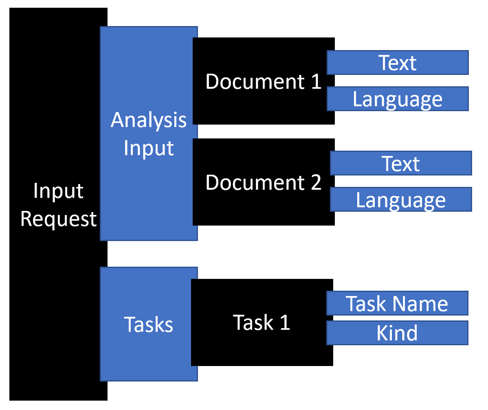
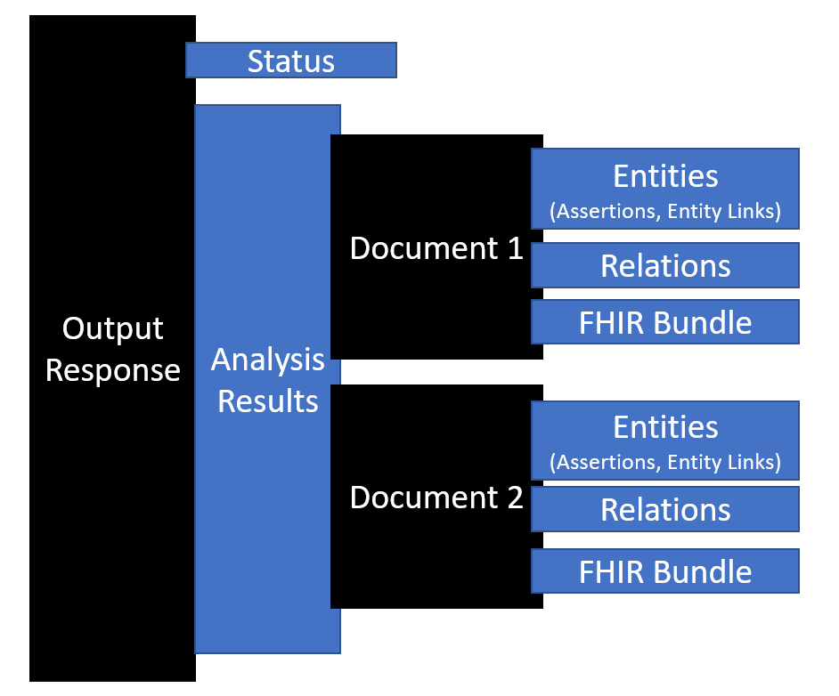

By using Text Analytics for health, a feature of Microsoft Azure Cognitive Services, you can convert unstructured health data into structured health data to get valuable insights. Text Analytics for health is a prebuilt feature of Azure Cognitive Service for Language.

You can use Text Analytics for health as a hosted cloud service, or you can deploy it by using the Docker containers. By using the cloud service, you can use the API immediately after provisioning. Conversely, the container option allows you to bring the service closer to your data for compliance, security, and other operational reasons.

The four different SDKs that are available in these languages are:

- .NET

- Python

- Java

- Node.js.

Additionally, you'll use the REST API for the cloud service and the containerized service. You can use the REST API from any logic that can make REST API requests and interpret the JSON response.

## Service input

When you make a request to Text Analytics for health, you're preparing an input request that contains one or more documents that you want to process. Each document can indicate the language of the unstructured text.

> [!NOTE]
> You can include up to 25 documents for the cloud service API and 1,000 for the container API (up to 125,000 characters in total).

A task indicates what type of analysis to perform on the document collection. For Text Analytics for health, you would include one task with the **kind** property set to **HealthCare**. When you use the SDKs, the SDK logic will set up a task for you, and you can specify options on the API call that will set up values on the task. The following diagram illustrates an input request.

> [!div class="mx-imgBorder"]
> 

## Service output

The output from Text Analytics for health includes a status that allows you to check if the processing is complete and review the results of the analysis of the input data. Each successfully processed document has a collection of identified entities and relations. If the input request includes a Fast Healthcare Interoperability Resource (FHIR) version, the output contains a FHIR bundle that contains the FHIR resources. The following diagram illustrates an output response.

> [!div class="mx-imgBorder"]
> 

The request and response will vary slightly between the REST API and the SDKs. The REST API uses JSON to represent the data, while each SDK has its own object structure similar to the JSON objects but designed to make using the SDK simpler.

> [!NOTE]
> When you send a request to the service, you'll need to specify an API version and a health AI model version. These versions are independent, and you can set up the versions separately.

## API version

The API version is related to the Azure Cognitive Service for Language API versioning. When you use the SDKs, the SDK version will control the API version that you use.

For example, if you installed the **5.2.0 Azure.AI.TextAnalytics NuGet** package for .NET, you'd use an API version of 2022-05-01. If you installed the preview of the same **NuGet 5.3.0-beta.1**, you'd use an API version of 2022-10-preview.

When you use the REST API, you'll set up the API version on the URL of the service request, such as `/language/analyze-text/jobs?api-version=2022-05-01`. We recommend that you use the latest non-preview SDK or API version unless you're testing a specific preview feature.

## Health AI model versions

A pretrained health AI model will process your request when you use the service. The model has a version, and you can set up your requests to use a specific model version. By default, your cloud service requests will process by using the latest generally available health AI model. Only one model version is available for each container when you're using the containerized service. Therefore, the container that you deploy will determine the health module version that's used.

In some cases, a model can be in preview, indicated by the word **preview** in the version string. For example, `2022-08-15-preview` would be an example of a preview version string. Similar to the API version, we recommended that you stay on the latest non-preview version unless you're testing a specific preview feature.

## Language support

Text Analytics for health supports English in the cloud service and containers. You can also specify these other languages:

- **English** - en

- **Spanish** - es

- **French** - fr

- **German** - de

- **Italian** - it

- **Portuguese** - pt

- **Hebrew** - he

When using containers, make sure that you use a container image with the languages that you use. You should [review the container languages](/azure/cognitive-services/language-service/text-analytics-for-health/language-support?azure-portal=true#details-of-the-supported-model-versions-for-each-language) before deploying.

You can include the language code on each document in your request. The following example shows a document that requests Spanish processing of the text.

```json
{
    "analysisInput": {
        "documents": [
            {
                "text": "El médico prescrió 200 mg de ibuprofenoIbuprofeno de 100 mg prescrito, dos veces al día.",
                "language": "es",
                "id": "1"
            }
        ]
    },
    "tasks": [
        {
            "taskName": "analyze 1",
            "kind": "Healthcare",
        }
    ]
}
```

The service will default to processing the document by using English if you don't specify a language on the input.

If you handle text with multiple languages, you can use the **Detect Language** feature of Azure Cognitive Service for Language to first determine the language of the text. The following example demonstrates the use of that feature:

```cpp
DetectedLanguage detectedLanguage = client.DetectLanguage("rnIbuprofeno de 100 mg prescrito, dos veces al día.");
Console.WriteLine("Language:");
Console.WriteLine($"t{detectedLanguage.Name},tISO-6391: {detectedLanguage.Iso6391Name}n");
```

With the language determined, you can properly request processing from Text Analytics for health by using the language detected.

> [!NOTE]
> In the latest preview version, you can specify the language as **auto**, which will indicate to the service that it should determine the language first before processing the document. This option automates the language detection call that was previously discussed, and it allows the service to do the call on your behalf.

In the subsequent units, you'll explore how to use the cloud and container service by using the REST API and the SDKs.
