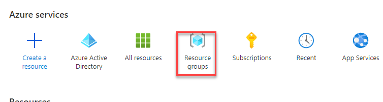
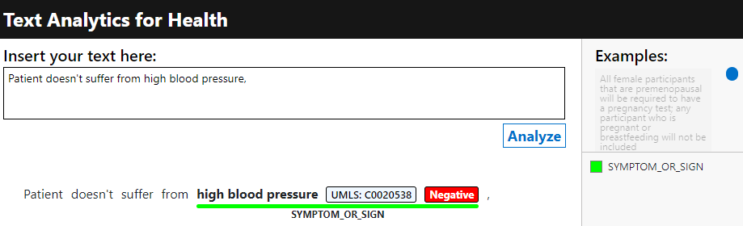

## Exercise - Create a language resource

In this exercise, you'll create an Azure subscription and a language resource, and then you'll copy the key and endpoint of the language resource that you created.

### Task - Create an Azure subscription and a resource group

If you already have an Azure subscription, skip to the next task.

1. Go to [Discover AI services with an Azure free account](https://azure.microsoft.com/free/ai/?azure-portal=true) and **Sign in**.

1. Select **Start free**.

1. Fill out the form and then select **Next**.

1. Provide payment information and then select **Sign up**.

1. After creating an Azure subscription, select **Resource groups**.

   > [!div class="mx-imgBorder"]
   > 

1. Select **Create**.

   > [!div class="mx-imgBorder"]
   > 

1. Select the subscription that you created, enter **DemoLanguageGroup** for the **Resource group**, select your **Region**, and then select **Review + create**.

   > [!div class="mx-imgBorder"]
   > 

1. Select **Create**.

### Task - Create a language resource

If you've already created a language resource, skip to the next task.

1. Go to [Language Studio](https://aka.ms/languageStudio/?azure-portal=true) and sign in.

1. Select your **Azure directory** and **Azure subscription** and then select **Create a new language resource**.

   > [!div class="mx-imgBorder"]
   > 

1. Select your **Azure subscription**, select the **Azure resource group** that you created, and then enter **DemoLanguageResourceFL** (replace **FL** with your initials) for the **Azure resource name**. Select your **Location**, select **S** for **Pricing Tier**, and then select **Done**.

   > [!div class="mx-imgBorder"]
   > 

1. After you've created the language resource, select **Done**.

### Task - Copy the key and endpoint
Your next task is to copy the key and endpoint by following these steps:

1. Go to the [Microsoft Azure portal](https://portal.azure.com/?azure-portal=true) and sign in.

1. Locate and open the language resource that you created.

   > [!div class="mx-imgBorder"]
   > 

1. Select **Keys and Endpoint**.

1. Copy **Key 1** to the clipboard.

   > [!div class="mx-imgBorder"]
   > 

1. Save the key you that copied on a notepad. You'll need this key in future tasks.

1. Copy the **Endpoint** URL.

1. Save the URL on a notepad. You'll need this URL in future steps.

## Exercise - Install WSL and Docker

In this exercise, you'll install the Windows Subsystem for Linux and Docker on Windows 10 or 11. If you aren't using Windows, go to [Get Docker | Docker Documentation](https://docs.docker.com/get-docker/?azure-portal=true) and follow the instructions for the operating system that you're using.

If you already have Docker installed on your machine, skip to the next exercise.

### Task - Install Windows Subsystem for Linux
To install the Windows Subsystem for Linux, follow these steps:

1. Locate your **Command Prompt** and select **Run as administrator**.

   > [!div class="mx-imgBorder"]
   > 

1. Select **Yes**.

1. Run the following command to install **Windows Subsystem for Linux**. This command will install the default **Ubuntu** distribution.

   `wsl --install`

   > [!div class="mx-imgBorder"]
   > 

1. Select **Yes** and then wait for the installation to complete.

1. Ensure that **Ubuntu** is installed successfully.

   > [!div class="mx-imgBorder"]
   > 

### Task - Install Docker for Windows
Follow these steps to install Docker for Windows:

1. Go to [Get Docker | Docker Documentation](https://docs.docker.com/get-docker/?azure-portal=true).

1. Select the operating system that you're using. In this exercise, you'll install Docker Desktop for Windows.

   > [!div class="mx-imgBorder"]
   > 

1. Select to download **Docker Desktop for Windows**.

1. Run the **Docker Desktop Installer** that you downloaded.

   > [!div class="mx-imgBorder"]
   > 

1. Select **Yes** if prompted.

1. Select **OK**.

   > [!div class="mx-imgBorder"]
   > 

1. Wait for the installation to complete.

1. Select **Close and restart**.

   > [!div class="mx-imgBorder"]
   > 

   Docker should launch after your computer restarts.

1. Read the agreement and select **Accept** if you agree.

1. Select **Sign in**.

   > [!div class="mx-imgBorder"]
   > 

1. Select **Sign Up** for personal account if you don't have a Docker account.

## Exercise - Set up and run Docker

In this exercise, you'll set up and run Docker.

### Task - Download and run the latest Docker version
To download and run the latest Docker version, follow these steps:

1. Open **Command Prompt**.

1. Run the following command, which will install the latest container version of Text Analytics for health.

   `docker pull mcr.microsoft.com/azure-cognitive-services/textanalytics/healthcare:latest`

   > [!div class="mx-imgBorder"]
   > 

1. Wait for the installation to complete.

1. In the command prompt, run the following command. Replace `{ENDPOINT_URL}` and `{API_KEY}` with the URL and key that you copied from Azure.

   `docker run --rm -it -p 5000:5000 mcr.microsoft.com/azure-cognitive-services/textanalytics/healthcare:latest Eula=accept rai_terms=accept Billing={ENDPOINT_URI} ApiKey={API_KEY}`

1. Select **Allow access** if Windows Defender prompts you.

## Exercise - Use the container

This example shows you how to use the container to analyze single documents by using a demo user interface.

### Task - Use the container
Follow these steps to use the container:

1. Go to the Docker app and select **Containers**.

1. Open the **Port** link.

   > [!div class="mx-imgBorder"]
   > 

1. Add **/demo** to the end of the URL and then press the **ENTER** key.

   > [!div class="mx-imgBorder"]
   > 

1. Enter **Patient doesn't suffer from high blood pressure**, or provide your own text, and then select **Analyze**.

   > [!div class="mx-imgBorder"]
   > 

   The result should resemble the following image.

   > [!div class="mx-imgBorder"]
   > 

1. Provide the following in-depth text and then select **Analyze**.

   > HISTORY OF PRESENT ILLNESS: The patient is a 54-year-old gentleman with a history of progressive angina over the past several months. The patient had a cardiac catheterization in July of this year revealing total occlusion of the RCA and 50% left main disease, with a strong family history of coronary artery disease with a brother dying at the age of 52 from a myocardial infarction and another brother who is status post coronary artery bypass grafting. The patient had a stress echocardiogram done in July, 2001, which showed no wall motion abnormalities, but this was a difficult study due to body habitus. The patient went for six minutes with minimal ST depressions in the anterior lateral leads, thought due to fatigue and wrist pain, his anginal equivalent. Due to the patient's increased symptoms and family history and history left main disease with total occasional of his RCA was referred for revascularization with open heart surgery.

1. The result will resemble the following image. Hover your mouse pointer on the relation arrows to view the type of relation. Select the entities that have a UMLS value attached to them and then you can view the normalized name of the entity. The **show JSON** button allows you to view the raw results.

   > [!div class="mx-imgBorder"]
   > 

## Exercise - Explore available endpoints

In this exercise, you'll explore the available endpoints for the container.

### Task - Explore endpoints
To explore the available endpoints, follow these steps:

1. Go to `http://localhost:5000/swagger` to view the available API for the container.

1. Scroll down to the **Health** section, and then locate and expand `/text/analytics/v3.1/entities/health`.

   > [!div class="mx-imgBorder"]
   > 

1. Select **Try it out**.

   > [!div class="mx-imgBorder"]
   > 

1. Review the **Request body** and then select the **Execute** button.

   > [!div class="mx-imgBorder"]
   > 

1. Review the **Response body**.

   > [!div class="mx-imgBorder"]
   > 

## Exercise - Call the container from the .NET application

In this exercise, you'll use the API from the .NET application that you created. If you don't have a .NET application, use the application from Cloud Service Lab or in the resources folder.

### Task - Explore the application
To explore the application, follow these steps:

1. Start Visual Studio and then open the .NET application.

1. If you're using the application that you created, edit the application by providing space as the **-credentials** and `http://localhost:5000` as the **-endPoint**.

   > [!div class="mx-imgBorder"]
   > 

1. Run the application.

1. View the results, as shown in the following image.

   > [!div class="mx-imgBorder"]
   > 

1. Stop the application.
