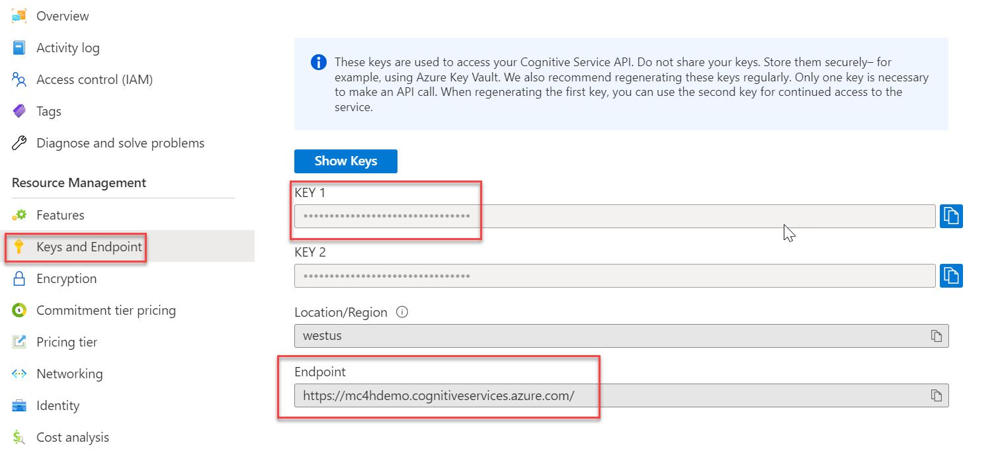

You can use the SDKs for .NET, Python, Java, or Node.js to process Text Analytics for health requests. The SDKs simplify some of the work that's necessary for interacting with the service API. For example, they simplify the process of building the service request and handle the paging of data from the service. Additionally, the SDKs help make it easier for you to navigate the results from the service.

Each SDK is open-source on GitHub, and you can review the code, contribute, and open issues. The following links are to each SDK on GitHub:

- [.NET](https://github.com/Azure/azure-sdk-for-net/tree/main/sdk/textanalytics/Azure.AI.TextAnalytics/?azure-portal=true)

- [Python](https://github.com/Azure/azure-sdk-for-python/tree/main/sdk/textanalytics/azure-ai-textanalytics/?azure-portal=true)

- [Node.js](https://github.com/Azure/azure-sdk-for-js/tree/main/sdk/textanalytics/ai-text-analytics/?azure-portal=true)

- [Java](https://github.com/Azure/azure-sdk-for-java/tree/main/sdk/textanalytics/azure-ai-textanalytics/?azure-portal=true)

You'll complete the following steps when using the SDK to process unstructured health text:

1. Reference the SDK.

1. Authenticate and initiate the service client.

1. Build a list of documents to process.

1. Set up options for processing the documents.

1. Request the service to process the documents.

1. Wait for the service to process the documents.

1. Use the results from the service.

Each SDK has some differences but most generally follow these steps. Factors that you should consider for each step are highlighted in this unit. In these examples, you'll use the .NET SDK.

## Reference the SDK

Each SDK has a package that you'll reference from your code. For .NET, this package is a NuGet package: [Azure.AI.TextAnalytics](https://www.nuget.org/packages/Azure.AI.TextAnalytics/5.2.0/?azure-portal=true). We recommend that you use the latest released package unless you're testing a preview feature. As you maintain your application, you'll want to periodically update the package to stay current with improvements in the SDK and the underlying service. The SDK determines the API version of the service that's used, so staying current is important. You can add a reference interactively in your editor, such as Visual Studio, or you can use the following command line.

`dotnet add package Azure.AI.TextAnalytics`

## Set up authentication and the client

To call the service, you'll need to provide the endpoint and key to authenticate. You can find this information on the language resource that you provisioned in your Azure subscription. The following image shows the **Keys and Endpoint** information.

> [!div class="mx-imgBorder"]
> [](../media/keys.png#lightbox)

By using this information, you can create an instance of the service client. You'll use the service client to make requests to Text Analytics for health. You can use the service client for the cloud service and the container-hosted API. An example of creating an instance of the service client is as follows:

```cpp
string endpoint = "https://myendpoint.cognitiveservices.azure.com/";
string apiKey = "mykey";
TextAnalyticsClient client = new(new Uri(endpoint), new AzureKeyCredential(apiKey));
```

Make sure that you keep your endpoint and keys secure. Consider using Microsoft Azure Key Vault and other [best practices for Azure Cognitive Services security](/azure/cognitive-services/security-features/?azure-portal=true) when you implement your handling of sensitive information.

## Build a list of documents to process

You can request Text Analytics for health to process one or more unstructured text strings. You can pass these strings to the service as a simple enumerable list of strings or a list of **TextInputDocument** objects.

```json
List<string> inputDocuments = new()
{
    "Patient has itching on right arm",
    "100mg ibuprofen, taken twice daily",
    "history of progressive angina over the past several months"
};
```

The following example shows the use of **TextDocumentInput** objects for the same data.

```json
List<TextDocumentInput> inputDocuments = new()
{
    new TextDocumentInput("1", "Patient has itching on right arm")
    {
        Language = "en",
    },
    new TextDocumentInput("2", "100mg ibuprofen, taken twice daily")
    {
        Language = "en",
    },
    new TextDocumentInput("3", "history of progressive angina over the past several months")
    {
        Language = "en",
    },
};
```

With **TextDocumentInput**, you can provide an **ID** (for example, **1**) to allow correlation of the document in the results. You can also specify a language to use for processing the request. By default, if not specified, the system uses English.

## Set up options for processing documents

You can make a request to the service by passing a list of documents to process. You can also provide an **AnalyzeHealthcareEntitiesOptions** object and then set up how the service should process the request. The following example shows the setup of **IncludeStatistics** by using a specific health AI model and disabling service logs.

```js
var serviceOptions = new AnalyzeHealthcareEntitiesOptions();
serviceOptions.IncludeStatistics = true;
serviceOptions.ModelVersion = "2022-08-15-preview";
serviceOptions.DisableServiceLogs = true;
```

After it's been set up, you'll pass the **options** object on each request to the service to process documents.

## Request the service to process the documents

With the client initialized and a list of documents and options set up, you're ready to request the processing of the documents by the service. The following code uses the client to start an asynchronous request to the service to process the list of documents.

```js
AnalyzeHealthcareEntitiesOperation healthOperation = await client.StartAnalyzeHealthcareEntitiesAsync(documentBatch, null, serviceOptions);
```

## Wait for the service to process the documents

The **healthOperation** object that's returned from starting the request is a reference to the operation that the service performs to process the documents. This object also contains a status indicating whether the request has completed or not. You can refresh the status by using the **UpdateStatusAsync** method. Additionally, you can use the **WaitForCompletionAsync** method, which periodically updates the status and returns after the service request completes. The following code shows an example of using the wait method.

`await healthOperation.WaitForCompletionAsync();`

## Use the results from the service

When the request is complete, the **Value** property on the **healthOperation** object will contain a collection of the results for the documents that were processed. Each result contains a collection of identified entities and relations. The following code shows a simplified example of iterating through each collection.

```json
await foreach (AnalyzeHealthcareEntitiesResultCollection resultCollection in healthOperation.Value)
{
    Console.WriteLine($"Results of "Healthcare" Model, version: "{ resultCollection.ModelVersion}"");

    foreach (AnalyzeHealthcareEntitiesResult documentResult in resultCollection)
    {
        if (documentResult.HasError)
        {
            Console.WriteLine($"  Message: {documentResult.Error.Message}");
            continue;
        }

        Console.WriteLine($"  Recognized the following {documentResult.Entities.Count} healthcare entities:");

        // View the healthcare entities that were recognized.
        foreach (HealthcareEntity entity in documentResult.Entities)
        {
            Console.WriteLine($"  Entity: {entity.Text}");
        }

        foreach (HealthcareEntityRelation relation in documentResult.EntityRelations)
        {
            Console.WriteLine($"    Relation: {relation.RelationType}");
        }
    }
}
```

The code shows how you can determine if an error has occurred while you're processing each document result by reviewing the **HasError** property.

After completing these steps, you've successfully processed a set of documents with Text Analytics for health by using the SDK.
