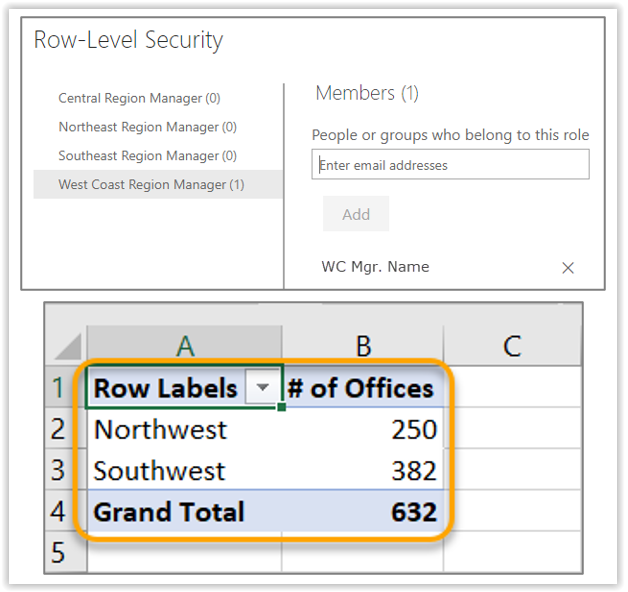

Modern Excel users can view promoted or certified datasets in Power BI and decide on the best dataset to use. Promoted datasets are endorsements from data modelers. Certified datasets are determined by the Power BI tenant admin, which is generally a higher endorsement from your organization. These labels ensure that a single version of the truth is used, regardless of the analysis tool.

The Power BI service can use and apply Sensitivity labels to data models and reports. In the case of a report that uses multiple sensitivity labels, the most sensitive label will take precedence. The Power BI Service will list the type of Sensitivity Label applied (if any) along with whether the dataset is endorsed or not. When Excel connects to a Power BI data source, these labels will still apply.

In Excel, when a user is building a PivotTable that is connected to Power BI with row-level security (RLS), they'll only see the data that is available to them based on the role that's assigned. The RLS roles flow through to Excel, allowing a data modeler to control what the users can view, even if they connect to the dataset from Excel and build a Pivot Table. The active user's assigned Power BI RLS roles will define the data available to them.

