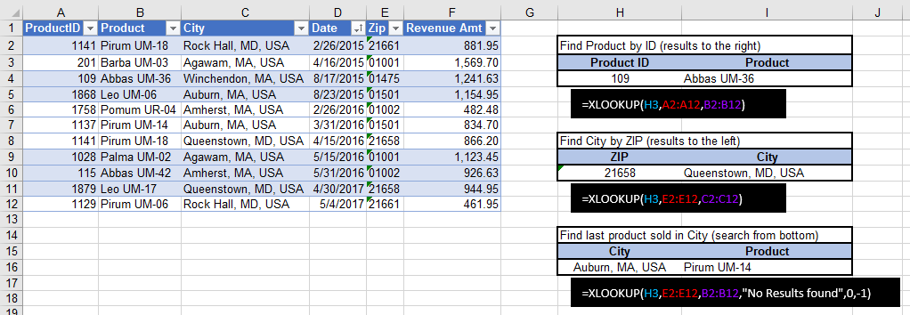
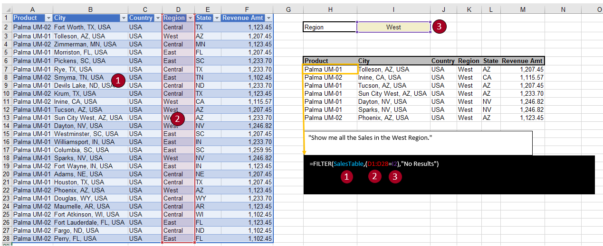
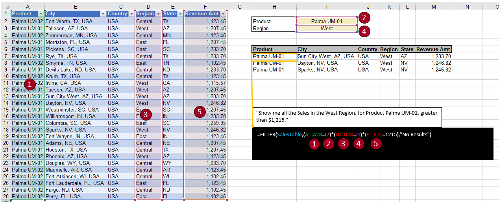
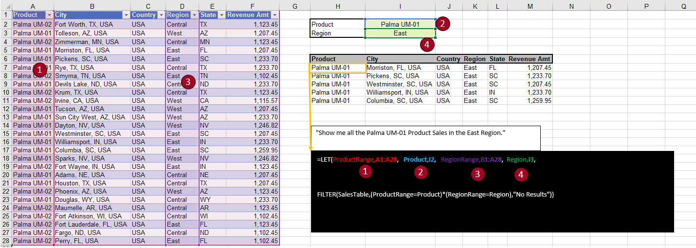

This unit introduces three new formulas you'll find in Office 365/Excel 2016+ called XLOOKUP(), FILTER(), and LET(). Another way to find out about new features and functionality in the application is to join the Microsoft Office Insiders Program (linked in the references section at the end of this module).

## XLOOKUP()

XLOOKUP() is a new, more powerful version of VLOOKUP(). It's simpler, faster, and more flexible.

The reasons why XLOOKUP() is more optimal than VLOOKUP() are as follows:

- Search columns and rows combine VLOOKUP() and HLOOKUP() for a more comprehensive search.

- Search columns to the left replace INDEX() MATCH() patterns, enabling you to use a combination that best works for your search.

- The formula is more robust in that it doesn't "break" when columns are added/deleted.

XLOOKUP() includes a syntax with three required parameters. The function performs an exact match by default.

> 

XLOOKUP() has the following features:

- Returns a value from a given column based on a value in another column

- Returns a different value if no result is found

- Searches from the top or from the bottom

XLOOKUP() has six parameters with the last three being optional parameters:

- **lookup\_value**: Parameter used to define the value you want to find

- **lookup\_array**: Array parameter used to specify the column in which to find the value

- **return\_array**: Array parameter used to define the column to return the value from

- **if\_not\_found**: If no match is found, return this optional value

- **match\_mode**: Optional parameter for specifying exact match, first above/below, or wildcard search

- **search\_mode**: Specify search from top or from bottom with this optional parameter

> 

In the previous dataset example, notice the XLOOKUP() formula to the right in the black box that shows the returned results. The three examples answer the following questions:

- **Find Product by ID**: Formula demonstrating finding the Product for Product ID = 109 where the product results are found in a column to the right of the Product ID column.

- **Find City by ZIP**: Example formula demonstrates finding City for ZIP = 21658, which are results located in a column to the left of the ZIP column.

- **Find last Product by City**: This formula demonstrates the use of optional parameters "No Results found" is returned if there are no results found, exact match, and -1 indicates to search from the bottom to the top of the table of data.

## FILTER()

FILTER() is a new array function. Adding the formula to a single cell returns a subset of the table, and the other values spill to the other cells within the result. FILTER() returns rows of data and allows multiple conditions by using **and/or** logic.

FILTER() has the following features:

- Returns multiple match results for one or more lookup values

- Filters data without needing to [refresh]{.underline}

- Can be nested inside other Excel functions

The following details explain the three parameters that are included with FILTER():

- **array**: Parameter used to specify a range of columns and rows to filter

- **include**: Parameter used to provide filtering rule criteria

- **if\_empty**: Optional parameter value to return if no rows meet the conditions

> 

The previous dataset example shows the FILTER() formula in the black box with the returned results. Notice that it uses a table instead of a range. We recommend that you always use a table when you can. The previous example filters the SalesTable table, where **Region = West**, and it returns all matching rows within the result.

> 

This example uses the same dataset, but applies three filters to the table. The formula filters the table on the following criteria. All criteria must be met for the row to be included.

- Product = Palma UM-01

- Region = West

-Revenue = Greater than USD 1,215.00

The formula uses the multiply function because a logical comparison will result in zero (0) for false or one (1) for true. If all conditions are **TRUE**, then 1 \* 1 \* 1 = 1. However, if any condition is zero (0) or false, then the entire logic is false.

An asterisk (\*) is used for **AND** conditions, and the plus (**+**) sign is used for **OR** conditions.

## LET()

The LET() function offers considerable flexibility for complex calculations and provides a simpler way to digest the different pieces of the formula. It combines the ability for storage of calculations and values that use variables with the native formula syntax of Excel.

> 

The variables are used to assign a name to a value or calculation. These variables are used to recall the syntax without having to repeatedly rewrite the formula. You can define up to 126 different variables in the function, but at a minimum, you're required to have the three components (variable, value of variable, and calculation). You can also take advantage of other array functions like FILTER() within the LET() function. The following example builds on the FILTER() example from earlier but now with variables assigned.

> 

In the preceding screenshot, numbers one through four are variables and definitions. The last statement is the calculation that uses the variables.

- ProductRange = Product column range

- Product = Product on which to filter

- RegionRange = Region column range

- Region = Region on which to filter

- Filter = Filtering on the table for the Product and Region
