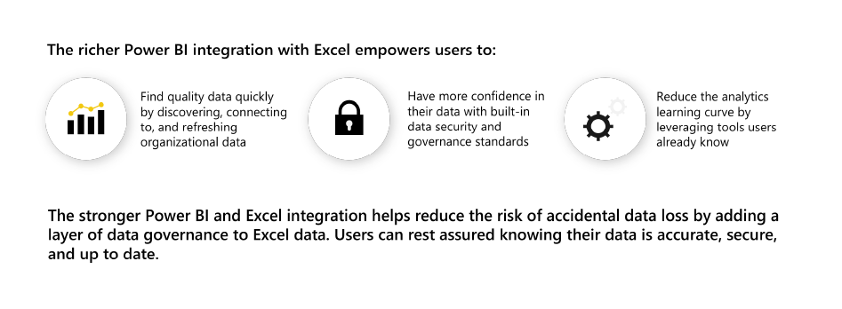

Excel is a great application by itself. However, when you use Excel together with Power BI, it becomes even better. Not every report or analysis needs to be in Power BI, and you don't have to choose one and exclude the other. Excel will inherit all of Power BI's sensitivity, certified, and promoted labels, so you can work with confidence that your data is accessible only to authorized users.

## Excel key strengths

Excel is a powerful, familiar application that's used by millions worldwide for data collection, sorting, analysis, budgeting, management, and most commonly, for reporting.

Great reasons to use Excel are:

- When you're learning

- When you're performing a one-off analysis

- In intensive accounts/finance roles

- When you need specific Excel features and a grid canvas

- Cube formulas, PivotTables, Sparklines, and Pivot Charts

## Power BI key strengths

Power BI is more modern. It offers custom visuals, is interactive and provides data story experiences. The Power BI service also provides centralized sharing and collaboration.

Compelling reasons to use Power BI include the ability to:

- Create data models.

- Share with a consumer audience.

- Provide or have polished and interactive experiences.

- Have it available when you need Power BI features.

- Use visuals, bookmarks, RLS, mobile, and more.

## Excel together with Power BI complete cycle

Excel is a good option for a simple data-collection tool. Connecting Power BI to a form-like data-collection tool in Excel is a simple, flexible, and familiar way of getting manual data entry functionality into Power BI. For example, you can fill out an Excel spreadsheet form, drop it into a shared folder, and then watch Power BI pull in those new entries. The experience will be as if you have written directly into Power BI.

You can analyze visuals, reports, and datasets in Power BI and export them to Excel. Likewise, Power BI can import Excel data models and files for analysis. Each has different strengths that you can use interchangeably; one can feed the other, and vice versa.

In the following demo, you’ll see how you can use Power BI together with Excel to create a highly customizable report in Excel using a data model published to the Power BI Service.

> [!VIDEO https://www.microsoft.com/videoplayer/embed/RWNWvk]
