## Overview

The estimated time to complete this exercise is 30 minutes.

In this exercise, you'll complete the following tasks:

1. Publish a Power BI Desktop Dataset & Report to the Power BI service
1. Download, Install, and Use Analyze in Excel
1. Build an Excel Report using a Power BI Dataset

> [!NOTE]
> This exercise has been created based on the sales activities of the *fictitious* Wi-Fi company called SureWi, which has been provided by [P3 Adaptive](https://p3adaptive.com/). The data is property of P3 Adaptive and has been shared with the purpose of demonstrating Excel and Power BI functionality with industry sample data. Any use of this data must include this attribution to P3 Adaptive. If you haven't already, download and extract the lab files from https://aka.ms/modern-analytics-labs into your **C:\ANALYST-LABS** folder.

## Exercise 1: Publish a Power BI Desktop Dataset & Report to the Power BI service

In this exercise, you use Power BI Desktop to publish your Dataset and Report to My workspace in the Power BI service.

### Task 1: Launch Power BI Desktop

In this task, you'll launch Power BI Desktop and open a PBIX file.

1. Launch Power BI Desktop.
1. If applicable, use the **X** in the upper right-hand corner to close the Welcome window.

### Task 2: Open the PBIX file

In this task, you'll navigate and open the starting PBIX file with the Dataset and Report created from Lab 02.

1. Select **File** > **Open report** > **Browse reports**.

    [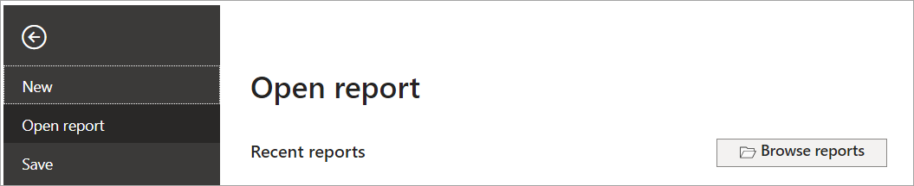](../media/browse-reports.png#lightbox)

1. Navigate to the **C:\ANALYST-LABS\Lab 03A**  folder.
1. Select the file **MAIAD Lab 03A - Power BI Model.pbix** and choose **Open**.

### Task 3: Publish the PBIX file to the Service

In this task, you'll publish the Dataset and Report from the Power BI Desktop file to the Power BI service.

1. First, you need to sign in to Power BI. Select **Sign in** located in the upper right-hand corner of Power BI Desktop.

    

1. Next, enter your Power BI **username** and **password**. Once you're signed in, the Sign-in changes to become your name.

    [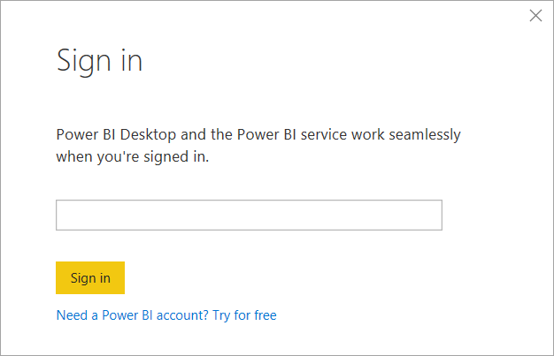](../media/sign-in-window.png#lightbox)

1. From the **Home** tab in the main menu, select the **Publish** button.

    [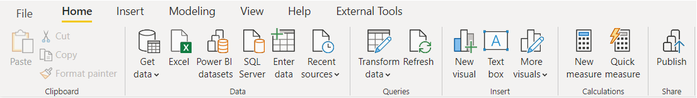](../media/home-tab.png#lightbox)

1. Select **My workspace**.

    [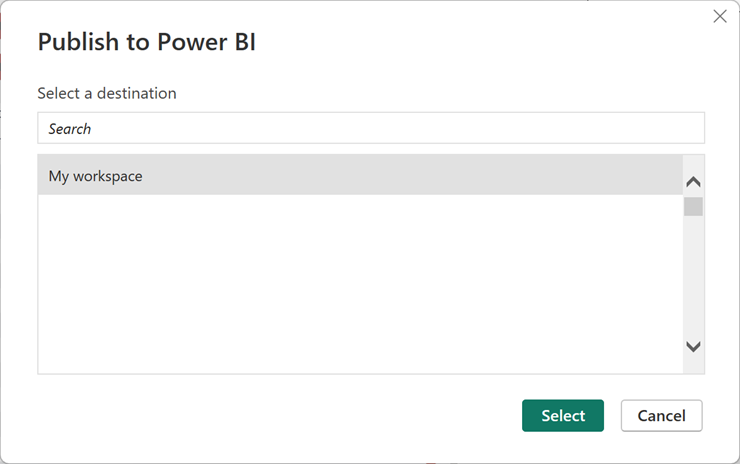](../media/workspace.png#lightbox)

1. Choose the **Select** button to publish the data model and report page to the Power BI service.

    > [!NOTE]
    > All users have My workspace in Power BI service. This is your *personal* sandbox. Every organization has different Workspaces. Workspaces can be created, and users can be added to Workspaces to share Datasets and Reports across the organization.

1. Once the publish is successful, you see the **Success!** message with a link that you can select to open the report in the Power BI service.

1. Select the **Open MAIAD Lab 03A - Power BI Model.pbix in Power BI** link.

    [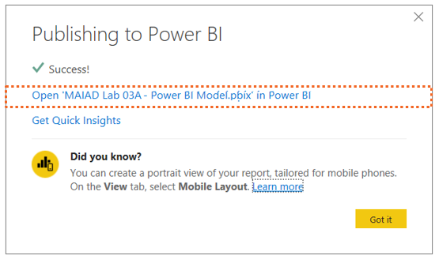](../media/success.png#lightbox)

    After you select the link, your browser opens and displays your report published to Power BI service in your My workspace location.

    > [!NOTE]
    > To navigate directly to Power BI service, enter the URL: [https://app.powerbi.com](https://app.powerbi.com) in your browser.

    [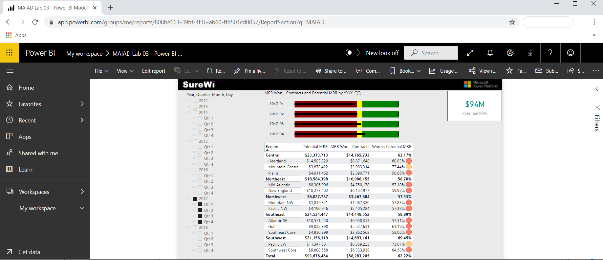](../media/report-displayed.png#lightbox)

    > [!NOTE]
    > THe selected report page, slicers, and filters are captured as default settings when published to the Power BI service.

## Exercise 2: Download, install, and use Analyze in Excel 

In this exercise, you'll download the Analyze in Excel libraries and use Analyze in Excel to connect to the published **MAIAD Lab 03A - Power BI Model** in Power BI from within the Excel application.

### Task 1: Download Analyze in Excel updates

In this task, you'll download a one-time Excel library that enables Excel to connect to Power BI Datasets.

1. From within the Power BI service, select **Analyze in Excel updates** from the Downloads menu, which is in the upper right corner.

1. Select the **Download** button.

### Task 2: Install Analyze in Excel

In this task, you'll install the Excel libraries that enable Excel to connect to Power BI Datasets.

1. Once the download completes, the installation file will be in your default Downloads folder. Navigate to your downloaded file and double-click the file to launch the (.msi) installer wizard.

    [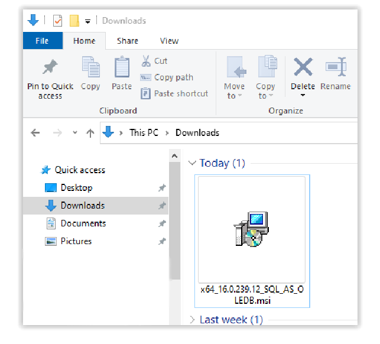](../media/open.png#lightbox)

    > [!NOTE]
    > You can open this file directly from your browser's Downloads section. For Firefox, this is in the top-right corner. For Microsoft Edge, this is the top-right corner under **Settings and more** menu. Download location varies by browser.

1. Follow the wizard steps to install the Analyze in Excel libraries.

    [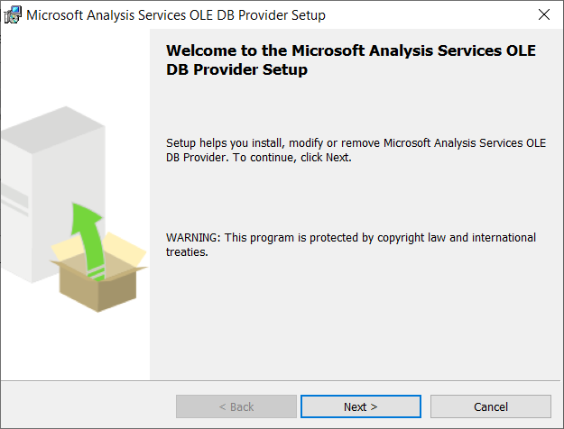](../media/next.png#lightbox)

### Task 3: Launch Analyze in Excel from Datasets + dataflows

In this task, you'll navigate to the **My workspace** location in the Power BI service to launch Analyze in Excel using the **MAIAD Lab 03A - Power BI Model** Dataset.

1. From the left-hand pane navigation, select **My workspace**.

    [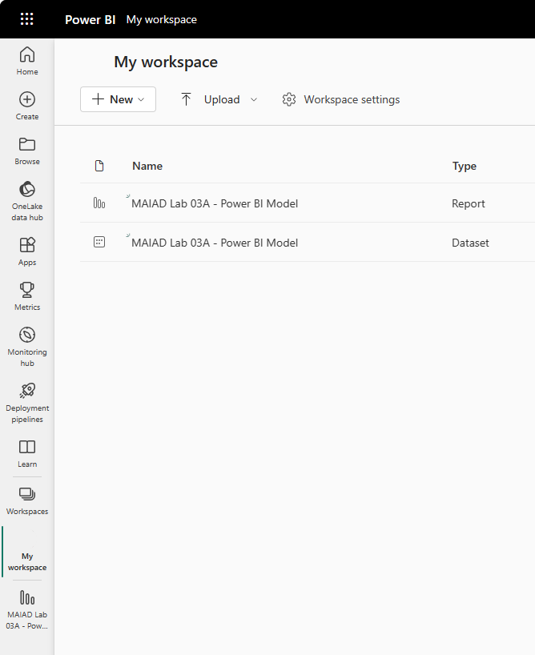](../media/datasets-dataflows.png#lightbox)

    > [!NOTE]
    > When you publish your PBIX file to the service, there are two Power BI artifacts created: the Data Model and the Report.

1. From the **MAIAD Lab 03A - Power BI Model** dataset, select **More options**, then select**Analyze in Excel**.

    [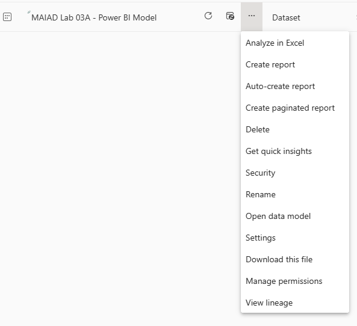](../media/analyze-excel.png#lightbox)

### Task 4: Launch the Analyze in Excel file

In this task, you'l launch the Excel file that has been connected to the **MAIAD Lab 03A - Power BI Model** Data Model.

1. Select **Open in Excel for the Web**. Select the **Editing** drop-down in the top-right corner of Excel for the Web, then select **Open in Desktop App** to open the file in Excel on your local computer.

1. Once Excel launches, you may need to select the buttons to **Enable Editing** and **Enable Content**. This allows Excel to connect to the data model published to the Power BI service, which is an external data connection to Microsoft's Azure storage in the cloud.

    [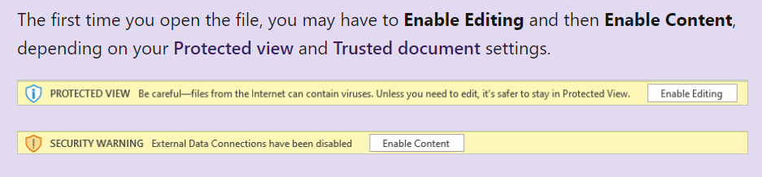](../media/enable-message.png#lightbox)

    > [!NOTE]
    > If you're not prompted with both the Enable Editing and Enable Content messages, you might need to check **Options** > **Trust Center** > **Trust Center Settings...** to ensure your Message Bar Settings are turned on.

## Exercise 3: Build an Excel report using a Power BI Dataset

In this exercise, you'll create a report in Excel using the Power BI Dataset connected to **MAIAD Lab 03A - Power BI Model** created using Analyze in Excel. The Excel report will contain a Pivot Table, a PivotChart, and CUBE formulas.

### Task 1: Add Measures to the Pivot Table Fields Values

In this task, you'll populate the Pivot Table with Measure fields from the Power BI Dataset connection.

1. From the **Pivot Table Fields** window, select the **Tools** (gear) icon and select **Fields Section and Areas Section Side-By-Side**.

    [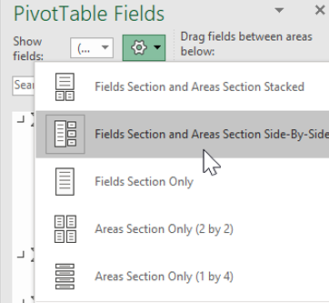](../media/gear.png#lightbox)

    > [!NOTE]
    > By default, the Pivot Table Fields are displayed with the **Fields Section and Areas Section Stacked**. The instructions that follow have the Pivot Table Fields displayed as **Fields Section and Areas Section Side-By-Side**.

1. From the **Offices** measure table, drag the **# of Offices** measure to the **Values** section in the Pivot Table Fields List.

1. From the **Contracts** measure table, select the **checkbox** for the **Total Contracts** and **MRR Won - Contracts** measures to the **Values** section in the Pivot Table Fields List.

    [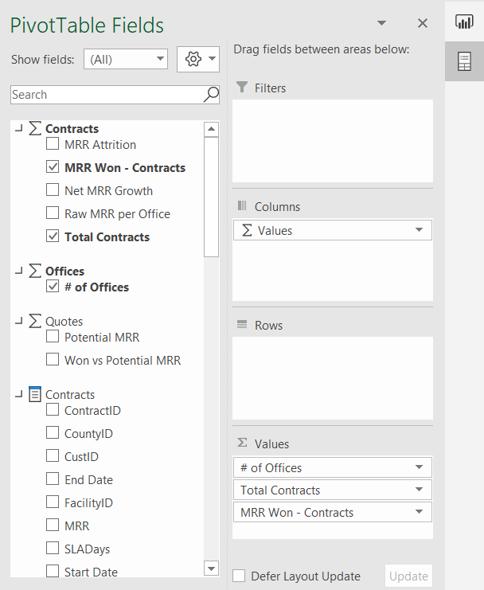](../media/measures.png#lightbox)

    > [!NOTE]
    > When selecting fields from the measure tables, the checkbox will move the field into the Values section by default. This is because only measures can go into the Values section of a Pivot Table Field List when connecting Excel to a Power BI service Dataset.

1. Right-click the Pivot Table and select **Pivot Table Options...**.

    [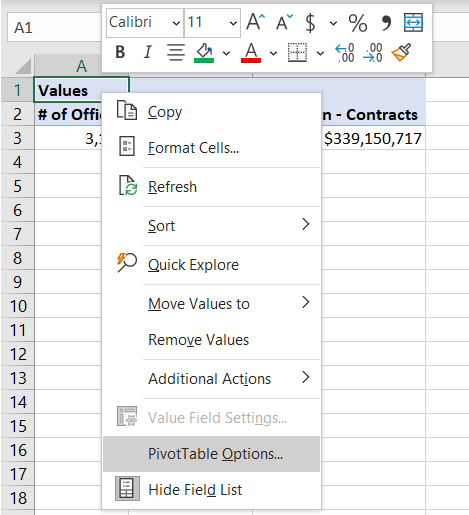](../media/options.png#lightbox)

1. Select the **Display** tab, then uncheck the **Show the Values row** box. Select **OK**.

    [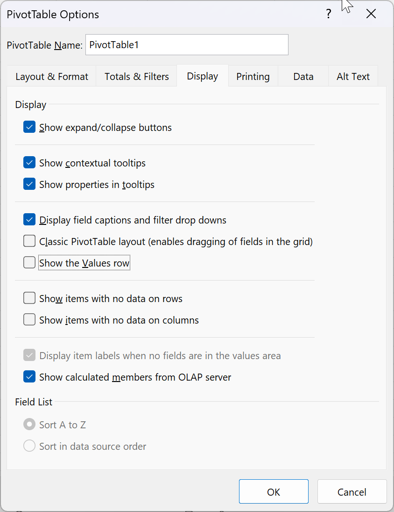](../media/values-row.png#lightbox)

    > [!NOTE]
    > This is done for aesthetic purposes, to remove the row with **Values** in the heading that happens by default when adding more than one measure into the Values section of the Pivot Table Fields.

### Task 2: Add Fields to the Pivot Table Fields Rows

In this task, you'll populate the Pivot Table with Lookup fields from the Power BI Dataset connection.

1. From the **Offices** field table, drag the **Region** and **District** columns to the **Rows** section in the Pivot Table Fields List.

    [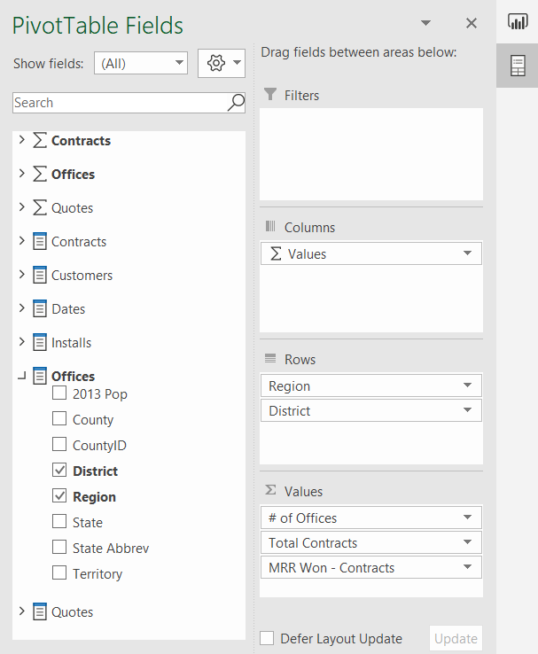](../media/fields.png#lightbox)

1. Use the mouse to place the cursor in **Cell A1** and type the name **Region & District** into the cell to change the default heading name.

    [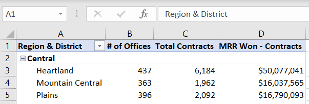](../media/label.png#lightbox)

### Task 3: Insert a PivotChart

In this task, you'll insert a PivotChart workspace into the Excel worksheet to the right of the Pivot Table. Then you add fields to the Axis and Values sections.

1. Use your mouse to select **Cell E1** on the worksheet. This selects the location for the PivotChart.

    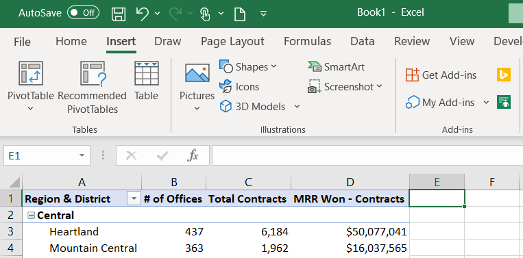](../media/location.png#lightbox)

1. Select the **Insert** tab on the main menu and select the **PivotChart** option from the **PivotChart** drop-down.

    [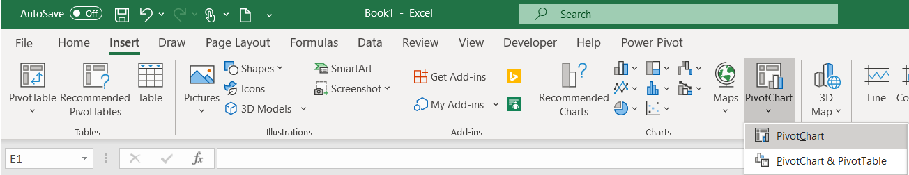](../media/pivotchart.png#lightbox)

1. On the Create PivotChart window, select the **Use an external data source** radio button.

1. Select the **Choose Connection**... button.

    [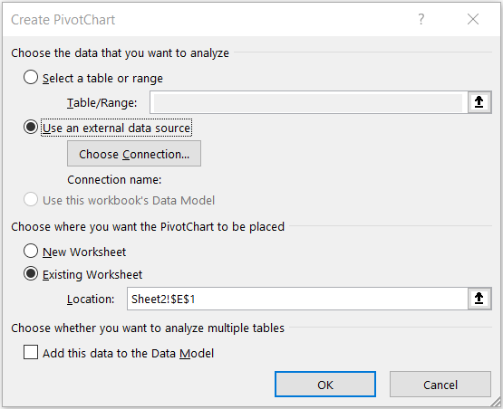](../media/connection.png#lightbox)

1. From the **Connections** tab and the **Connections in this Workbook** section, select the `pbiazure//api.powerbi.com` connection string path name to connect the PivotChart to the Power BI Dataset external data source.

    [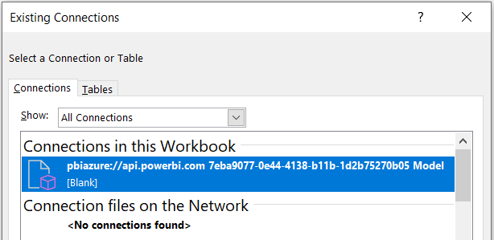](../media/workbook-connections.png#lightbox)

   > [!NOTE]
   > The exact name of your pbiazure://api.powerbi.com connection string will be different than the one shown in the preceding image. This is the unique connection location identifier for a published Power BI dataset artifact.

1. Select **Open**, then select **OK**.

1. From the **Quotes** measure table, click the **checkbox** next to the **Won vs Potential MRR** measure to move it into the **Values** section in the Pivot Table Fields List.

1. From the **Offices** field table, drag the **Region** measure to the **Axis (Categories)** section in the Pivot Table Fields List.

    [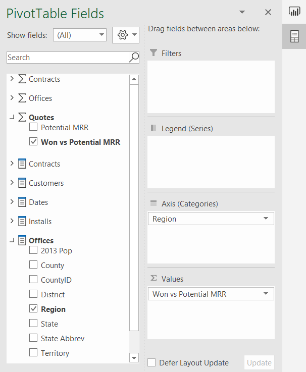](../media/pivot-table-fields.png#lightbox)

### Task 4: Format PivotChart

In this task, you'll format the PivotChart using some of the familiar formatting options in Excel.

1. From the **Design** tab in the main menu, select **Style 4**.

    [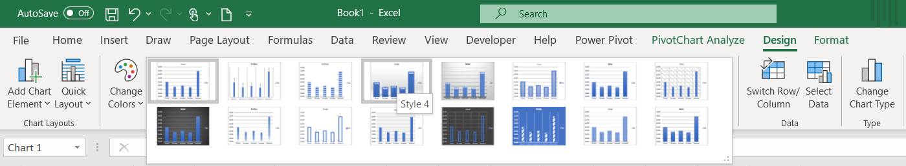](../media/design.png#lightbox)

1. Double-click the Chart Title and change the default title text to **MMR Won % by Region**.

1. Use the mouse to hover over the upper right-hand side of the PivotChart to display the Chart Elements options and uncheck the Legend checkbox.

    [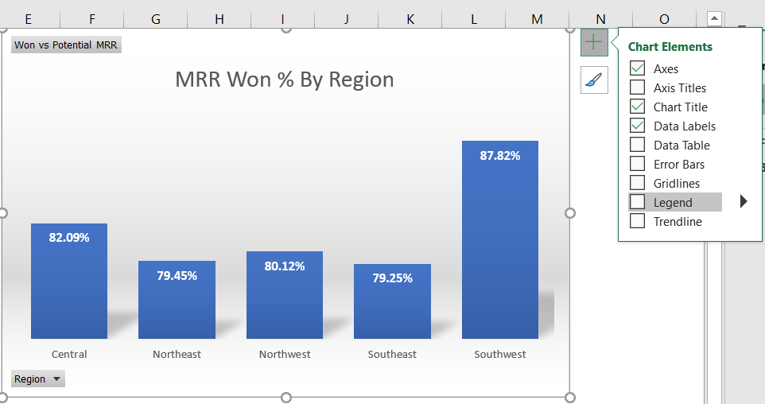](../media/legend.png#lightbox)

### Task 5: Add KPIs using CUBEVALUE

In this task, you'll use CUBE formulas to create high-level KPIs for the report.

1. Rename the data connection with a friendly name. Select the **Data** tab, then select **Queries & Connections** to open the **Queries & Connections** pane along the right-hand side.

    [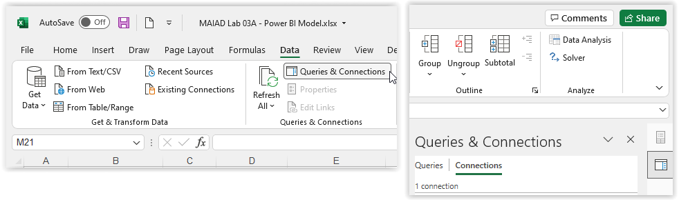](../media/queries-connections-pane.png#lightbox)

1. Select **Connections**, right-click your connection, choose **Properties**, and change the connection name to **Power BI - MAIAD Lab 03A – Power BI Model**. Select **OK**.

    [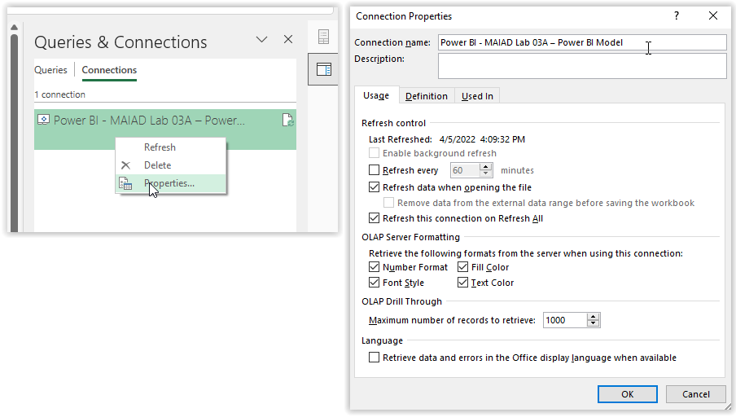](../media/rename-data-connection.png#lightbox)

    > [!NOTE]
    > The best practice when referencing data models within Excel is to provide user-friendly names for reference and to provide a detailed description about the data connection.

1. Right-click Row 1, then select **Insert** to add a row above the Pivot Table and PivotChart.

1. Press <kbd>CTRL + Y</kbd> to repeat the last step and add another row above the Pivot Table and PivotChart.

1. Right-click Column A, then select **Insert** to add a column before the Pivot Table.

    > [!NOTE]
    > This provides a row and column buffer for aesthetic purposes and provides a row for a report heading and the KPIs using CUBEVALUE formulas.

1. Right-click Column A, select **Column width**, and enter **1**. Select **OK**.

1. Select the **Home** tab. Select Row 2, then select **Black** in the **Fill Color** drop-down to create a report heading in Row 2.

1. Select **Gold, Accent 4** in the **Font Color** drop-down.

1. Select **Cell I2** and enter the text **"Potential MRR:"**. This will serve as the KPI description.

1. In **Cell J2**, enter the following CUBEVALUE formula and press <kbd>Enter</kbd>:

    =CUBEVALUE("Power BI - MAIAD Lab 03A – Power BI Model","[Measures].[Potential MRR]")

    [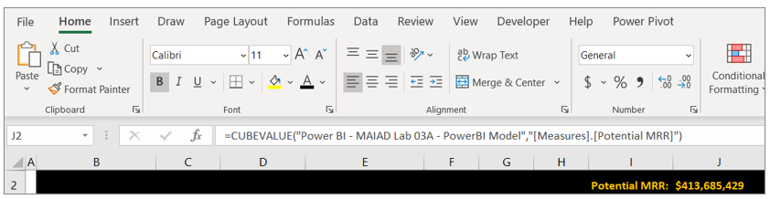](../media/measure-access.png#lightbox)

    > [!TIP]
    > As you type the CUBEVALUE formula, you'll notice that Intellisense guides you as to the syntax needed to complete the formula. A CUBEVALUE formula can be combined for use with Slicers.

1. Select **Cell K2** and enter the text **"Won MRR:"**. This will serve as the KPI description.

1. In **Cell L2**, enter the following CUBEVALUE formula and press <kbd>Enter</kbd>:

    =CUBEVALUE("Power BI - MAIAD Lab 03A – Power BI Model","[Measures].[MRR Won - Contracts]")

    [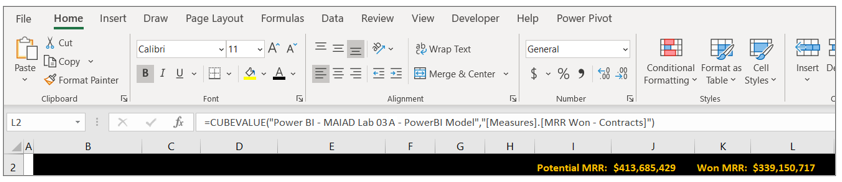](../media/cube-value.png#lightbox)

1. Select **Cell M2** and enter the text **"% Won:"**. This will serve as the KPI description.

1. In **Cell N2**, enter the following Excel formula and press <kbd>Enter</kbd>:

    =L2/J2

    [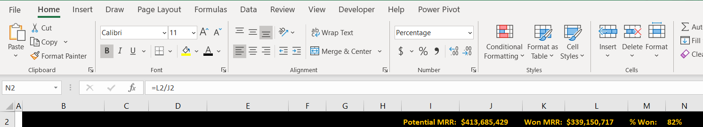](../media/formula-bar.png#lightbox)

    > [!TIP]
    > You can combine the familiarity and features of Excel with Dataset published to Power BI.

1. Right-click **Cell N2**, select **Format Cells**, and select **Percentage**. Select **OK**.

1. Select **File** from the Main Excel Ribbon Menu, then **Save a Copy**.

1. Navigate to the **C:\ANALYST-LABS\Lab 03A**  folder.

1. Save the file as **MAIAD Lab 03A - Power BI Model - My Solution.xlsx**.

In this exercise, you published a Power BI Desktop Dataset and Report to the Power BI service. Then you created a report in Excel with a Pivot Table, PivotChart, and CUBE functions connected to a Power BI Dataset. This final exercise illustrates what's possible when you use Power BI together with Excel.

> [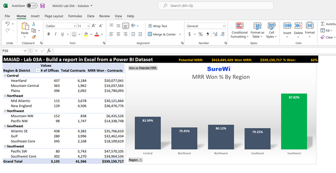](../media/final-report.png#lightbox)

> [!IMPORTANT]
> Now that you have your report created, you want to keep it updated. But don' worry, it takes just two button clicks: **Data** > **Refresh All**.

> [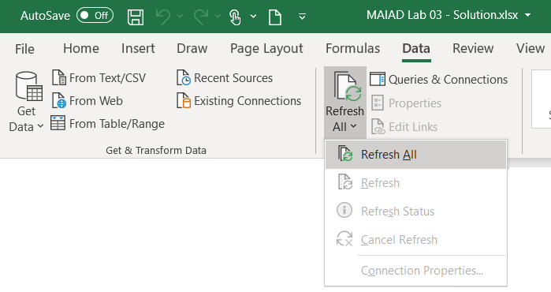](../media/refresh.png#lightbox)
