## Overview

The estimated time to complete this exercise is 30 minutes.

In this exercise, you'll complete the following tasks:

1. Use Excel to create a pivot table from a Dataset published in the Power BI service

1. Add Sparkline Charts

> [!NOTE]
> This exercise was created based on the sales activities of the *fictitious* Wi-Fi company called SureWi, which was provided by [P3 Adaptive](https://p3adaptive.com/). The data is property of P3 Adaptive and has been shared with the purpose of demonstrating Excel and Power BI functionality with industry sample data. Any use of this data must include this attribution to P3 Adaptive. If you haven't already, download and extract the lab files from https://aka.ms/modern-analytics-labs into your **C:\ANALYST-LABS** folder.

## Exercise 1: Use Excel to create a Pivot Table from a Data Set in the Power BI service

In this exercise, you'll use Excel to connect to a published Data Set in the Power BI service.

### Task 1: Launch Excel

In this task, you'll launch a new blank worksheet to get started.

1. Launch Excel.

    > [!NOTE]
    > If you haven't already signed in to your Microsoft 365 account, you may be prompted to sign in. Use your work email address and password to sign into your account.

1. Create a new blank workbook.

### Task 2: Use Insert new Pivot Table from Power BI

In this task, you'll create a new Pivot Table workspace connected to a published data set in the Power BI service.

1. Select the **Insert** tab on the Main Excel main ribbon menu.

1. Choose **PivotTable** > **From Power BI**.

    > [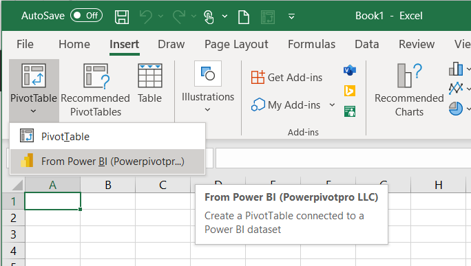](../media/pivot-table-button.png#lightbox)

1. If you have many published Data Sets, you can use the **Search** option to type in "Lab", then select the **MAIAD Lab 03A - Power BI Model** data set from the available data set options.

    > [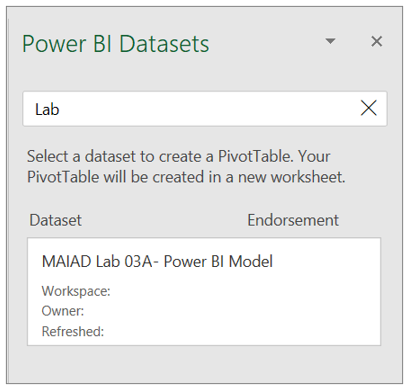](../media/datasets-window.png#lightbox)

1. Notice you have a new Pivot Table workspace and the PivotTable Fields with Measure and Field tables.

    > [!NOTE]
    > Measure tables are identified by the summation icon. This behavior occurs when Excel connects to a Power BI dataset. All Measures that can *only* go into the Values of the PivotTable Fields will be in located in the summation icon table name. Any of the columns or calculated columns that are used for Filters, Columns, or Rows are located in a table icon of the same name.

    > [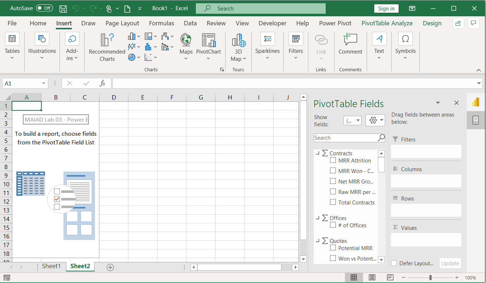](../media/workbook-connected.png#lightbox)

    > [!NOTE]
    > On the right-hand side of the PivotTable Fields window, notice the icons that allow you to toggle the window between Power BI Datasets or PivotTable Fields.

    > [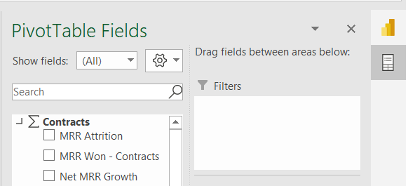](../media/pivot-table-fields-icon.png#lightbox)

### Task 3: Add Measures to the PivotTable Fields Values

In this task, you'll populate the PivotTable with Measure fields from the Power BI Dataset connection.

- From the **Contracts** measure table, drag the **Raw MRR per Office** measure to the **Values** section in the PivotTable Fields List.

    > [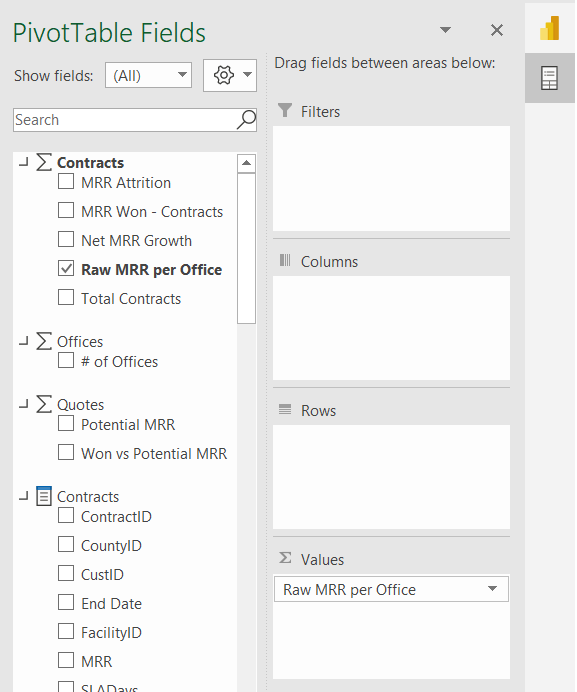](../media/measure-values.png#lightbox)

### Task 4: Add Fields to the PivotTable Fields Rows

In this task, you'll populate the PivotTable with Lookup fields from the Power BI Dataset connection.

1. From the **Offices** field table, drag the **Region** and **District** fields to the **Rows** section in the PivotTable Fields List.

    > [!NOTE]
    > Lookup field tables are identified by the table with **Fields** icon.

    > [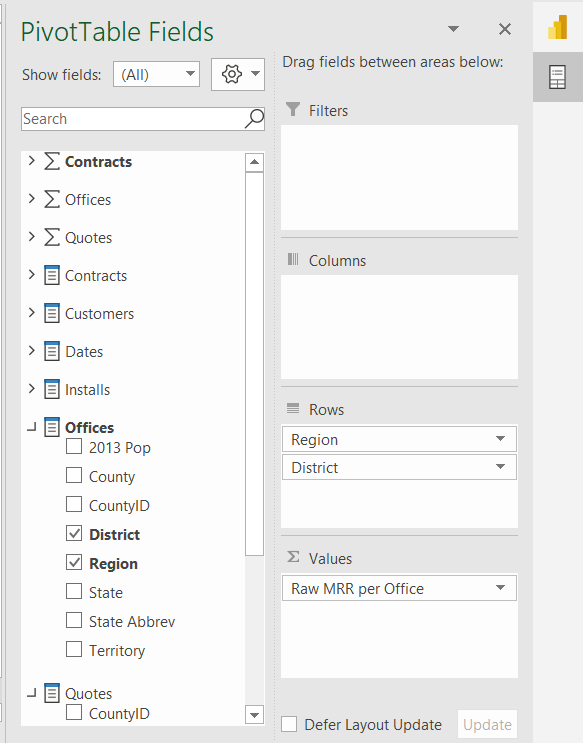](../media/fields-rows.png#lightbox)

1. From the **Dates** field table, drag the **Year** field to the **Columns** section in the PivotTable Fields List.

    > [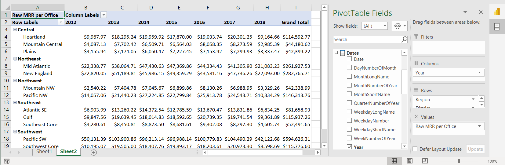](../media/year-results.png#lightbox)

### Task 5: Add Slicers

In this task, you'll Add Slicers connected to the Pivot Table.

1. If the PivotTable Fields list doesn't display, select the Pivot Table to make it *active*, then right-click choose **Show Field List**.

1. In the PivotTable Fields, locate the **Customers** Lookup fields table and right-click the **Company Size** field.

1. Select **Add as Slicer**.

    > [!NOTE]
    > The Slicer will just appear in a random location the worksheet. You'll reposition the Slicer in the next task.

1. You can also add a Slicer from the Main ribbon menu. Select the Pivot Table to make it active, then select the **PivotTable Analyze** tab in the Main ribbon menu.

1. Select the **Insert Slicer** button.

1. From the **Customers** Lookup fields table, check the box next to the **Segment** field.

1. Select **OK**.

### Task 6: Move and Format Slicers

In this task, you'll insert blank Rows and Columns to make space for the Slicers to create a mindful report design for the end users.

1. Right-click Column A select **Insert** to add a blank column to the left of the Pivot Table.

1. Right-click Column A, select **Column Width**, enter **1** in the Column width field, and select **OK**.

    > [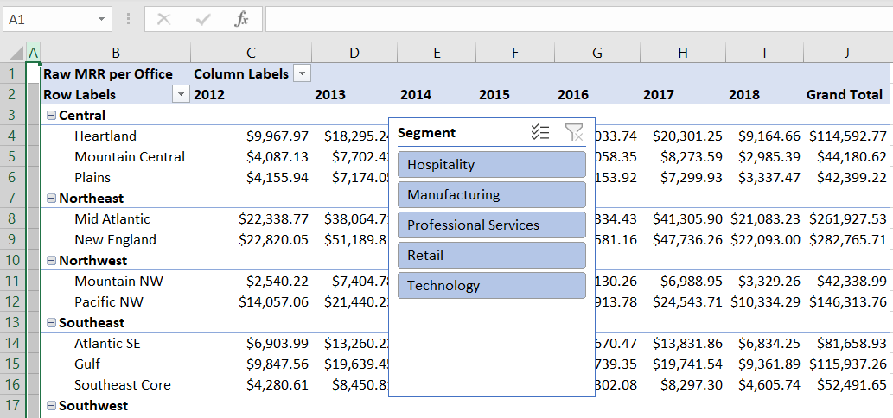](../media/column-width.png#lightbox)

1. Right-click Row 1 and select **Insert** to add a blank row above the Pivot Table.

1. Use <kbd>CTRL</kbd> + <kbd>Y</kbd> to repeat the insert five times to create a total of 6 blank rows above the Pivot Table. This provides space for our Slicers above the Pivot Table.

1. Drag the **Company Size** slicer above the Pivot Table.

1. With the **Company Size** slicer selected, choose the **Slicer** tab on the Main ribbon menu.

1. Change the Slicer buttons number of **Columns** to three.

    > [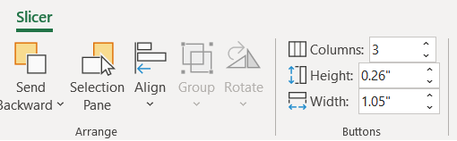](../media/slicer.png#lightbox)

1. Change the Slicer Style color to **Dark Blue**.

    > [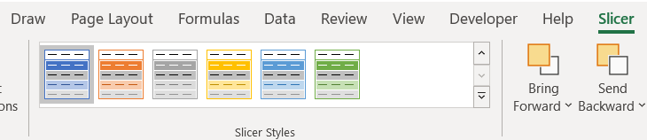](../media/slicer-options.png#lightbox)

1. Drag the **Segment** slicer above the Pivot Table and to the right of the Company Size slicer.

1. With the Segment slicer selected, choose the **Slicer** tab in the Main ribbon menu.

1. Change the Slicer buttons number of **Columns** to 5.

1. Change the Color to **Dark Blue**.

    > [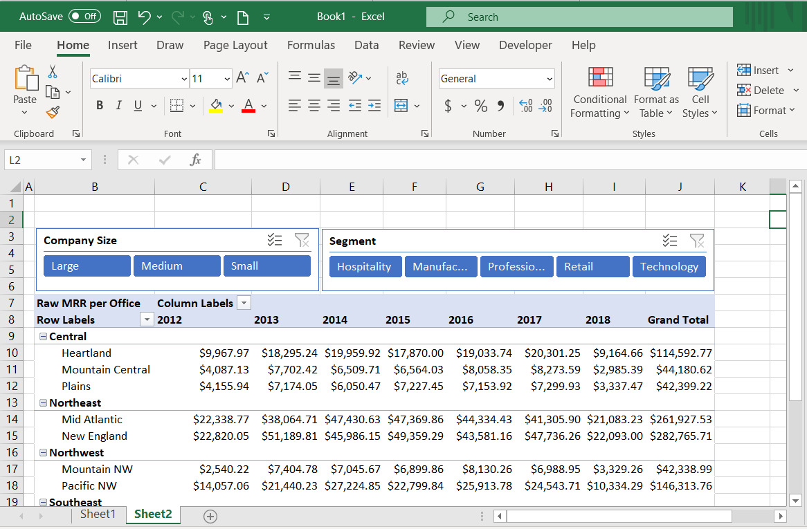](../media/reposition.png#lightbox)

### Task 7: Add Report Title & Format Pivot Table

In this task, you'll add a title for the Report and apply final formatting to the Pivot Table.

1. In cell B2, enter the Report title **MAIAD - Lab 03B - Excel & Power BI service - better together** and press <kbd>CTRL</kbd> + <kbd>B</kbd> to make the font bold.

1. In cell B8, enter the Pivot Table row title **By Region & District**.

1. In cell C7, enter the Pivot Table column title **By Year**.

    > [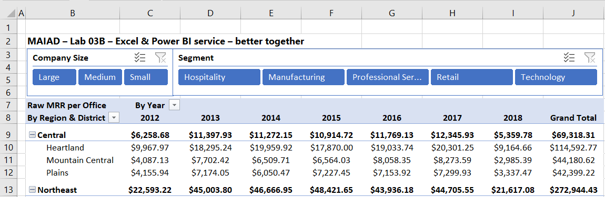](../media/title-rows-headings.png#lightbox)

1. Select the Pivot Table to make it active.

1. Select **Design** from the Main ribbon menu, then select the **Subtotals** button, then select **Show all Subtotals at Top of Group**. This will create Subtotals for each Region in the Pivot Table.

1. Highlight Columns C to J, right-click, select **Column Width**, enter **12** in the Column width field, and select **OK**.

1. With the Columns C to J still highlighted, select the **Center** alignment from the **Home** tab on the Main ribbon menu.

    > [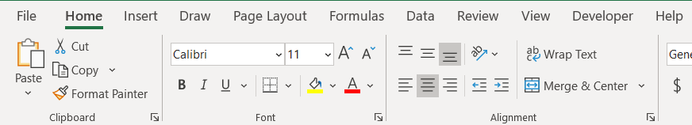](../media/center.png#lightbox)

1. Expand the **Segment** slicer so that each of the values is fully visible to the end user.

1. Right-click the Pivot Table and select **PivotTable Options...**.

1. From the Layout & Format tab, uncheck the **Autofit column widths on update** box, then select **OK**.

    > [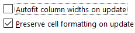](../media/autofit.png#lightbox)

## Exercise 2: Add Sparklines

In this exercise, you'll create Sparkline charts to display the Year trend next to the Pivot Table.

### Task 1: Create Sparkline chart

In this task, you'll create a Sparkline chart, combining features in Excel with a Data Model published to the Power BI service.

1. Position your cursor in cell **K9**, select the **Insert** tab at the top of the screen, then select the **Line** button.

    > [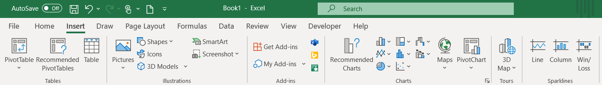](../media/sparklines.png#lightbox)

1. Enter **D9:H9** in the Data Range field to specify the **Central Region** and the Years 2013 to 2017, then select the **OK** button.

1. From the Sparkline menu options, select the **Sparkline Color** drop-down and select **Green, Accent 6**.

    > [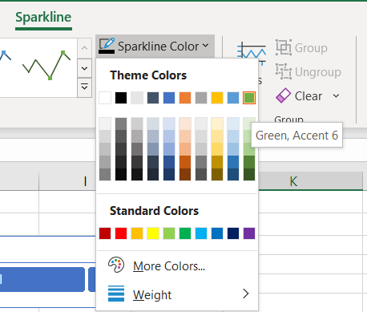](../media/sparkline-color.png#lightbox)

1. From the Sparkline menu options, select the **Marker Color** drop-down, select **High Point**, then select **Green, Accent 6**. Then select the **Marker Color** drop-down again, select **Low Point**, and select **Dark Red**.

    > [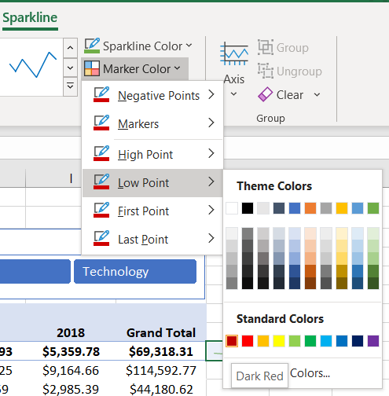](../media/dark-red.png#lightbox)

1. In Column K, copy and paste the Sparkline for each of the Region rows.

1. In cell K8, enter the title **Completed Year Trend**.

    > [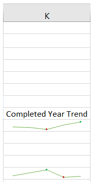](../media/charts.png#lightbox)

1. Hold the **CTRL** key and highlight each of the Region rows (9, 13, 16, 19, and 23), right-click, select **Row Height**, enter **20** in the Row height field, and select **OK**.

	> 
	> [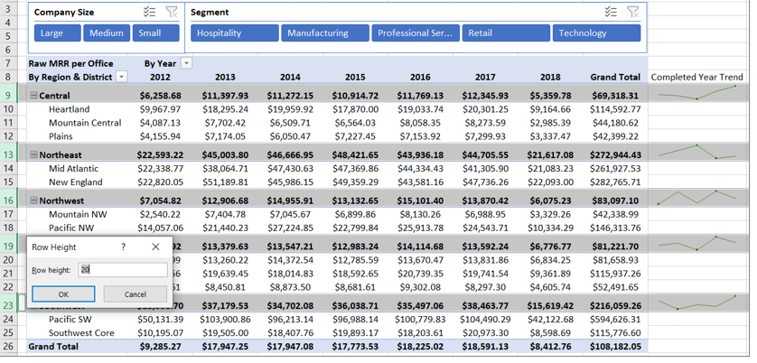](../media/row-height.png#lightbox)

### Task 2: Final Formatting

In this task, you'll create a final polished report by removing the Excel headings and gridlines.

1. From the main ribbon menu, select the **View** tab.

1. Uncheck the **Formula Bar**, **Headings**, and **Gridlines** boxes.

    > [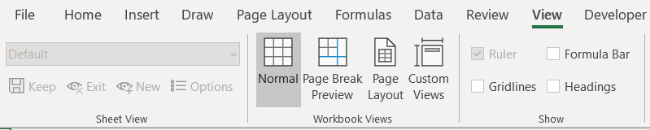](../media/view-menu.png#lightbox)

### Task 3: Save the Excel file

In this task, you'll save the Excel file.

1. From the main ribbon menu, select **File** > **Save As**.

1. Navigate to the **C:\ANALYST-LABS\Lab 03A** folder.

1. Save the file as **MAIAD Lab 03 - Solution.xlsx**.

In this exercise, you started in the Excel application and connected to a published data set in the Power BI service to create a Pivot Table with Slicers and Sparkline charts, demonstrating how Excel plus Power BI is better together.

> [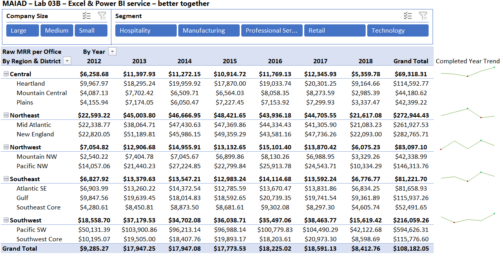](../media/completed-lab.png#lightbox)
