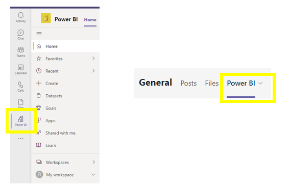
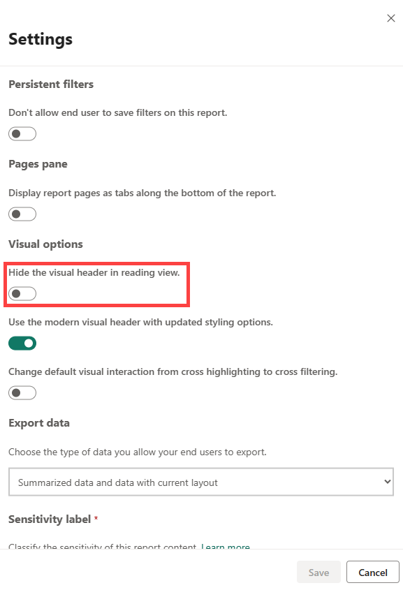
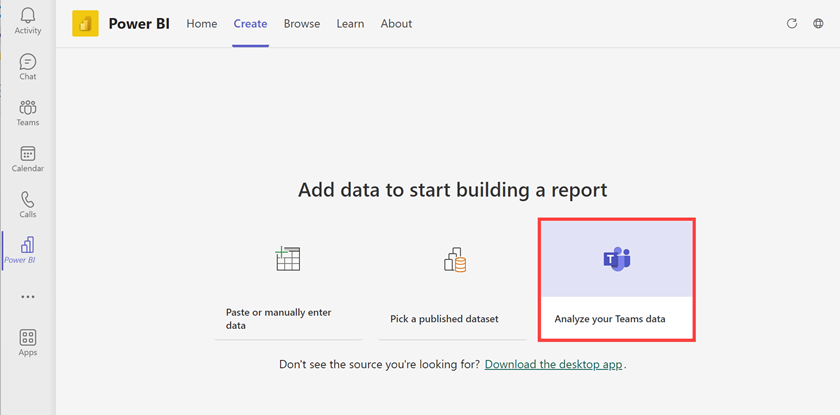
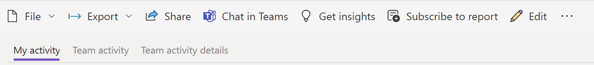

A user can share or access something from a published Power BI report within Microsoft Teams through the Power BI Teams App or the Power BI service.

## Power BI Teams app

You can add the Power BI App from the Microsoft Teams App menu bar on the left side of the application, or to a new tab at the top of a Channel by adding a tab. This allows you to view Power BI data by workspace, by access (Share with Me section), recently viewed, and by data type.

> [!div class="mx-imgBorder"]
> 

This integration is similar to the Power BI service and gives end users the same set of reports, but within the Teams application. The toolbar allows you to share a report link (**Share** button) or to Chat in Teams with other members. You can post the link directly to a Teams channel, a group chat, or an individual chat.

The Power BI App helps you to easily find Power BI assets. It allows for more organized onboarding by providing access to your organization's important data by channel. This feature empowers teams to collaborate by having conversations directly linked to the reports. Featured reports help your users find and access Power BI dashboards, reports, and datasets that are relevant to that specific team or department quickly.

## From Power BI service

You can share a link to the report from the Power BI service with the **Share** button or **Chat in Teams** button. Both the Power BI App in Microsoft Teams and Power BI service allow you to share a specific visual. It generates a link to that specific visual along with the filters in place and allows you to post to a Microsoft Teams channel with comments.

> [!div class="mx-imgBorder"]
> 

If you hover over the visual and select the **More Options** button on the top right, you'll see a **Chat in Teams** button. If the option is not available in the report, the report author will need to update the report setting. They can go to the **File** menu, go to **Settings**, and toggle the **Hide the visual header in reading view** slider under **Visual Options**.

> [!div class="mx-imgBorder"]
> 

## Analyze Microsoft Teams activity with Power BI

From the Power BI App in Microsoft Teams, go to the **Create** tab and select **Analyze your Teams data**.

> [!div class="mx-imgBorder"]
> 

This button provides analytics related to meetings, calls, and messages by date. You can tailor this report for individual or team use, and you can also publish it to the Power BI service to share it with others.

> [!div class="mx-imgBorder"]
> 
