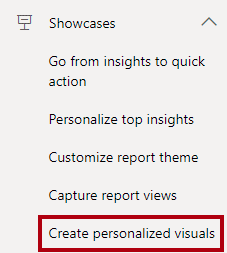
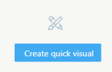
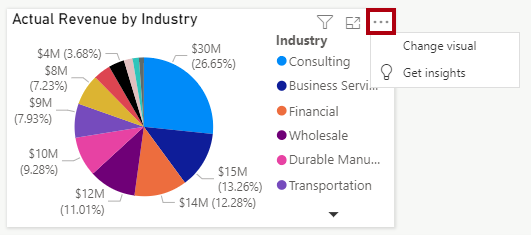

In this unit, you explore the **Create personalized visuals** showcase. This showcase demonstrates how to use the authoring APIs to create personalized visuals.

In the Power BI Embedded Analytics Playground menu, select the **Create personalized visuals** showcase.

> [!div class="mx-imgBorder"]
> 

In the embedded Power BI report, in the lower right, select the **Create quick visual** button.

> [!div class="mx-imgBorder"]
> 

In the **Create quick visual** window, choose a visual type, set the fields, and then optionally format the visual, perhaps by including a specific title. When you've completed the setup, select **Create**.

The app has used the `createVisual` function to add a new visual with a default layout to the page.

Hover the cursor over the new visual, and then in the upper-right corner, select the ellipsis (**...**) to open the visual's context menu. (Your visual might differ from the one that's shown in the following image.)

> [!div class="mx-imgBorder"]
> 

The app has used the `updateSettings` function to pass in new settings that define a command extension. For more information, see [Modify menu commands for a report visual](/javascript/api/overview/powerbi/change-visual-commands/?azure-portal=true).

Select the **Change visual** command. In the **Create quick visual** window, set up a different visual and then select **Create**.

The app should have replaced the visual with the new setup.

For more information, see [Quickly create personalized visuals showcase](/javascript/api/overview/powerbi/showcase-visual-creator/?azure-portal=true).
