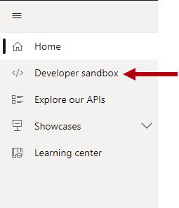
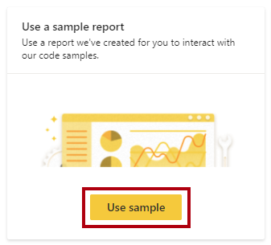
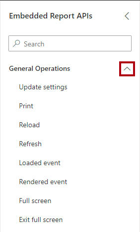
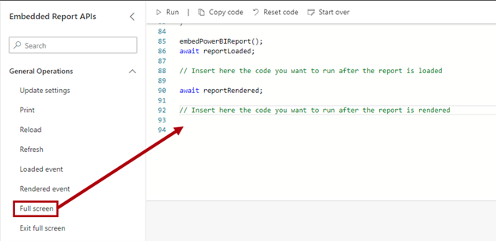
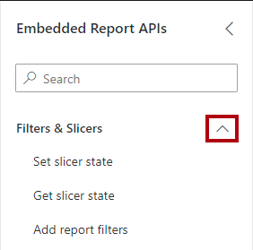
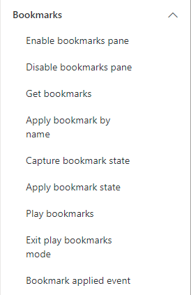
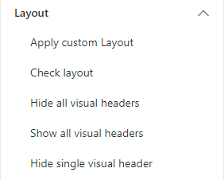

You can use Microsoft Power BI client APIs to embed Power BI content by using JavaScript or TypeScript. It's a client library that provides programmatic control of the entire embedding experience.

> [!NOTE]
> To learn about the basics of Power BI client APIs and how they're used to embed Power BI content, see the Embed Power BI content module.

Beyond embedding Power BI content, the client APIs let your app:

- Apply operations to content, such as adding a report filter.
- Work with events so that your app can respond to user actions that are made in a report, such as a button selection.
- Interact with bookmarks, either applying them or creating new ones.
- Produce dynamic report layouts, which provide control so that users can customize the report experience.
- Create personalized report visuals.
- Drive an in-context analytics workflow.

### Apply operations

Your app can apply many operations to embedded content. These operations include general operations, such as reloading or refreshing a report. They also include the ability to enter or exit full screen mode, or you can reapply the settings that the app applied in the configuration object when first embedding the content.

Beyond general operations, page navigation operations are also available. Additionally, you have access to filter and slicer operations, which allow your app to determine or set the filter/slicer state. Other useful operations include data operations that allow you to export visual data and menu operations that extend menus with new custom commands.

You can experience some of these operations by going to the [Power BI Embedded Analytics Playground](https://playground.powerbi.com/?azure-portal=true) and working through the following instructions.

> [!NOTE]
> The Power BI Embedded Analytics Playground is a website that helps you learn, explore, and experiment with Power BI embedded analytics. It includes a developer sandbox for hands-on experiences that use the client APIs with sample Power BI content or your own content. Code snippets and showcases are available for you to explore, too.
>
> For more information, see [What is the Power BI embedded analytics playground?](/power-bi/developer/embedded/power-bi-playground/?azure-portal=true)

In the left pane, select **Developer sandbox**.

> [!div class="mx-imgBorder"]
> 

When prompted, select the **Use sample** button to start by using a sample report.

> [!div class="mx-imgBorder"]
> 

> [!TIP]
> You can also select your own report that's sourced from the Power BI service, or you can use an embed token that your development app generates. In this activity, you'll continue to use the sample report.

The playground embeds a sample report, and above the report is the code pane that contains the code that's required to embed, load, and render the report.

In the **Embedded Report APIs** pane, expand the **General Operations** group.

> [!div class="mx-imgBorder"]
> 

To update the code, from the **Embedded Report APIs** pane, drag the **Full screen** operation and drop it on the last line (line 94) in the code pane.

> [!div class="mx-imgBorder"]
> 

Review the code fragment that's been added to the code pane. Then, to run the code, on the menu bar above the code pane, select **Run**.

> [!div class="mx-imgBorder"]
> 

The report renders in full screen mode. To exit full screen mode, press the **Esc** key.

Now, let's programmatically modify the report's date slicer. In the **Embedded Report APIs** pane, expand the **Filters & Slicers** group.

> [!div class="mx-imgBorder"]
> 

Drag the **Set slicer state** operation to the code pane, dropping it beneath the last line of code. Then, review the 43 lines of code that you added to the code pane. Run the code, and then notice that the report continues to open in full screen mode. The **Date** slicer date range should be set to **October 12, 2014 - November 27, 2014**.

> [!div class="mx-imgBorder"]
> 

To exit full screen mode, press the **Esc** key.

> [!TIP]
> The playground provides an effortless way to discover operations and evaluate them without the need to develop an app. Remember, you can explore these operations by using the sample report or your own report.

### Work with subscribable events

Events communicate between embedded Power BI content and your app. An app can raise events in response to automated actions (the rendering of a report) or user actions (a button selection).

It also means that your app can respond in a meaningful way when the report loads (which raises the `loaded` event) or renders (`rendered` event). For more information, see [Use phased embedding](/javascript/api/overview/powerbi/phased-embedding/?azure-portal=true).

Your app can respond when a user interacts with an embedded Power BI report. The following user actions raise events that your app can subscribe to:

- Selection of a report button (`buttonClicked` event)
- Selection of a command extension, which is a custom command that your app adds to the context menu (`commandTriggered` event)
- Selection of a hyperlink (`dataHyperlinkClicked` event)
- Selection of a data point, such as a column of a column chart visual (`dataSelected` event)
- Selection of a report visual (`visualClicked` event)
- Report page change (`pageChanged` event)

Consider the potential to enhance your app. At Tailspin Toys, their sales app can write back customer notes of interest to the app database. When a user selects a report button, the app opens a dialog window that prompts them to enter their notes. The app persists the entered data and then refreshes the report to show the new data that's represented in the report visuals.

Later units of this module demonstrate how an app responds to various events.

Moreover, other events are available for dashboards, dashboard tiles, the Q&A experience, and reports that are embedded in mobile view. For more information, see [How to handle events](/javascript/api/overview/powerbi/handle-events/?azure-portal=true).

### Interact with bookmarks

[Bookmarks](/power-bi/desktop-bookmarks/?azure-portal=true) allow users to capture the state of a Power BI report page, including filters and the visibility state of report elements. When applied, a bookmark restores the captured state to the report page. You can *play* a series of bookmarks like a slide show, which can be a helpful storytelling device when you're presenting to an audience.

In your app, you can programmatically control bookmarking experiences, where you can:

- Manage bookmarks by applying, capturing, or playing them.
- Apply a bookmark or return to the current viewing session.
- Enter or exit the bookmarks slide show mode.
- Show or hide the **Bookmarks** pane.
- Retrieve a list of bookmarks.
- Access bookmarks and their properties, perhaps to present them in a dropdown list.

The following image shows the bookmark operations that you can explore in the Power BI Embedded Analytics Playground.

> [!div class="mx-imgBorder"]
> 

At Tailspin Toys, their sales app allows users to capture the current state of an embedded report page as a *personal bookmark*. A personal bookmark is visible only to the user who created it, and it allows users to return to a specific view of interest. The app persists personal bookmark metadata in the app database, and it presents a dropdown list of personal bookmarks so that the user can reapply them.

A later unit of this module demonstrates how an app can use bookmarks.

For more information, see [Enhance your users' experience with bookmarks](/javascript/api/overview/powerbi/report-bookmarks/?azure-portal=true).

### Produce dynamic report layouts

You can use the layout APIs to let users select which visuals and layouts that they want to view.

The following image shows the layout operations that you can explore in the Power BI Embedded Analytics Playground.

> [!div class="mx-imgBorder"]
> 

At Tailspin Toys, the sales app allows users to define page size, canvas scale, and pages layout. Within the pages layout, app users can specify a visual layout for each visual. It also allows them to show or resize visuals of interest and hide other visuals.

A later unit of this module demonstrates how an app can personalize the report layout.

For more information, see [Personalize a report layout](/javascript/api/overview/powerbi/custom-layout/?azure-portal=true).

### Create personalized report visuals

The Power BI client API includes the **powerbi-report-authoring** package. This package is an extension of the **powerbi-client** library for programmatically creating and personalizing visuals and for writing a Power BI report after it's been loaded. It also allows your app to edit embedded Power BI reports.

Use the `addPage` function to add an authoring page, and use the `createVisual` function to add a new visual with a default layout to the authoring page.

The following image shows the authoring operations that you can explore in the Power BI Embedded Analytics Playground.

> [!div class="mx-imgBorder"]
> 

At Tailspin Toys, the sales app provides a guided experience that allows users to set up and personalize new visuals.

A later unit of this module demonstrates how an app can allow users to create personalized visuals.

For more information, see [Report authoring overview](/javascript/api/overview/powerbi/report-authoring-overview/?azure-portal=true).

### Drive an in-context analytics workflow

The app embeds Power BI content in the `div` element, hosting the content within an `iframe` element. The `iframe` element creates a separation between the app and the embedded content, making sure that the data is more secure. The client APIs always communicate between the app and the embedded content. Because communication is bidirectional, your app can drive an in-context analytics workflow:

1. The user navigates within the app.
1. The app shows a Power BI report that's filtered to a specific view.
1. The user interactively filters data in the report.
1. The user selects a button to perform an action.
1. The app responds by running some code.

> [!div class="mx-imgBorder"]
> 
