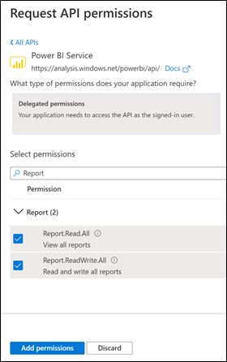
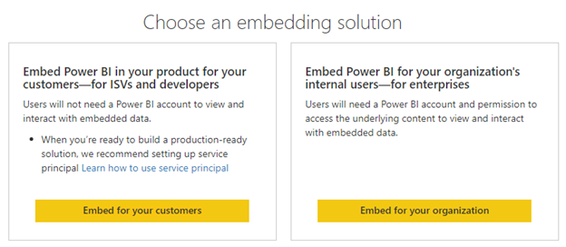

As the app developer, one of your first tasks is to register an *Azure AD app*. An Azure AD app establishes an identity for your app and specifies permissions to Power BI REST API resources. Your app can use the Azure AD app registration to generate Azure AD tokens.

Each Azure AD app has an *ApplicationID*, which is sometimes referred to as a *ClientID*. It's a globally unique identifier that identifies the app in the Microsoft identity platform. The app uses the ApplicationID when requesting an Azure AD token, so its value should be hard-coded in the app's config file.

Your app must set the Azure AD app credentials to authenticate as itself, without requiring interaction from an app user. You can add both *certificates* and *client secrets* as credentials to the app registration.

A certificate, which is sometimes called a *public key*, is the recommended credential type for production apps because it's considered more secure than client secrets. For more information about using a certificate as an authentication method in your app, see [Microsoft identity platform application authentication certificate credentials](/azure/active-directory/develop/active-directory-certificate-credentials/?azure-portal=true).

Alternatively, a client secret is a string value your app can use in place of a certificate to identify itself. It's sometimes called an *application password*.

> [!IMPORTANT]
> Client secrets are less secure than certificate credentials. Developers sometimes use client secrets during local app development because of their ease of use. However, you should use certificate credentials for your production apps.

Whether using certificates or client secrets, you should take steps to protect credentials from unauthorized access and use. We recommend using [Azure Key Vault](/azure/key-vault/general/security-features/?azure-portal=true), which protects cryptographic keys, certificates, and secrets in the cloud.

You have three options to create an app registration:

- Use the Azure portal
- Use the Embedding setup tool
- Develop a PowerShell script

### Use the Azure portal

Use the **App registrations** in the Azure portal to create, list, and manage app objects in your home tenant. You can also add secrets or certificates and scopes to make your app work, customize the branding of your app in the sign-in dialog, and more.

> [!NOTE]
> When you register your app in the Azure portal, the portal automatically creates a service principal object at the same time.

An advantage of using Azure portal is that it exposes all supported Power BI service permissions. Permissions include rights to view all reports, read and write all reports, and others.

> [!div class="mx-imgBorder"]
> 

The Azure portal allows granting those permissions for the master user account to avoid Azure AD prompting for consent. What's more, a Global Administrator can grant permissions to all users within the organization to avoid prompts for all app users.

> [!NOTE]
> It's not necessary to grant permissions when your app's embedding identity is a service principal. That's because Power BI admins manage its permissions in the Power BI admin portal.

However, a disadvantage of using the Azure portal is that developers might find it time consuming and complex.

### Use the Embedding setup tool

To simplify and accelerate setting up your development environment, use the [Embedding setup tool](https://app.powerbi.com/embedsetup/?azure-portal=true). It offers two embedding solution options: *Embed for your customers* and *Embed for your organization*.

> [!NOTE]
> The sample *Embed for your customers* app doesn't support using a service principal embedding identity; however, it can be adapted to support it.

> [!div class="mx-imgBorder"]
> 

The tool takes the hard work out of getting set up. It takes only minutes to work through the Wizard-like workflow. When you're done, the tool automatically:

- Creates an Azure AD app registration and requests relevant Power BI REST API permissions.
- Optionally creates a workspace.
- Optionally imports a dataset and report into the workspace. You can import a sample report or you can upload a Power BI Desktop (.pbix) file of your choice.
- Grants permissions to avoid Azure AD prompting for consent.
- Returns important configuration values, including the ApplicationID, workspace ID (GroupID), and ReportID.
- Creates a sample ASP.NET app written in C# that you can download as a zip file. The app's config file contains all configuration values (described in the previous bullet item) but doesn't include the master user account or its credentials. You must enter those config values.

This is great news for you as a novice Power BI embedded analytics developer. First, you can obtain a functional app in minutes. Second, Microsoft developed the sample apps by using current software libraries and good design practices, so you can reverse-engineer them to understand how they work and learn from them. It's up to you whether you choose to continue developing the app or to start from scratch and develop a new app by applying your new skills.

### Develop a PowerShell script

The option to develop a script to create an app registration is a good one when you need to reproduce management operations. For example, you might create a script to onboard a new tenant in a multi-tenancy app. Well-written scripts can result in faster and more accurate results.

[Microsoft Graph](/graph/overview/?azure-portal=true) provides a unified programmability model. It exposes REST APIs and a client library to access data and perform operations on various Microsoft cloud services. Of relevance to creating app registrations, you can use Microsoft Graph to:

- Generate app secrets
- Create app registrations
- Create the app's service principal
- Assign a user as the app owner
- Add the service principals to a security group

> [!NOTE]
> When programmatically creating an app registration, a service principal isn't automatically created. Your script must explicitly add a service principal to the app.

> [!TIP]
> For an example of how to develop a script that creates an app registration, see the Automate Power BI solution management module.
