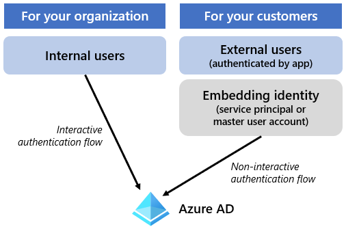

Two scenarios that you should consider when programmatically embedding Power BI content are:

- For your organization
- For your customer

Your app will use only one of these scenarios when embedding Power BI content. The appropriate embedding scenario is determined by the app audience, as described in the following topics.

## For your organization scenario

The **For your organization** scenario applies when the app audience comprises *internal* users. Internal users have organizational accounts and must authenticate with Microsoft Azure Active Directory. To access Power BI content, app users require Power BI licenses and permissions to consume (or create or edit) content.

> [!NOTE]
> In this scenario, Power BI is software-as-a-service (SaaS). The scenario is sometimes referred to as *User owns data*.

Several reasons for using the **For your organization** scenario include:

- **Internal business intelligence portal**: While the Power BI service (app.powerbi.com) provides a comprehensive and intuitive user experience for browsing content, it might not achieve the appearance and behavior or functionality that your organization wants. You can create a business-intelligence portal that meets specific business requirements. When the organization already has a business-intelligence portal that embeds content from other business-intelligence tools, then you can enhance the portal to embed Power BI content, too.
- **Internal app**: Intranet apps can embed Power BI content to show data visualizations. For example, the intranet site for the Sales department might include Power BI visuals that show sales-related charts and KPIs. An internal call center app can embed real-time visuals to provide up-to-date information about incoming customer calls.
- **Customized logging**: Your app can log custom events to record Power BI content access and use beyond what [Power BI logging](/power-bi/admin/service-admin-auditing/?azure-portal=true) can achieve.

## For your customers scenario

The **For your customers** scenario applies when the app audience comprises *external* users. The app is responsible for authenticating users. To access Power BI content, the app relies on an embedding identity (Azure AD service principal or master user account) to authenticate with Azure AD. That identity might require a Power BI license and must be granted permissions to consume (or create or edit) content on behalf of the app users. External users aren't required to have a Power BI license or content permissions. Even when external users do have Power BI licenses, they aren't used by this scenario.

> [!NOTE]
> In this scenario, Power BI is platform-as-a-service (PaaS). The scenario is sometimes referred to as *App owns data*.

To develop an app with this scenario, you need to make sure that Power BI content resides in a non-personal workspace that has a license mode of **Premium per capacity** or **Embedded**.

> [!NOTE]
> The products required to set those license mode options are introduced and described in the next unit.

Typically, SaaS apps and independent software vendor (ISV)-developed apps will develop for the *For your customers* scenario.

## Scenario comparison

The following table compares characteristics of the two embedding scenarios:

|     Characteristic         |     For your organization                             |     For your customers                                                                                                    |
|----------------------------|-------------------------------------------------------|---------------------------------------------------------------------------------------------------------------------------|
|     Audience               |     Internal users                                    |     External users                                                                                                        |
|     Authentication         |     Azure AD                                          |     App does authentication                                                                                               |
|     App user license       |     App users   require a Power BI license            |     No app user   licenses required                                                                                       |
|     Authentication flow    |     Interactive authentication flow   for app user    |     Non-interactive authentication   flow for embedding identity (Azure AD service principal or master user   account)    |

The following diagram shows the authentication flow for the two embedding scenarios:

> [!div class="mx-imgBorder"]
> 
