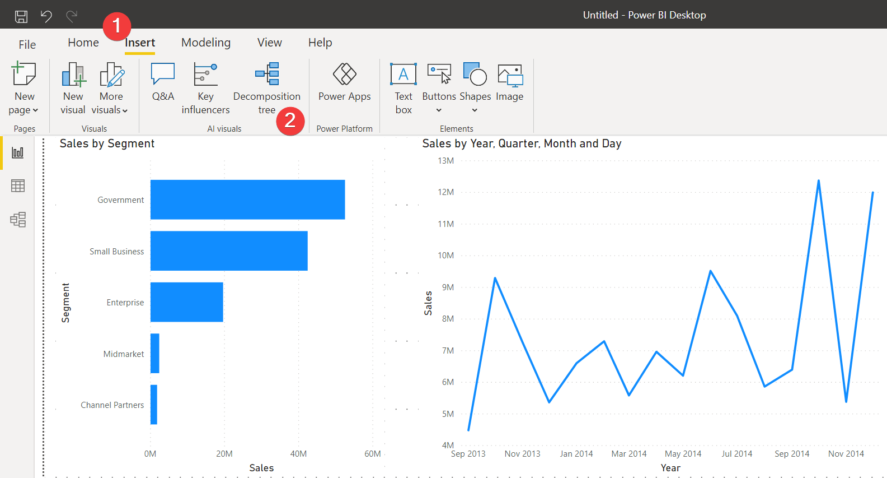
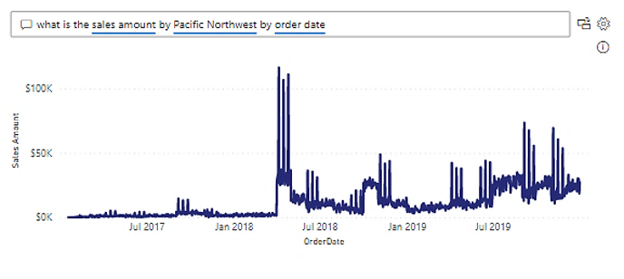
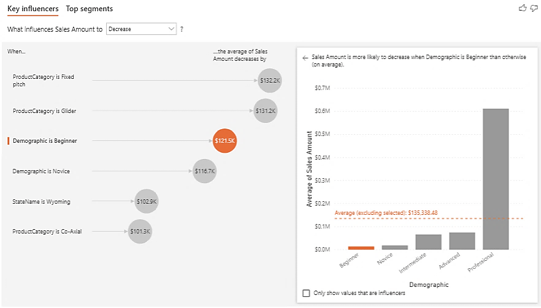

AI visuals offer greater insight by using embedded machine learning and natural-language processing to get a better understanding of your data. You can find AI visuals in the **Visualization** pane like any other visual.

This unit explores the following AI visuals: decomposition tree, Q&A, and key influencers.

> [!div class="mx-imgBorder"]
> 

## Assess measures with a decomposition tree

The decomposition tree is an interactive visual that allows you to break down a measure by various attributes across different dimensions.

The decomposition tree is useful for root cause analysis, which is the ability to continuously ask "why" until you get to the root of your problem. It's a good way to look at the "who" and the "how" when processes are going well or running poorly.

> [!div class="mx-imgBorder"]
> 

When building a decomposition tree, you'll start with a measure and then select the different ways to break down the measure. In the previous example, you're looking at discounts to see where they're flowing and which is receiving the highest discount. With the decomposition tree, you can see where you aren't offering discounts; hence, seeing greater margins. Furthermore, you can look at the relationship between your discounts and quantities sold to assess if they're having the desired effect of moving product.

## Ask questions with the Q&A visual

The Q&A visual allows users to ask natural-language questions and get answers in the form of a visual. Power BI chooses the visuals based on the displayed data. You can use the Q&A visual to explore your data by using intuitive, natural-language capabilities. The Q&A visual only provides results about the data in Power BI.

> [!div class="mx-imgBorder"]
> 

Default questions are offered to you, but you can also ask detailed questions of your data, such as asking about specific dimensional members in your data. If you like a visual that's created in the Q&A, you can even convert it into a standard visual for use in the rest of your workbook.

> [!div class="mx-imgBorder"]
> 

## Use machine learning with key influencers

Key influencers use machine learning to help find the drivers behind your metrics. Key influencers will analyze your data, rank the important factors, and display them as key influencers.

For example, you're looking at the results of a net promoter score (NPS) survey. You can identify the commonalities among people who returned lower scores on the survey. Next, you populate the metric that you want to understand, and then you add the fields that you think might influence its increase or decrease. This process is discussed further in the Lab.

> [!div class="mx-imgBorder"]
> 
