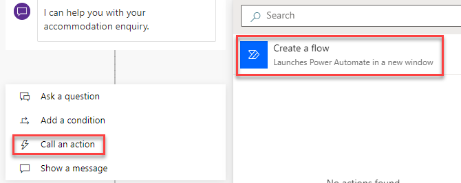
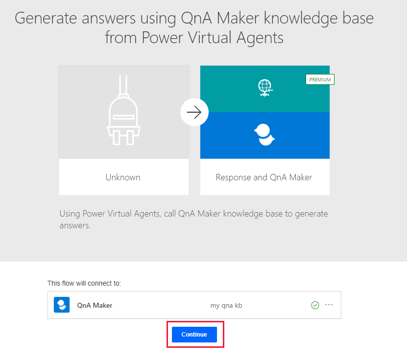

Microsoft Copilot Studio chatbots will often require access to other services and systems to be able to complete their goals. Microsoft Copilot Studio can also be integrated with other Microsoft AI services to create an enhanced customer experience.

## Power Automate

The primary integration for Microsoft Copilot Studio chatbots is through Power Automate cloud flows.

Microsoft Copilot Studio can pass parameters to a Power Automate cloud flow and receive data back from the flow and use that data in the chatbot's conversation flow. For instance, a chatbot might handle customer order updates and will use a Power Automate cloud flow to fetch the order's status from the relevant system.

Power Automate cloud flows can be initiated from the **Call an action** node in a topic.

## Skills

Microsoft Copilot Studio enables you to extend your bot by using Microsoft Bot Framework Skills. If existing Azure Bot Framework bots are deployed, you can define those bots as a skill and then embed the skill within a Microsoft Copilot Studio bot. You can then use the Azure Bot Framework bot from within your Microsoft Copilot Studio chatbot.

A developer can also use a Microsoft Copilot Studio chatbot from an Azure Bot Framework bot. The Microsoft Copilot Studio bot becomes the skill and the Microsoft Bot Framework dispatcher tool can integrate with the Microsoft Copilot Studio bot.

Solution architects need to oversee the design of bots and decide when to use existing bots and when to create new bots and with which toolset.

## Bot Framework Composer

Bot makers can use Bot Framework Composer to create custom content and add it to Microsoft Copilot Studio.

For instance, by using Bot Framework Composer with your Microsoft Copilot Studio chatbot, you can:

- Show an Adaptive card.
- Use Microsoft Bing search as a backup.

For more information, see [Microsoft Copilot Studio composer](/composer/pva/overview-composer-pva/?azure-portal=true) and [Advanced framework composer](/power-virtual-agents/advanced-bot-framework-composer/?azure-portal=true).

## QnA Maker

You can extend a Microsoft Copilot Studio chatbot to provide answers from a QnA Maker knowledge base. To respond to questions, you will need to add a fallback topic that uses Power Automate to run a cloud flow that connects to the QnA Maker through its connectors.

For more information, see [Fallback topics](/azure/cognitive-services/qnamaker/tutorials/integrate-with-power-virtual-assistant-fallback-topic/?azure-portal=true).

## Cognitive Services

Azure Cognitive Services can be used by bots for many purposes, such as:

- Sentiment analysis
- Image classification
- Form recognition

You can use Azure Cognitive Services with Microsoft Copilot Studio by using Power Automate cloud flows and the associated Cognitive Services connector.
