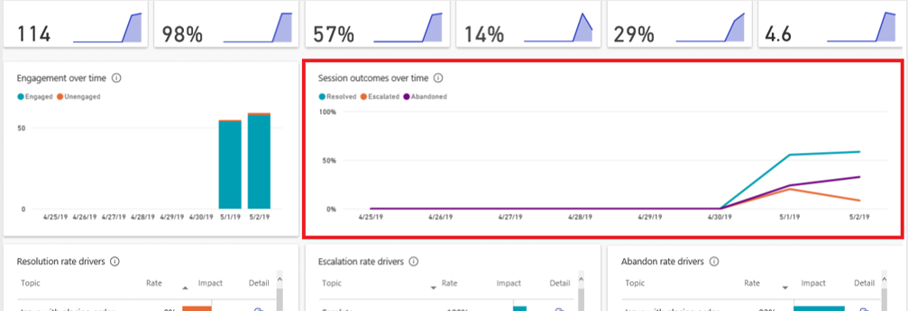
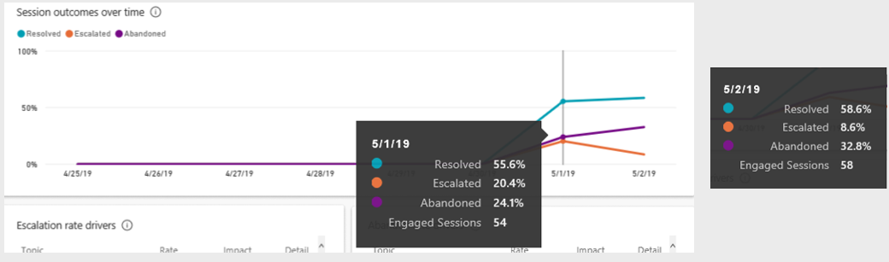
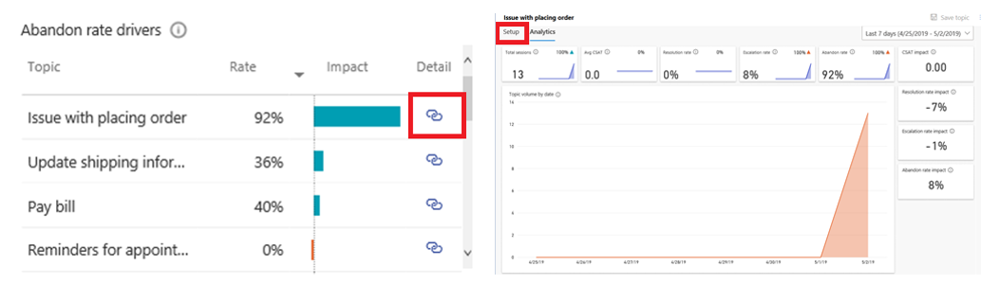

As much as you try to build useful and engaging chatbots that help customers resolve their issues, you'll never know how effective they are until the bot is used in the real world. You might find that a conversation doesn't flow the way that you thought it would when you initially designed it. Before publishing your bot, try to simulate the customer experience by testing the bot and reading the dialog aloud. By reading it aloud, you can identify those areas where the conversation isn't flowing as it would with a real person. After you've identified those areas, you can always return to modify specific topics to better fit the overall objective.

After your bot is live, it's likely that you'll find areas where you could improve the performance. Microsoft Copilot Studio allows you to measure and constantly improve the performance of your chatbot. It provides you with valuable metrics to measure engagement of customers with your chatbot. Microsoft Copilot Studio analytics provide you with several important analytical tools, such as:

- **Summary charts** - Provide summary details, such as the total number of sessions, resolution rates, outcomes, and more.

- **Engagement over time chart** - Helps you to clearly observe how your users are engaging with your chatbots over a specific period.

- **Session outcomes over time chart** - Provides percentages on how many sessions are being Resolved, Escalated, or Abandoned.

- **Resolution rate driver chart** - Provides details that are related to resolved sessions. It lists each topic and provides a resolution rate for it. You can explore further into the related details when the topic is being abandoned.

- **Escalation rate driver chart** - Provides details that are related to sessions that have been escalated to a live agent. It lists each topic and provides an escalation rate for it. You can explore further into the related details when the topic is being escalated.

- **Abandon rate driver chart** - Provides details that are related to abandoned sessions. It lists each topic and provides an abandon rate for it. You can explore further into the related details when the topic is being abandoned.

For more information, see [Key concepts - Analytics](/power-virtual-agents/analytics-overview).

The following example explains how you might use these reports to design a better bot topic.

The **Session outcomes over time** chart is shown in the following screenshot.

> [!div class="mx-imgBorder"]
> 

Ideally, you want most of your sessions to be resolved. Resolution indicates that the bot and its topics are doing what they should be doing. However, you might want to know what happens if the abandon rate starts to increase. The following image shows that on May 1, the abandon rate was 24.1 percent, and on May 2, it increased to 32.8 percent.

> [!div class="mx-imgBorder"]
> 

This increase is significant. At this point, you should closely examine the individual topics to identify if specific topics are leading to the increase in abandoned rates.

> [!div class="mx-imgBorder"]
> 

The process would be as follows:

1. **Identify high impact topics** - The **Abandon rates driver** report lets you view which topics in the bot have the highest abandon rates.

1. **Examine the topic** - Select the **Detail** icon next to a topic and then examine specifics that are related to the topic.

1. **Download and read transcripts** - While examining a topic, you can download and read the topic transcripts. This step helps you identify the specific spot in the topic that's leading to the topic being abandoned.

1. **Improve the topic content** - Within the topic, you can select **Setup** to open the topic and make specific changes.
