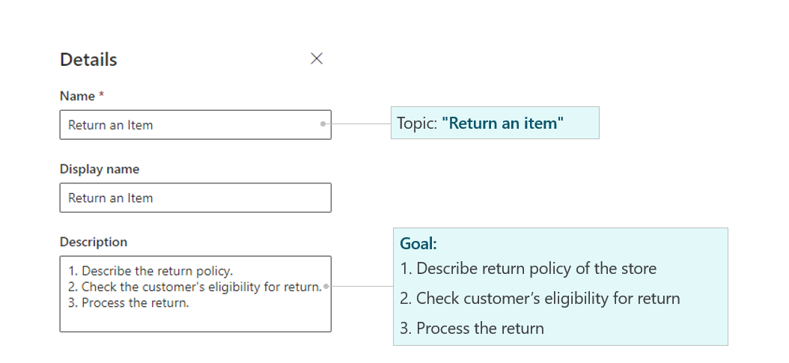
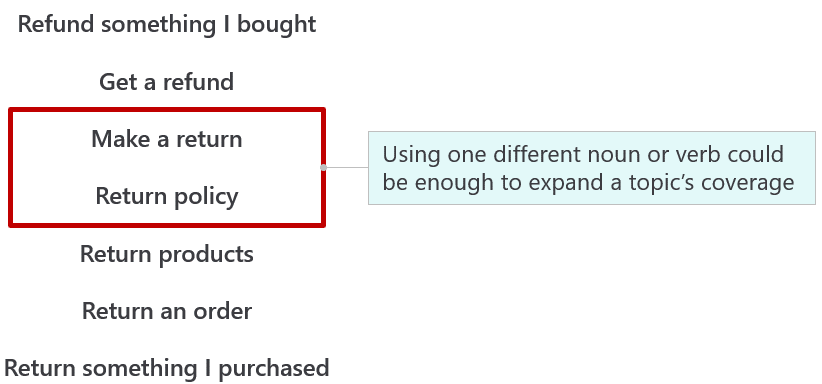
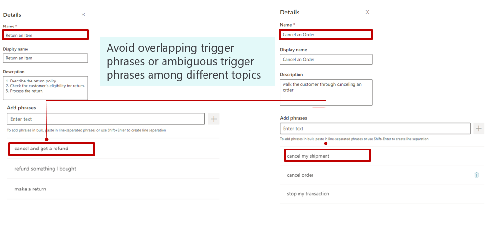

When you start designing your solution and building your responses, make sure that you can get the correct information to the customer. Additionally, you'll need to ensure that the customer can consume that information easily. You can accomplish this goal through a well-designed topic.

## Build useful trigger phrases

The first key to a well-designed topic is defining useful trigger phrases. Trigger phrases are important because they're the primary components that determine which topic is used. By not defining meaningful trigger phrases, you'll run the risk that the topic won't be triggered as it should. Most topics have multiple trigger phrases defined, providing flexibility because customers won't always use the same phrasing when interacting with your bot.

## Define the topic goal

When you create your topics, you'll need to define the topic's **Name**, **Display name**, and **Description**. The name and display name help you more easily identify the topic as you're building your bot.

When you first listed your scenarios and started defining the high-level flows of your topics, you identified the goal of the topic. For your return topic, you established that the goals were to:

- Provide the customer with details about the return policy.

- Determine the customer's eligibility to do a return.

- Assist the customer in processing the return.

The **Description** field is where you can define the topic's goal. If you expound on the goal in the description, it can help guide you as you're building the key elements of the topic. Additionally, providing extra detail will help others understand the purpose of the topic.

The following image shows a list of the goals that you previously defined in the description field.

> [!div class="mx-imgBorder"]
> 

## Define your trigger phrases

Trigger phrases determine when a topic is used, and they should fit with the topic that you're building. For example, if you're building a topic around helping a customer with your store hours, your trigger phrases might be "When are you open?", "What are your hours?", or simply "store hours." As a guideline, you should start with 5 to 10 trigger phrases. Based on your specific needs, you can always add more trigger phrases later.

When you design trigger phrases for your topics, consider the following guidelines:

- **Understand the goal and scope of the topic clearly** - By clearly understanding the topic's goal, you can create more meaningful trigger phrases that increase the likelihood that the topic will be used.

- **Use shorter trigger phrases** - Ideally, trigger phrases should be fewer than 10 words. Using shorter trigger phrases will result in a greater likelihood that the system can match what the customer is typing with one of your trigger phrases. The longer a phrase is, the less likely it will be selected.

- **Use phrases that are semantically different** - The goal of trigger phrases is to make sure that you're maximizing the potential coverage of the topic. If you use the same verb for every phrase, you're limiting your results.

For example, the following image shows multiple trigger phrases that have been defined for the return topic. While they're all focused on refunds or returns, multiple verbs have been used to expand the coverage.

> [!div class="mx-imgBorder"]
> 

- **Use the words that your customers use** - Consider the situation from your customers' perspective and think about how they're engaging with the bot. Try to use phrases that are in line with what customers might enter.

- **Avoid trigger phrases that are highly ambiguous among different topics** - Because a typical bot might have multiple topics associated with it, make sure that your triggers are as unique as possible for each topic. If a trigger phrase could apply to multiple topics, the bot might not understand which topic to use.

For example, two common scenarios that could occur with an order support bot are a customer returning an item that they ordered or a customer canceling an order before it ships. Two separate topics would handle these cases because they're two different scenarios.

The following image shows that the word **cancel** is used as a trigger phrase in both topics. As a result, when someone enters text that includes the word **cancel**, the bot won't know which topic to use so will ask the customer which one they want. This scenario can become frustrating to users.

> [!div class="mx-imgBorder"]
> 

As you define your triggers, you don't need to add articles (a, an, the), capitalization, contractions, and pluralization. While these elements might look appealing on the design screen, they don't improve the chance of your topic triggering. It's best to focus on adding the appropriate trigger phrases that help ensure that the topic is triggered when it should be.

For more information, see [Create a Topic](/power-virtual-agents/authoring-create-edit-topics#create-a-topic).
