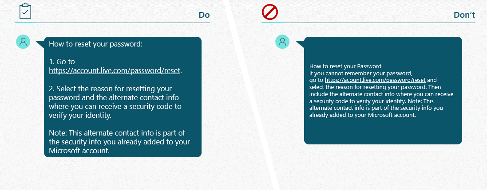

One challenge with any type of automated response system is mimicking the qualities of real-life conversations. Automated conversations are often impersonal, too formal, or consist of longer than required responses. Real-life conversations happen both ways, where a back-and-forth dialog occurs between both parties, and the responses are appropriate based on how the other party is engaging. When you're building topics for your bot, you should focus on trying to emulate the best elements of any conversation.

Before you learn how to create an effective conversational bot, consider the qualities of a well-designed bot, which should be:

- **Cooperative** - If cooperation doesn't exist between your chatbot and the customer, they're not having a conversation. Your bot's conversation flow should be built in a manner that the customer doesn't need to put forth an effort or have special knowledge or understanding of your design. Customers should be able to engage with the bot as they would in a text-based conversation with a human.

- **Goal-oriented** - Every step or turn needs to have a goal in mind. As you're building your topics, ask yourself why you're asking or showing this step to the user.

- **Fast** - Successful conversations move at a fast pace.

- **Turn-based** - Providing the correct information at the appropriate time and then verifying that it's correct before moving forward is critical. Poor interaction requires the participant to backtrack and make corrections, which slows down and adds effort to the process.

- **Truthful** - Humans have strategies to prevent and quickly resolve misunderstanding in context. Similarly, chatbots should validate information before using it to act.

- **Polite** - Nothing is more polite than respecting the time of someone who has given you their attention. You can achieve politeness by making customers' investment of time more productive than expected. For example, you can achieve politeness by anticipating others' needs before they've thought to ask and by offering more choices or fewer choices in a polite manner, depending on the context.

You want your customer conversations to emulate the best elements of any conversation. They should be personal, polite, friendly, and supportive. Small stylistic changes in writing can impart warmth and familiarity to your brand voice. A simple change that you can make is to avoid overusing exclamation points to convey energy. Many people rely on exclamation points for this purpose, but if you're inserting too many in the wrong places, it's often perceived as insincere and robotic.

> [!div class="mx-imgBorder"]
> 

Other ways to make your bot sound more conversational include:

- **Use short sentences** - Shorter sentences are easier for people to comprehend. Additionally, shorter sentences mimic live conversation flow more closely, for example, "Sounds great! Let me get that started for you."

- **Be positive** - Maintain a positive tone throughout the conversation. Use statements that show respectfulness and positivity, such as "Let's get started," "I have a couple questions," or "Should only take a minute."

- **Use active voice** - Your bot needs to be goal-driven, and active voice sentences are short and direct. Active sentences tell the user what you're currently doing, for example, "No problem. I can resolve this for you."

- **Use contractions** - Contractions serve two purposes: to reduce the size of a message and to project personability. Contractions are more aligned with how humans talk. For example, "I'm going to ask you a couple questions" is shorter and more personable than "I am going to ask you a couple questions."

- **Be consistent with pronouns** - Identify which pronoun you want to use with your bot based on how you want to present to customers. Two common examples are first person (**I**) and first person plural (**we**):

  - **I** - The bot speaks as an individual who's representing your organization.

  - **We** - The bot speaks as if it's your organization talking to the customer.

   Both options work well in a bot. However, make sure that, after you've identified which one you want to use, stick with it and don't switch between them. Otherwise, your bot can lose its personability and can seem disjointed.

Similarly, you'll also want to be consistent with your conversational tone and style. Your bot should seem as if it's the same agent and brand throughout the conversation. This approach is helpful because it reduces the likelihood that the user will misinterpret what you're saying. For example, the following image shows two examples of chat conversations where the bot introduces itself and then begins the process of engaging with the customer.

> [!div class="mx-imgBorder"]
> 

In the conversation on the left, the bot maintains a consistent, positive tone throughout the entire conversation. It directly tells the user what it can do for them, but it's also respectful of the user's time by asking them for information. In the conversation on the right, the tone shifts throughout the conversation. It starts out informal, but when it tells the user how to speak with a live agent, it shifts to a more formal tone. When it gets to capturing the customers phone number, it seems to be more demanding by not asking for the customer's number but rather telling them to provide it.

## Use documentation in conversations

Many organizations use their existing knowledge repository content in bot conversations to assist users through troubleshooting problems. This approach can save time when you're building content and it can help provide more available topics that your bot can use when assisting customers.

When you use website documentation to answer a question, make sure that you break down the sections into short, scannable graphs. As a result, it's easier for the user to consume and helps maintain that conversational tone.

The following image shows two examples that use a **How to reset your password** website article. The first example divides the items into easy-to-consume chunks, whereas the second example places the content into one difficult-to-read block.

> [!div class="mx-imgBorder"]
> 

## Conversation pacing

The pace in which your bot is interacting with users is important. You want your conversations to have a faster pace to ensure that they're proceeding forward. However, you'll also need to make sure that you aren't moving a conversation too fast or providing the user with too much information too quickly.

Consider the following approaches when you're determining pacing:

- **Use small, readable blocks** - When you have substantial information to communicate, break up the information into multiple readable blocks. This approach helps make the pace of the conversation feel more natural and is easier for users to consume.

- **Don't rush the customer** - Occasionally, when your chatbot is responding to the customer too quickly, it can be difficult for the customer to keep up. As a result, the customer might feel rushed and as if their needs aren't being met. Adding a minimum delay in specific spots can provide the customer with the extra time that they need to contemplate specific information.

- **Check in periodically** - Because you don't have the luxury of reading someone's expressions, it's always a good idea to check in with the user to ensure that they're following the conversation after you've explained or answered a question. This approach is especially beneficial when you're providing complex answers.

## Conversation tone and considerations

Maintaining a consistent tone throughout the entire conversation is imperative. Additionally, the overall tone of your conversation needs to be friendly, especially when you're helping users complete tasks. This statement isn't implying that you can't change the tone in accordance with what you're doing. On the contrary, tailoring the tone of the chatbot's responses to the context of the conversation is always a good idea. For example, if the conversation is about a serious subject, such as billing or cybersecurity, be empathetic but brief and straightforward. Your chatbot will still be perceived as friendly because it's empathizing with the customer's situation. If you're conversing about a more mundane subject, such as creating a new account, the tone can be more relaxed.

Many people rely too heavily on exclamation points. Some people can misinterpret them. Exclamation points don't express energy or excitement, strong writing does, more specifically, the use of strong verbs. In your desire to help, avoid sounding condescending or insincerely enthusiastic by keeping exclamation points at a minimum or don't use them at all.

> [!div class="mx-imgBorder"]
> 

Other considerations regarding conversational tone:

- **Keep the user engaged** - Likely, while the user is engaging with your chatbot, they're doing other tasks as well. Regularly invite the user into the conversation by asking questions or making suggestions. This approach will help keep them involved in the conversation.

- **Respond to the customer in a timely manner** - Some data can take longer to retrieve than others, especially when your bot needs to retrieve data from other systems. If it might take a while to process the customer's request, let the customer know what to expect.

- **Keep your chats easy to consume** - Customers abandon a chat when the prompts are lengthy or complex. Keep them brief, simple, and straightforward. A simpler way to do so is to use tools such as the **Flesch-Kincaid Grade Level feature in Microsoft Word** or an app like [Hemingwayapp.com](http://www.hemingwayapp.com/?azure-portal=true) to determine the grade level for your scripts. A general guideline: the lower the grade level, the better.

## Tips for styling your conversation

As you build your bots, the goal is to make the conversation mimic the real-world conversations that humans have with customers as much as possible. You want customers to be actively engaged in the conversation and to keep interactions short and useful. To create conversational bots, remember the following five tips as you're building your topics.

- **Write like you speak** - Read your text aloud. Determine if it sounds like something a real person would say. Be friendly and conversational. Don't use robot words.

   | Example | Revised |
   |---------|---------|
   | Invalid ID | You need an ID that looks like this: `someone@example.com`. |

- **Fewer words, bigger ideas** - Crisp minimalism drives modern design. Shorter is always better.

   | Example | Revised |
   |---------|---------|
   | If you're ready to purchase Office 365 for your organization, contact your Microsoft account representative. | Ready to buy? Contact us. |

- **Be brief** - Give users enough information to make decisions confidently. Get rid of unnecessary words.

   | Example | Revised |
   |---------|---------|
   | The Recommended Charts command on the Insert tab recommends charts that are likely to represent your data well. Use the command when you want to visually present data and you're not sure how to do it. | Create the correct chart for your data by using the Recommend Charts command on the Insert tab. |

- **Get to the point fast** - Lead with what's most important. Feature keywords first for quick scanning. Make customer choices and next steps obvious.

   | Example | Revised |
   |---------|---------|
   | Templates provide a starting point for creating new documents. A template can include the styles, formats, and page layouts that you use frequently. Consider creating a template if you often use the same page layout and style for documents. | Save time by creating a document template that includes the styles, formats, and page layouts that you use most often. Then, use the template whenever you create a new document. |

- **Project friendliness** - Use contractions, such as *It's, you'll, you're, we're, let's*.

   | Example | Revised |
   |---------|---------|
   | To help you avoid traffic, remember anniversaries, and in general, do more, Cortana needs to know what you are interested in, what is on your calendar, and who you are doing things with. | To help you avoid traffic, remember anniversaries, and do more, Cortana needs to know what you're interested in, what's on your calendar, and who you're doing things with. |
