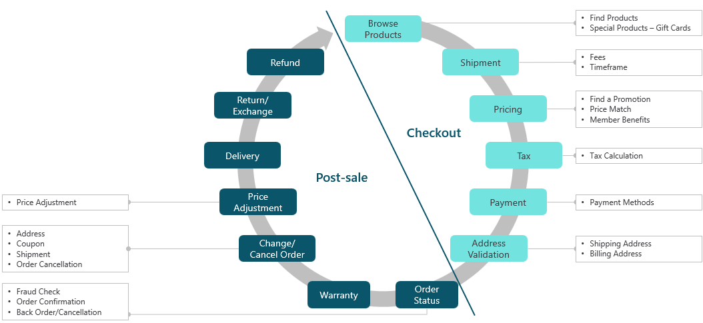

## Identify the topic

It's important that you focus on building topics that are relevant to your audience and that they'll likely ask about. For example, an organization that sells products might get questions related to returns, problems, shipping, and troubleshooting. These areas might benefit from being added as a topic. You should consider which of those topics will provide the highest overall impact. If 40 percent of your customer inquiries are related to product returns, you might consider creating topics that are related to returns first. As you prepare to build a topic, try putting yourself in the customers' position and consider their point of view, for example:

- The reason why they're reaching out

- What types of questions they have

- Their possible mindset

- What a successful resolution might look like to them

Exceptional topic design requires that you have a deep understanding of both sides of the conversation.

When you're initially planning your topics, we recommend that you list the different topics that you need based on the scenarios that you're trying to support. For example, an organization that's building a bot to help assist customers as they purchase products might want to build topics based on what their customer might need assistance with.

Customers could engage with a chatbot in the following scenarios:

- While shopping for a product online (Pre-sale)

- When placing the order (Checkout)

- After the order has been completed (Post-sale)

Each scenario likely needs multiple topics to support it. For example, if your chatbot is guiding customers through the checkout process, you'll likely need to create topics for items that are related to shipping, pricing, tax, payments, and address details.

The following image shows what the mapping might look like for two scenarios: Post-sale and Checkout.

> [!div class="mx-imgBorder"]
> 

- **Checkout support** - Topics that support the checkout process might include, Browse topics, Shipment, Pricing, Tax, Payment, and Address validation.

  Topics, such as Pricing, might need to complete tasks, such as finding a promotion, to save the customer money or to have a solution for price matching.

- **Post-sales support** - Post sales topics might include Refund, Return exchange, Delivery, Price adjustment, Change/cancel order, Warranty, and Order status.

  Post-sale topics, such as a topic that assists a customer with changing or canceling their order, need data such as address details, shipment information, or coupon information.

After you've created a high-level list of the topics that you need and the information that's likely used in the topics, you can start to build more details around what your topics will look like.

## List all scenarios

As you begin to build your topics, you'll need to consider the different scenarios that are related to what the customer wants to accomplish. Factors that you should consider include information that the customer might be looking for, specific tasks that they want to accomplish, or issues that they might want to troubleshoot.

The following scenarios might apply to a return topic.

- **Informational needs** - Determine if the customer wants specific information about returns, such as:

  - Your organization's return policy.

  - Which shipping providers they can use.

- **Task completion** - Assess if the customer needs guidance on initiating a return.
    Anticipate that they might ask the following questions:

  - How do I initiate a return on a defective product?

  - How do I print a return label?

- **Troubleshooting** - Determine if the customer has a defective product that they want to return.
    Before processing the return, you might complete the following tasks:

  - Assist the customer with basic troubleshooting steps based on common issues that customers encounter.

  - Assist with returning or exchanging a product, if the issue wasn't resolved through troubleshooting.

By listing the scenarios that might apply to a topic, you can begin to outline the topic's goal. For example, based on the information that you need to provide and the tasks that would need to be completed, the goals for a return topic might be as follows:

- Provide the customer with details about the return policy.

- Determine the customer's eligibility to do a return.

- Assist the customer in processing the return.

You can use these goals as reference points when you start building your topics.

## Design a high-level conversation tree

After you've determined the different scenarios, you should start mapping a high-level conversation tree. A conversation tree outlines the flow of a topic as the customer moves through it. It's an important part of the process. Your goal is to make the conversation as efficient as possible. If the customer needs to answer 10 different questions, they'll likely become frustrated and abandon the conversation. 

Look for ways to simplify this process as much as possible by considering the following factors:

- The fewest number of questions that can help you understand the scenario enough to provide the appropriate solution.

- Integration of other technologies, such as Microsoft Power Automate, to provide personalization and expedite issue identification.

For example, to determine if a customer can return a specific product, you'll first need to know what product they purchased and when they purchased it.

The easiest way to get this information is to pull it from the customer's order. After the customer has provided their order number, you can use Power Automate to get order details, such as the product purchased and the order date. Additionally, with the order number, you can likely retrieve the customer's information.

After you've identified the product eligibility and reason for the return, you could ask the customer to provide the reason why they want to return the product.

Based on their response, your bot could assist them with the following types of product issues:

- **Faulty product** - Assist them in troubleshooting the product.

- **Wrong product** - Go through the process of initiating the return.

With minimal effort from the customer, you can identify the product that they want to return. Additionally, you can help provide the customer with exactly what they need, whether it's informational, task completion, or troubleshooting steps based on why they wanted to return the product.
