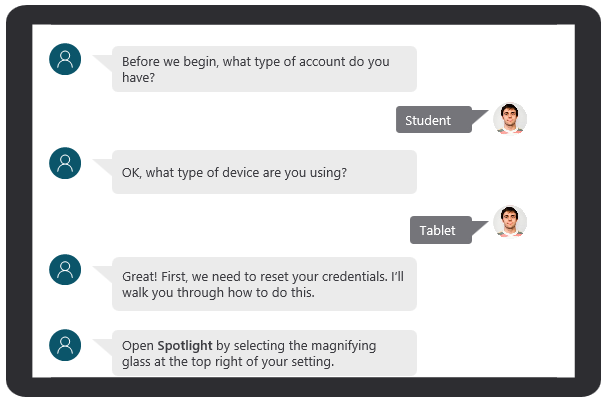

Microsoft Copilot Studio lets you create powerful AI-powered chatbots. The bots can assist with a range of requests, from providing simple answers to common questions, to resolving issues requiring complex conversations. One of the many advantages to Microsoft Copilot Studio is that you can create bots without the need for data scientists or developers. As a result, the amount of time that it takes an organization to deploy a bot solution is dramatically reduced.

While Microsoft Copilot Studio simplifies the process of building chatbots, the chatbot still needs to be something that customers want to interact with. For example, support organizations typically have many different agents who are available to support their customers. Some agents are more skilled than others, whether they have a better understanding of your products and services, they have more experience, or they have highly developed customer service skills.

Chatbots work in a similar fashion. Some chatbots are more exceptionally designed than others. A poorly designed bot makes customer interaction more difficult, and customers might become frustrated to the point where they discontinue working with the bot.

> [!div class="mx-imgBorder"]
> 

The goal of any bot that you create is to design it in a way that the customer's experience is equivalent to the experience that they would have with a live agent. The bot might not have the same skills that an experienced agent has; however, it should be as effective and proficient. Additionally, the bot should know when it's time to transfer the customer to a live agent who can assist the customer on more challenging items.

In this module, you'll examine some design principles and best practices that you can use when designing chatbots with Microsoft Copilot Studio.
