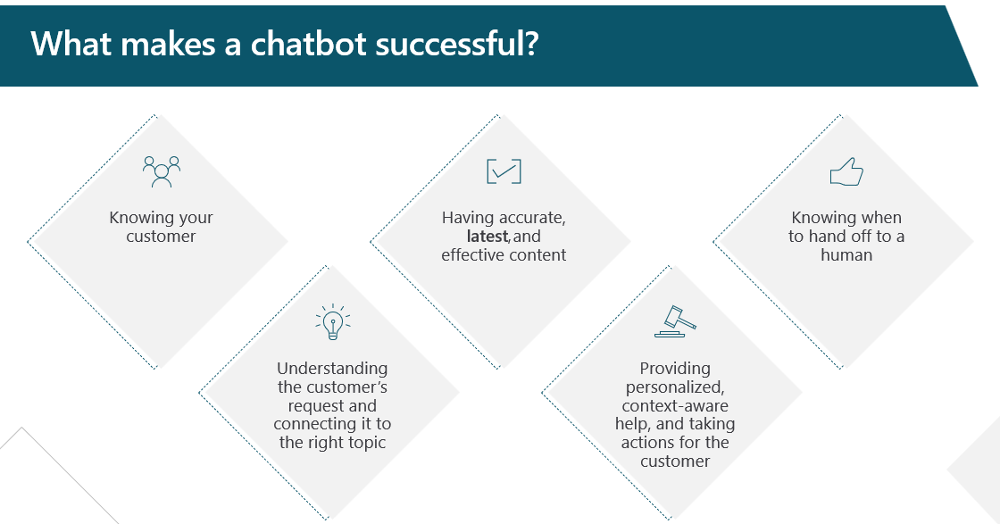
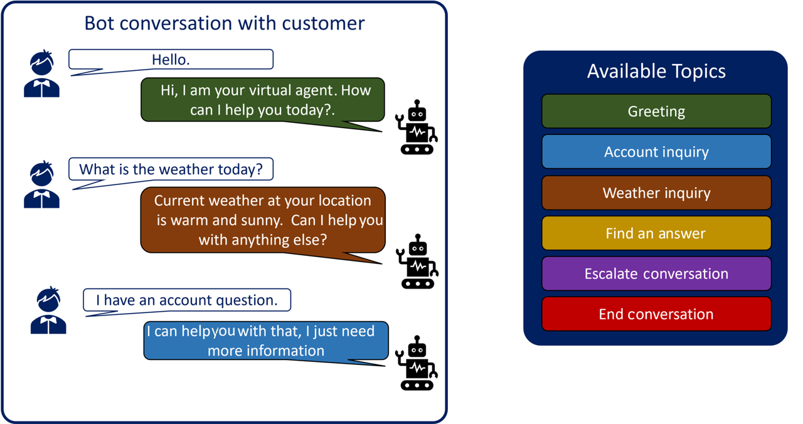
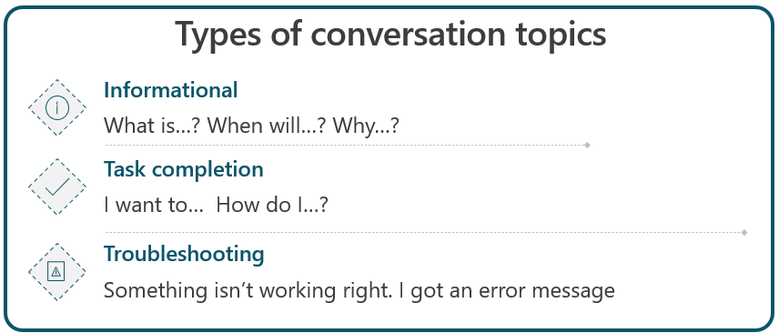

When you design a bot, make sure that you build it to maximize its usability, meaning that:

- It does what it was designed to do.

- It's straightforward to interact with.

- The customer perceives it as providing value to them.

> [!div class="mx-imgBorder"]
> 

When designing a bot to maximize its useability, you need to consider different factors that can affect the success of a bot. Key components that contribute to making a successful bot include:

- **Knowing your customer** - You should understand what your customers are looking for and observe how they interact with you. For example, organizations with a younger client base can likely do more with an automated solution because these customers are generally more adept with technology.

- **Understanding the customer's request and connecting it to the right topic** - A well-designed bot has many different topics that it can use when interacting with a customer. This feature makes it possible for you to build a single customer service bot rather than building multiple bots for different scenarios. For this reason, your bot should easily identify which topic to present to the customer based on what they're typing.

- **Having accurate, latest, and effective content** - Your organization's products and procedures will evolve over time, so your bot will need to evolve over time as well. If your bot doesn't have access to your organization's most current information, it won't meet your customers' needs. You need to keep your bots' knowledge current as you would ensure that your live agents' knowledge is current.

- **Providing personalized, context-aware help, and taking actions for the customer** - Customers don't want to be presented with generalized answers. They want personalized experiences, whether they're talking with a live person or a chatbot. A well-designed bot can provide customers with tailored and personalized responses based who the customer is and what their needs are.

- **Knowing when to hand off to a human** - Like a human agent, no bot will have all the answers. In those instances, the bot needs to know when it's time to hand off to a live agent.

## Topics

In Microsoft Copilot Studio, topics represent paths that the system can take a customer on while they're interacting with a bot. The topic that's used, and the path that's followed within an individual topic, is in response to the data that customers type in the conversation panel. Topics are the primary elements that dictate how conversations flow. If a customer asks about the weather, the bot can launch a weather topic. To provide customers with the correct weather forecast, the bot can ask questions that are defined in the topic, such as what city the customer lives in. The bot retains that information so that it can be sent to a weather service for forecast details. The bot can return the forecast to the customer in a personalized message that includes relevant customer information.

> [!div class="mx-imgBorder"]
> 

Topics consist of two primary elements:

- **Trigger phrases** - Phrases, keywords, or questions that users enter that relate to a specific issue.

- **Conversation nodes** - Defines how a bot should respond and what it should do.

As the customer enters information, the bot's AI uses natural language understanding to parse what they're typing and then finds the most appropriate trigger phrase or node. If a user enters "I need to return a defective product" into your bot, Microsoft Copilot Studio could match parts of the text, such as "return" or "defective product," to return a topic that includes those items as trigger phrases.

When the trigger phrases or nodes have been loaded, the system will use different conversation nodes in the topic to control and define the path that the customer will take during the conversation. Presented messages can provide details or instructions for customers, and the bot can ask questions to identify the type of product that the customer wants to return. Additionally, the bot can use actions to help the customer create a custom return label that could be sent to them to facilitate the return.

For more information, see [Create and edit topics in your Microsoft Copilot Studio bot](/power-virtual-agents/authoring-create-edit-topics/?azure-portal=true), [Manage topics in Microsoft Copilot Studio](/power-virtual-agents/authoring-topic-management/?azure-portal=true), and [Use system topics in Microsoft Copilot Studio](/power-virtual-agents/authoring-system-topics/?azure-portal=true).

## Types of conversation topics

When building topics, you'll need to ensure that the topic has been designed to support what the customer wants to do. For example, a customer who engages with an airline might want to book a flight. To effectively book the flight for the customer, you'll need details such as the destination, flight dates, customer information, and more.

> [!div class="mx-imgBorder"]
> 

When creating a topic, you can loosely categorize most into one of three topic types.

- **Informational** - These topics are more focused on providing information to the customer. Typically, these topic types start with the customer asking a question that starts with *what*, *when*, or *why*, such as: What are your store hours for your Seattle location?

- **Task completion** - These topics assist the customer in accomplishing an objective. They're often triggered by statements such as "I want to" or "How do I," for example, "I want to schedule a service appointment."

- **Troubleshooting** - These topics are designed to assist the customer in solving a problem or troubleshooting. The topics are triggered by statements, such as "I'm receiving an error" or "Something isn't working right." An example of this topic type would be: My coffee machine is making a loud noise.

To build effective topics, follow these steps:

1. Identify topics.

1. List all scenarios.

1. Design a high-level conversation tree.

1. Design solutions.

1. Validate and iterate on the design.

As you move through the remainder of this module, you'll examine each step more closely.
