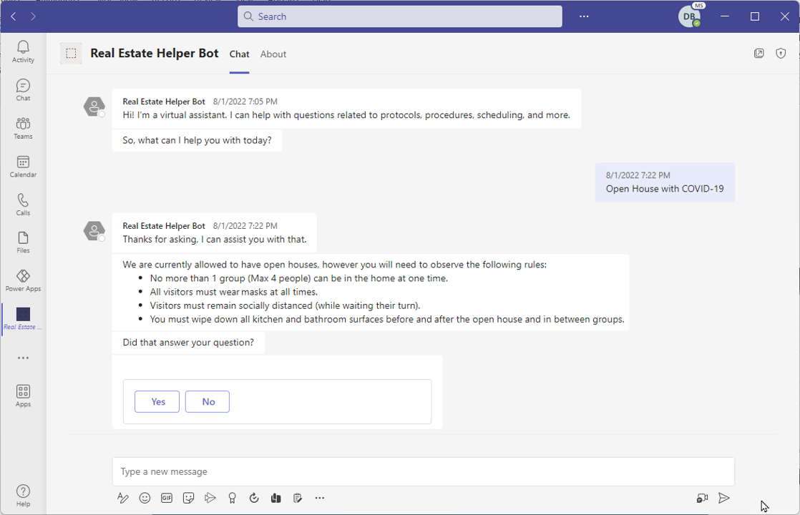

Traditionally, some people consider a chatbot as something that organizations use to provide support to their customers. However, chatbots can be so much more. Organizations can also use chatbots to support their employees.

## Internal support

The following scenarios outline some reasons why an organization would build an internal chatbot.

- **Consistent internal communication** - Bots bring consistency. The information that bots provide to users, and steps or procedures that they use, are always the same.

- **Convenient and quick** - Employees can access bots inside the applications that they use every day, such as Microsoft Teams.

- **Available all day, every day** - More companies have employees that span multiple time zones. With bots, time zones don't matter because the chatbot is always available.

- **Act on behalf of the user for routine tasks** - Often, chatbots can perform tasks, such as sending a communication or scheduling a meeting, that help save employees time.

- **Replace intranet or internal email for frequently accessed information** - Organizations can build chatbots based on knowledge repositories. A chatbot provides employees access to items, such as FAQs, that are presented in a conversational experience.

For example, every organization hires employees. With more companies having remote workers, the onboarding process for new employees can be challenging. New employees could use an onboarding bot to ask questions about benefits, policies, and more. Other areas where an organization might use a bot to support internal scenarios could be IT support, change management, or internal process information.

The following image shows a real estate company that has created an embedded bot in Microsoft Teams to assist agents with open houses.

> [!div class="mx-imgBorder"]
> 

## Customer support

Increasingly, organizations use chatbots to support a wide variety of different customer scenarios. Because bots can include multiple topics, they're flexible enough to replace other forms of communication. For example, many organizations use web forms to capture information, such as lead generation. The lead generation form could be replaced with a bot. The bot could create a more personalized experience by identifying specific products that a customer might be interested in. It could capture the potential customer's information before sending details to the correct person. It represents a more effective way of identifying lead information.

A well-designed chatbot becomes a virtual member of your team. Other areas where a chatbot could be beneficial include:

- **Website search replacement** - Organizations could use a chatbot to help customers find a person or information instead of using a website search.

- **Efficient routing** - Organizations could use a chatbot to capture general details about a customer and then redirect inquiries to the correct person in the organization. For example, the bot could direct support requests, customer service agents, and sales-related items to your professional services staff.

After you've identified possible scenarios for a bot, you can start planning it.

For more information, see [Microsoft Copilot Studio web app](/power-virtual-agents/fundamentals-what-is-power-virtual-agents-portal).
