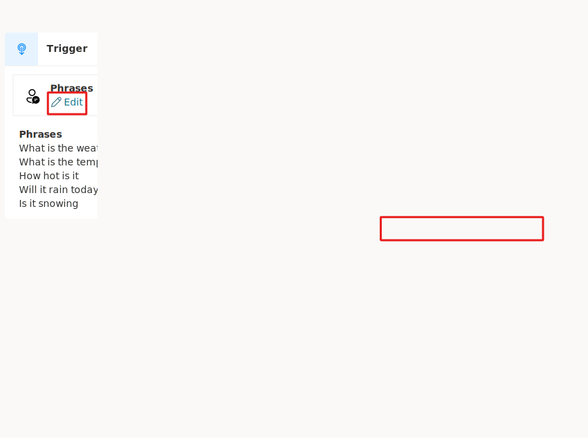
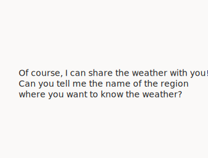
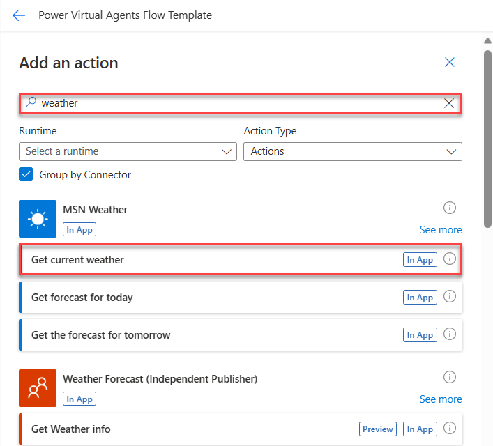
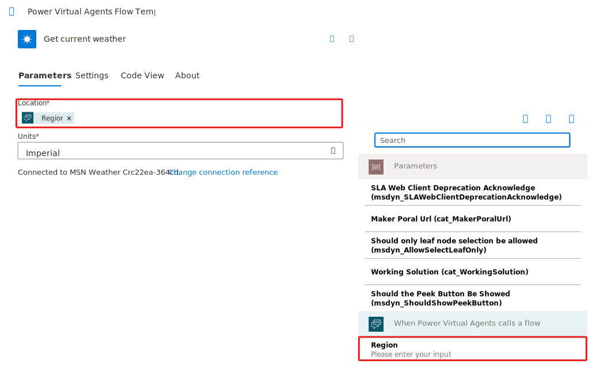
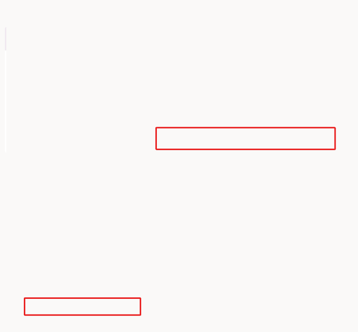
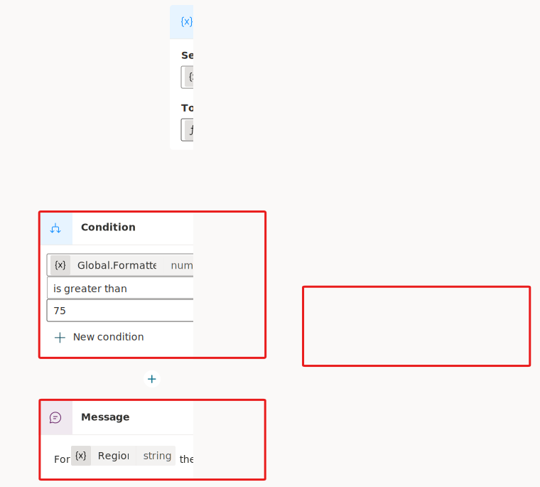

It’s highly beneficial for companies to connect to their data because they can provide users with up-to-date information and insights that are often relevant for customer or user questions.

In this exercise, you go through the process of creating a new topic, adding a Power Automate action to retrieve information from an external service, and displaying that data back to the user.

## Task: Create a new topic

Your first task is to create a new topic by following these steps:

1. Open the Microsoft Copilot Studio authoring canvas and navigate to the **User 1 Contoso Customer** Copilot you created previously. Select the **Topics** page from the navigation menu to the left of the screen.

1. Then select the **New Topic** drop down at the top of the page and choose the **From Blank** option. Enter `Check Weather` as the name of your topic.

1. Enter simple trigger phrases that a user might ask, such as `What is the weather` and `What is the temperature today`, until you have at least five trigger phrases. Select the **Edit** button within the node to open a pane to the right of the screen where you can add the trigger phrases.

   > [!div class="mx-imgBorder"]
   > 

1. Create a new **Question** node below the trigger phrase node and then enter text, such as: `Of course, I can share the weather with you! Can you tell me the name of the region where you want to know the weather?`

   > [!div class="mx-imgBorder"]
   > 

1. For these modules, you store the **User's entire response**; however, you could also use the **Country or region** entity so that you can use slot filling to detect the country/region from the user's response to the question.

   > [!TIP]
   > You could detect or estimate the user's region from another topic or time zone area system variable.

1. **Rename** the variable to `Region`. To do so, select the name of the variable within the node. Within a pane that appears to the right of the screen, you can change the name. The node should then appear as it does in the following screenshot.

   > [!div class="mx-imgBorder"]
   > 

1. Within the top right corner of the screen, select the **Save** button to ensure that your work is saved.

## Task: Create your Power Automate flow

Next, you create your Power Automate flow by following these steps:

1. Select the **Add node** button below the question node to add a new node to the topic. Select **Call an action > Create a flow**, as shown in the following screenshot. Power Automate opens in a new browser window and includes the scaffolding pre and post actions for a new Power Automate flow to interact with Microsoft Copilot Studio, as shown in the second screenshot.

   > [!div class="mx-imgBorder"]
   > 

   > [!div class="mx-imgBorder"]
   > 

   Examine the preceding screenshot to note the scaffolding that occurs when you create a new Power Automate flow by using Microsoft Copilot Studio. Two nodes are automatically created. The first node is the input that the flow expects from Microsoft Copilot Studio. You don't need to set inputs within this action; however, a common input would be a user utterance or variable, such as the country/region specified in the example. The second node is the output that a maker can return to Microsoft Copilot Studio after the flow retrieves or completes the operations within the automation.

   > [!IMPORTANT]
   > Make sure that you keep the Microsoft Copilot Studio pre and post actions at the top and bottom of your Power Automate flow to ensure that the data can be passed to and from Power Automate from Microsoft Copilot Studio.

1. In the new flow window that opens, select the **Add an input** within the first scaffolded action. Then, select **Text**.

   > [!div class="mx-imgBorder"]
   > 

1. Within the first column, enter `Region` (leaving the second column empty).

1. Then, select the **Insert new step** button to add a new action.

   > [!div class="mx-imgBorder"]
   > 

1. Select the **Add an action** option from the menu.

1. Enter `weather` in the search bar and then select **Get current weather by MSN Weather**.

   > [!div class="mx-imgBorder"]
   > 

1. A new node appears, where you can enter the location and units. When you select into the **Location** field, as shown in the following screenshot, the **Dynamic content** option displays.

   **Dynamic content** is real-time data, and in this scenario, the region data would be the data passed from Microsoft Copilot Studio that you set up at the beginning of the topic and requested from your user. From the **Dynamic content** drop-down menu, select **Region** and then keep units as **Imperial**.

   You're sending the **Region** data from the user to the weather service from MSN Weather. The flow will get this data and make it available for you to return to the user in Microsoft Copilot Studio in the next steps.

   > [!div class="mx-imgBorder"]
   > 

1. Select the**Return value(s) to Microsoft Copilot Studio** node at the end of the flow, then select **Add an output > Text**. Place your cursor in the **Enter a value to respond** text box. The **Dynamic content** panel opens from the result of the **Get current weather** API action in the previous step. Select **Temperature** from dynamic data to add it to the response text box. Then, enter `Temperature` in the **Title** field.

   > [!div class="mx-imgBorder"]
   > 

   You built an **API request** to the MSN Weather service where you entered the **Region** from Microsoft Copilot Studio. The MSN Weather service retrieves the data for the region, and when you have that data (almost instantly), you can return it to Microsoft Copilot Studio and the user.

1. The flow is almost complete. You need to rename it before you can move on to best practices so that administrators and users can more easily find it in Microsoft Copilot Studio. Select the template title and rename it to `Get Temperature`, as shown in the following screenshot.

1. Select **Save** on the flow in Power Automate to ensure that it saves. Wait a moment until the green banner appears, indicating success.

   > [!div class="mx-imgBorder"]
   > 

You completed your work in Power Automate. Next, you switch to Microsoft Copilot Studio.

## Task: Connect a Power Automate flow with Microsoft Copilot Studio

In this task, you connect a Power Automate flow with Microsoft Copilot Studio.

1. Open your existing topic in Microsoft Copilot Studio, entitled **Weather**, and return to the bottom of your flow, as shown in the following screenshot. Select **Call an action**. Your new Power Automate flow displays in the list. From the list, select **Get Temperature**.

   > [!div class="mx-imgBorder"]
   > 

1. When you select the **Get Temperature** flow, a new **Action** node is created automatically. If the flow requires an input, it requests that you select the value. Because the flow that you created in the previous steps has the input of **Region**, you need to add this input into the Power Automate action by selecting the variable that the value is stored in from the user, which is **Region**, from the previous steps in the lab.

1. Select **Enter or select a value** and then select the **Region** variable that you created in previous steps of this lab. This value is now connected to the Power Automate flow and displays the result from Power Automate into the Temperature variable.

   > [!div class="mx-imgBorder"]
   > 

   Now, you can skip to displaying the output in a message by using the variable in a **Message** node. However, if you're following along with the Contoso Coffee sample data provided in the previous labs, you continue with the steps to make it relevant for the Contoso Coffee scenario. You can convert the returned data, which was a string that was returned from Power Automate, to a number by using Microsoft Power Fx. You can convert that data by adding a **Set Variable Value** node, which creates a new **Global** variable called **FormattedTemperature**.

1. Below the Action node within the topic, select the **Add node** button. Then, select **Variable management > Set a variable value**.

1. Next, select the **To value** field, and choose the **Formula** tab within the dialog pane. Then, you use the **Value** Power Fx function to convert this data to a number by using the following syntax:

   `Value(Topic.Temperature)`

   Then, select **Insert**.

   > [!div class="mx-imgBorder"]
   > 

1. Next, select the **Set variable** field within the node. From the menu, select the **Create new variable** button.

1. Within the **Variable properties** pane to the right, enter `FormattedTemperature` for the **Variable name**, and select **Global** for the Usage. Ensure that you also select both **check boxes** below Global.

   > [!div class="mx-imgBorder"]
   > 

1. Add a **Condition** node so that you can check if the **Formatted Temperature** variable is greater than 75. If so, then a specific message displays. Otherwise, with all other conditions, you display a different message. Add two message nodes for both sides of the conditional statement.

   The reason why you need to format the data is because the data returned from Microsoft Copilot Studio is a string, and operators such as **greater than** are only available on types of data that are a number. Using Power Fx is straightforward when you're converting an object's type directly in Microsoft Copilot Studio.

1. For the **true** branch, if the Formatted Temperature **is greater than** `75`, add the following text within the **Message** node:

   `For {Region} the temperature is {Global.Temperature} and that is getting warm! Consider cooling off with one of our cold brew coffees.`

   The braces **{ }** are variables to display dynamic data. To enter variables into the node, use the **{X}** button on the **Message** node and then select a variable from the list, as shown in the following screenshot.

1. For the **false** branch, add the following text within the message node: `The temperature for {Region} is {Global.Temperature}.` where the braces **{ }** are variables to display dynamic data. To enter variables into the node, use the **{X}** button on the **Message** node and then select a variable from the list, as shown in the following screenshot.

   > [!div class="mx-imgBorder"]
   > 

1. To end the conversation, select the **Add node** button below the condition. Select **Topic management** and then choose **End conversation**.

   > [!div class="mx-imgBorder"]
   > 

1. **Save** your topic using the button found in the top right corner of the screen and then use the testing panel to test the flow. Determine if the response is as expected, as shown in the following screenshot.

   > [!div class="mx-imgBorder"]
   > 

You successfully created a Power Automate flow and a new topic in Microsoft Copilot Studio that used the flow to provide real-time data from an external service to the user.
