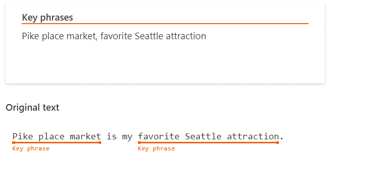
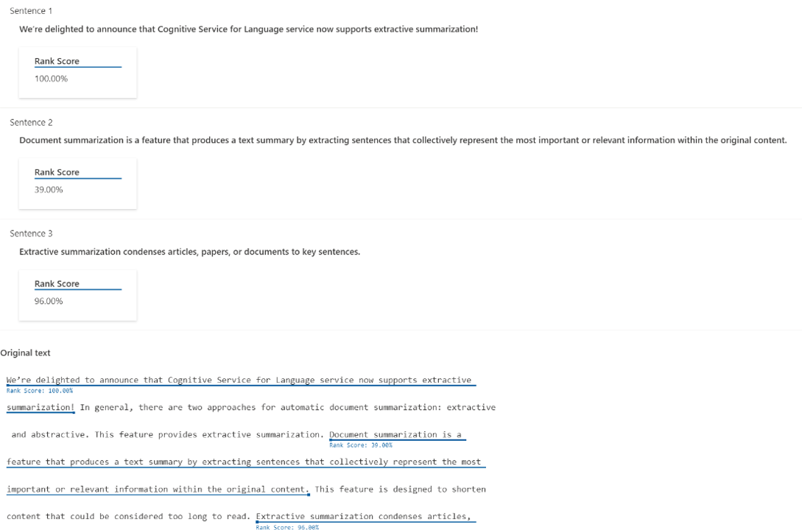
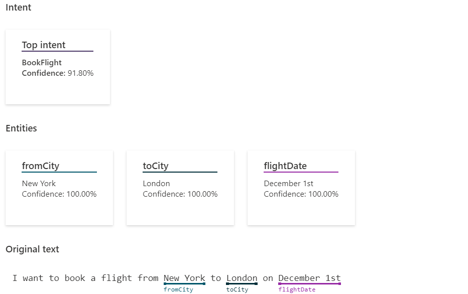

Azure Cognitive Services for Language is a cloud-based service that provides natural language processing features for understanding and analyzing text. This service helps build intelligent applications by using the web-based Microsoft Azure Cognitive Services Language Studio, REST APIs, and client libraries. This language service unifies commonly used services such as text analytics, QnA Maker, and Language Understanding (LUIS), and it provides several new features.

These features can be one of the following types:

- **Preconfigured** - These prebuilt AI models are intended for easier consumption, so they aren't customizable. You can send your data and use the feature's output in your applications.

- **Customizable** - You'll train an AI model by using the tools to fit your data specifically.

With Azure Cognitive Services for Language, you can accomplish multiple tasks:

- **Extract information** - Use natural language processing to extract information from unstructured text. For example, it can identify key phrases or personal data, summarize text, recognize and categorize named entities, or customize an entity extraction model on top of your domain set.

   > [!div class="mx-imgBorder"]
   > 

- **Summarize text-based content** - Allows you to summarize lengthy documents and conversation transcripts.

   > [!div class="mx-imgBorder"]
   > 

- **Classify text** - Use natural language processing to detect the language or classify the sentiment of the text that you have. You can also classify your text documents by customizing a classification model over your dataset.

   > [!div class="mx-imgBorder"]
   > 

- **Answer questions** - Provide answers to questions that are being asked in unstructured texts by using the prebuilt capabilities, or you can customize your domain-specific, question-and-answer pairs over data that you provide.

   > [!div class="mx-imgBorder"]
   > 

- **Understand conversations** - Create your own models to classify conversational utterances and extract detailed information from them to fulfill scenarios.

   > [!div class="mx-imgBorder"]
   > 

- **Translate text** - Use cloud-based machine translation to build intelligent, multilanguage solutions for your applications.

Microsoft Copilot Studio bots can use many features that are associated with the preceding items to help make the bot more efficient and allow it to handle various scenarios.

Available components of Azure Cognitive Services for Language include:

- **Entity linking** - Identifies and extracts entities that are found in text. For example, in the sentence "We went to Seattle last week," the word *Seattle* would be identified, with a link to more information on Wikipedia. For more information, see [entity linking](/azure/cognitive-services/language-service/entity-linking/overview/?azure-portal=true).

- **Named entity recognition** - Identifies and categorizes entities in unstructured text, such as people, places, organizations, and quantities. For more information, see [named entity recognition](/azure/cognitive-services/language-service/named-entity-recognition/overview/?azure-portal=true).

- **Sentiment** - Helps you discover what people think of your brand or topic by *mining* text for clues about positive or negative sentiment. It can associate the positive and negative sentiment with specific aspects of the text. For more information, see [sentiment analysis and opinion mining](/azure/cognitive-services/language-service/sentiment-opinion-mining/overview/?azure-portal=true).

- **Detect language** - Detects the language that a document is written in and then returns a language code for a wide range of languages, variants, dialects, and some regional/cultural languages. For more information, see [language detection](/azure/cognitive-services/language-service/language-detection/overview/?azure-portal=true).

- **Detect personal information** - Identifies, categorizes, and redacts sensitive information in unstructured text, such as phone numbers, email addresses, and forms of identification. For more information, see [personally identifiable information (PII) detection](/azure/cognitive-services/language-service/personally-identifiable-information/overview/?azure-portal=true).

- **Key phrases** - Identifies the main concepts in text. For example, in the text "The food was delicious and the staff were wonderful," key phrase extraction will return the main topics of *food* and *wonderful staff*. For more information, see [key phrase extraction](/azure/cognitive-services/language-service/key-phrase-extraction/overview/?azure-portal=true).

For example, you could use the **Detect personal information** feature to analyze information in a conversation to extract a phone number, email address, or street address. This information could be based on other services, such as your organization's customer relationship management (CRM) system, to identify the corresponding customer record. After you've identified the appropriate record, all information that's associated with that customer in your CRM application could be made available to your Microsoft Copilot Studio bot to use. This feature allows you to create a more personalized experience.

The remainder of this module focuses on how to set up a Microsoft Copilot Studio bot to use Azure Cognitive Services for Language in the bot. However, if you want to learn how to create some of these elements by using Azure Cognitive Services for Language, select the following links for more information:

- [What is Azure Cognitive Service for Language](/azure/cognitive-services/language-service/overview/?azure-portal=true)

- [Get started with Language Studio](/azure/cognitive-services/language-service/language-studio/?azure-portal=true)

- [Build customer question answering models](/azure/cognitive-services/language-service/question-answering/overview/?azure-portal=true)

- [Responsible use of AI](/legal/cognitive-services/language-service/transparency-note?context=%2Fazure%2Fcognitive-services%2Flanguage-service%2Fcontext%2Fcontext&azure-portal=true)
