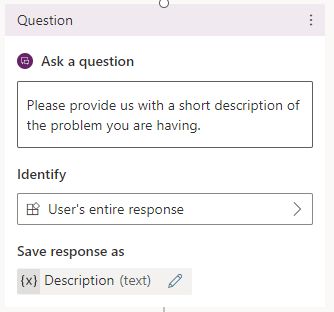

After you've created and published the Azure AI Services for Language model that you want to use, you'll need be able to call it from a Microsoft Copilot Studio bot. When creating the Microsoft Copilot Studio bot, you'll still follow the same principles that you would when creating any bot. You need to create topics to handle the conversation with the customer. You could use items, such as entities, to enhance the usability and functionality of your bot.

Various learning modules are available on Microsoft Learn to help you learn the basics of creating a bot. For more information, select the following links:

- [Get started with Microsoft Copilot Studio bots](/training/modules/power-virtual-agents-bots/?azure-portal=true)

- [Manage topics in Microsoft Copilot Studio](/training/modules/manage-power-virtual-agents-topics/?azure-portal=true)

- [Manage Microsoft Copilot Studio](/training/modules/implement-power-virtual-agents/?azure-portal=true)

- [Enhance Microsoft Copilot Studio bots](/training/modules/enhance-power-virtual-agents-bots/?azure-portal=true)

## Identify the topic to use

A Microsoft Copilot Studio bot consists of a series of topics that represent different subject areas that the bot can help with. You can connect to your Azure AI Services for Language from any topic that you create. For example, you might have a topic that assists customers with account information and details. In that instance, you might connect to the personal identifying information service to extract personal details to use for looking up customer information.

Additionally, you can use Azure AI Services for Language when you want your bot to provide knowledge management capabilities. You might create multiple knowledge article topics in the bot to assist the customer. Many organizations might create a knowledge base that contains hundreds or even thousands of knowledge articles or question-and-answer pairs. If the system is unable to identify a topic that will work, you could have the Microsoft Copilot Studio bot direct the customer to the bot's fallback topic. The fallback topic will be used when the bot can't find an answer. Within the fallback topic, you could include an action that passes the user's text to the Question/Answer service. After the system receives an answer from your knowledge base, it can display the answer to the user as a message inside the bot.

For more information, see [Configure the system fallback topic in Microsoft Copilot Studio](/power-virtual-agents/authoring-system-fallback-topic/?azure-portal=true).

## Use the authoring canvas to add an action

When designing a topic in Microsoft Copilot Studio, you'll use the authoring canvas to build the messages that will be presented to users, and you'll define how the conversation flows. For example, you might ask the customer to provide you with a brief description of the issue that they're having. You might capture the description in a question node. The question node allows you to ask the user a question and then capture their response so that it can be used later. For example, the following image shows a question node being used to capture the customer's description of their problem.

> [!div class="mx-imgBorder"]
> 

The system is capturing the entire response that the customer enters into the chat window and will store it in a variable called **Description**. In Microsoft Copilot Studio, variables represent reusable pieces of information that can be used in topics. By storing information in the **Description** variable, you can use that information later in the topic, such as passing it to another conversation note later in the topic.

Now that you've reviewed some initial design elements, you'll learn how to call an Azure AI Services for Language service from a topic.
