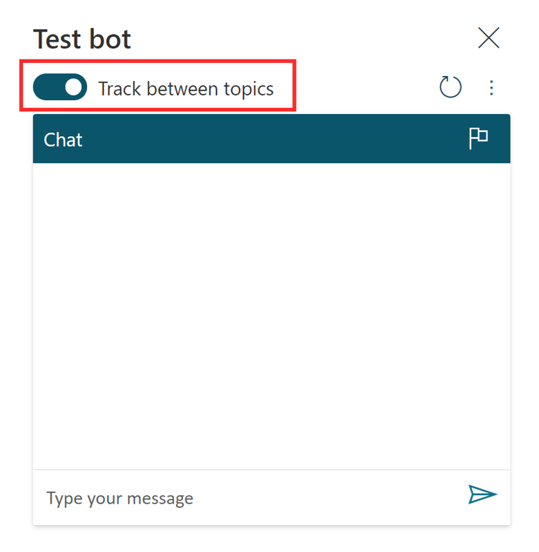
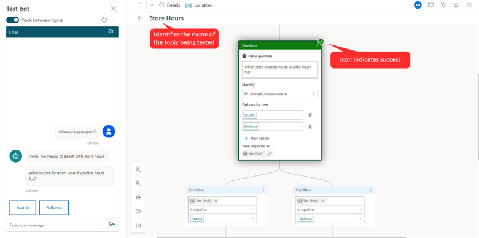
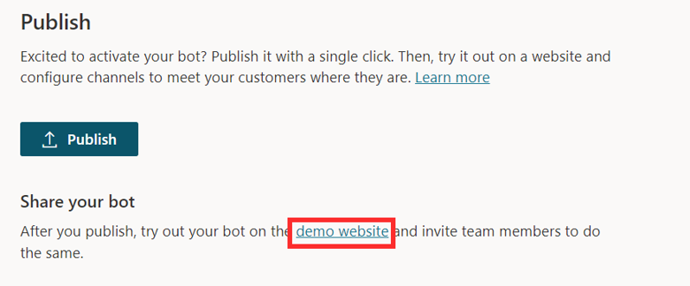

Because a bot is made up of multiple topics, it's important to ensure that each topic is working appropriately and can be interacted with as intended. For example, if you want to make sure that your Store Hours topic triggers when someone enters text asking about store hours, you can test your bot to ensure that it responds appropriately.

You can test your bot in real time by using the test bot panel, which you can enable by selecting **Test your bot** in the lower-left corner of the navigation pane. When the panel displays, the button name changes to **Hide your bot** so that you can hide it if you need more space during the design process.

> [!div class="mx-imgBorder"]
> 

The **Test bot** window interacts with your bot topics as a user would. As you enter text into the test bot window, information will be presented as it would to a user. Your bot will likely contain multiple topics. As you engage with a specific topic, it might be handy to have the application take you to that topic. You can accomplish this task by turning on the **Track between topics** option at the top. This option follows along with the bot as it implements the different topics. For example, typing "hello" would trigger the Greeting topic, and then the application will open the Greeting topic and display its conversation path in the window. If you type the "When are you open?" question, the application will switch to display the Store Hours topic. As each topic is displayed, you can observe how the path progresses, which will help you evaluate how your topics are doing.

> [!div class="mx-imgBorder"]
> 

The following image shows that the "When are you open?" message has been sent to the bot. Notice that you're automatically taken to the Store Hours topic. The conversation path is highlighted in green. The bot will wait for you to respond and has provided two suggestion buttons on how to respond. These suggestion buttons reflect the Seattle and Bellevue user options that were defined when the topic was previously created. In the test bot, you can select either button to continue.

> [!div class="mx-imgBorder"]
> 

As you select an option, you'll continue down the conversation path until you reach the end. The chat will stop when you reach the bottom of this branch.

By testing your bots often throughout the creation process, you can ensure that the conversation will flow as anticipated. If the dialog doesn't reflect your intention, you can change the dialog and save it. The latest content will be pushed into the test bot, and you can try it out again.

After your bot content has been created, it needs to be published so that customers can engage with it. Published bots can be made available across multiple platforms and channels. Before a bot can be added to channels, interacted with, or used by team members, you'll need to publish it at least once. For example, you can deploy a bot to organizational websites, mobile applications, and messaging platforms such as Microsoft Teams or Facebook.

Publishing bots as you make changes also ensures that customers engage with the latest bot content. For example, if your organization's store hours change, after you've edited the Store Hours topic to reflect the changes, you'll need to publish it again from within the Microsoft Copilot Studio portal. After the bot has been published again, the updated content will be used by all channels that the bot is set up on.

## Publish a bot

When you're ready to publish your bot, select the **Publish** tab on the side navigation pane. During the publishing process, the bot will be checked for errors. Bot publishing typically takes a few minutes. When the publish is successful, the top of the page will display a green banner indicating that everything worked correctly. If errors are detected, you'll be notified through a message that's displayed in the application.

> [!div class="mx-imgBorder"]
> 

Before the bot is deployed to the different channels that use it, you might want to gain feedback from other team members. When a bot is first published, you can make it available on the demo website. You can provide the demo website's URL to team members or stakeholders to try it out. The advantage of using the demo website is that the experience is different than testing the bot during the design process. Because the test bot experience is only intended to allow bot authors to test it, the demo website link increases the pool of users who can test and provide feedback that's related to the overall experience of the bot.

To add a bot to the demo website, select the demo website link under **Share your bot**. This webpage demonstrates what your bot looks like to a user who comes to your webpage. The bot canvas is at the bottom of the page. You can interact with it by entering text in the window or by selecting a starter phrase from the provided options.

> [!div class="mx-imgBorder"]
> 

Now that the bot is published, you can deploy it to other channels.

For more information, see [Publish your bot](/power-virtual-agents/publication-fundamentals-publish-channels/?azure-portal=true) to other channels.
