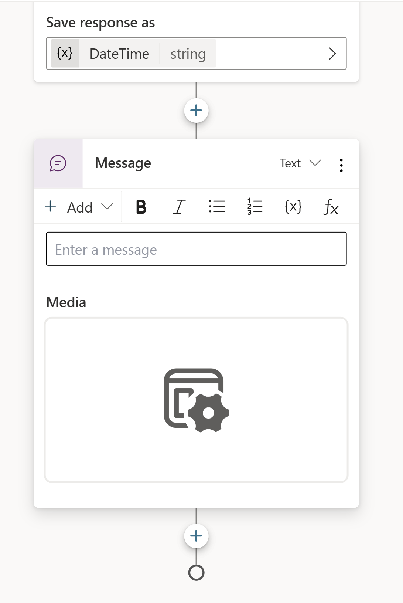

In this exercise, you'll create a bot by using Copilot in Microsoft Copilot Studio. Additionally, you'll learn how to use the Conversation Booster feature to improve your bot's responses.

1. Sign in to [Microsoft Copilot Studio](https://powerva.microsoft.com/?azure-portal=true).

    Make sure that you're in the correct environment and that it was made in the US region.

1. Select **Home** from the left navigation menu and then select **+ Create a bot**.

	> [!div class="mx-imgBorder"]
	> [](../media/create-bot.png#lightbox)

    The Create a bot wizard opens. This wizard helps you set up your bot by naming it, selecting the language, and also optionally choosing if you want to boost your conversations with generative answers.

1. Name your bot as **Real Estate Booking Service** and then select **English**.

	> [!div class="mx-imgBorder"]
	> [](../media/bot-name-language.png#lightbox)

	The **Boost your conversations with generative answers** option should also display.
    
	> [!div class="mx-imgBorder"]
	> [](../media/boost-conversations.png#lightbox)
    
    On this page, you can fill in your favorite real estate website. As a result, after you create the bot, if the bot can't answer a question, it searches the website that you provided for the answer. This approach is a great way of quickly creating a bot that can answer several questions without you needing to manually create topics.
    
    For example, you provide the `https://powerplatform.microsoft.com/` website, as shown in the following image.
	
	> [!div class="mx-imgBorder"]
	> [](../media/conversation-booster.png#lightbox)
    
    If a user asks, "What is Microsoft Copilot Studio?" the bot searches the website for the answer and then presents it to the user, as shown in the following image.
    
	> [!div class="mx-imgBorder"]
	> [](../media/bot-response.png#lightbox)
    
    Make sure to provide a website that's related to a real estate service. If you don't want to use this feature, you can leave it blank; you won't reference this feature in the rest of the module.

1. With the bot name and language set, select **Create**.

	> [!div class="mx-imgBorder"]
	> [](../media/create-bot-wizard.png#lightbox)

    > [!NOTE]
    >
    > After you select **Create**, the process of creating the first bot within a new environment can take up to 15 minutes. Subsequent bots are created much faster.

1. With your bot created, select **Topics** from the left navigation menu and then select the **+ New topic** dropdown menu. Select **Create with Copilot**.

	> [!div class="mx-imgBorder"]
	> [](../media/create-copilot.png#lightbox)

    > [!NOTE]
    >
    > If the **Create with Copilot** option doesn't display, you might need to enable Intelligent authoring support:
    > 
    > 1. Select the **Settings** icon in the upper menu and then select **General settings**.
    > 1. Set the **Intelligent authoring support with Copilot** toggle to **On**.

1. A new window appears asking you to **Name your topic** and provide a description in the **Create a topic to...** space.

1. In the **Name your topic** field, enter the following text:

    `Book a Real Estate Showing`

1. In the **Create a topic to...** field, enter the following text:

    `collect a user's full name, email, address of the property, and date and time of the showing`

    Select **Create**.

	> [!div class="mx-imgBorder"]
	> [](../media/create-it-with-copilot.png#lightbox)

   A new topic displays with the generated trigger phrases.

	> [!div class="mx-imgBorder"]
	> [](../media/generated-trigger-phrases.png#lightbox)

    > [!NOTE]
    >
    > Remember, your generated content might appear differently than what's shown in this lab.

    Multiple question nodes, entity selection, and variable naming should also display.

	> [!div class="mx-imgBorder"]
	> [](../media/question-nodes-entity-selection-variable-naming.png#lightbox)

1. Look for and then select the **What is your email address?** question node.

	> [!div class="mx-imgBorder"]
	> [](../media/what-is-your-email-address.png#lightbox)

1. Select the **Edit with Copilot** icon in the upper part of the authoring canvas.

	> [!div class="mx-imgBorder"]
	> [](../media/edit-with-copilot.png#lightbox)

1. In the **Edit with Copilot** panel, in the **What do you want to do?** field, enter the following text:

    `update the message to say thank you to the Name variable from the previous node and then proceed to ask the question`

    Select **Update**.

	> [!div class="mx-imgBorder"]
	> [](../media/edit-with-copilot-panel.png#lightbox)

   The message should be updated to include the _Name_ variable from the message node before it.

	> [!div class="mx-imgBorder"]
	> [](../media/message-updated-name-variable.png#lightbox)

    In addition to adding new nodes, you can use Copilot to update existing ones.

1. Make sure that no node is selected by clicking in the empty space around the nodes. In the **Edit with Copilot** panel, in the **What do you want to do?** field, enter the following text:

    `summarize the information collected in an adaptive card`

    Select **Update**.

   A message node with an Adaptive Card is added to the end of the topic.

	> [!div class="mx-imgBorder"]
	> [](../media/message-node-adaptive-card.png#lightbox)

1. Select the Adaptive Card. The Adaptive Card properties should appear on the right of the screen.

	> [!div class="mx-imgBorder"]
	> [](../media/adaptive-card-properties.png#lightbox)

    Your Adaptive Card formula should look similar to the one above. If it doesn't, then you can copy and paste in the formula below:

     ```
    {
    type: "AdaptiveCard", 
        body: 
        [
            {
                type: "TextBlock",
                size: "Medium",
                weight: "Bolder",
                text: "Summary"    
            },
            {
                type: "FactSet",
                facts: 
                [
                    {
                        title: "Full Name",
                        value: Text(Topic.FullName)
                    },
                    {
                        title: "Email Address",
                        value: Text(Topic.Email)
                    },
                    {
                        title: "Property Address",
                        value: Text(Topic.PropertyAddress)
                    },
                    {
                        title: "Showing Date and Time",
                        value: Text(Topic.ShowingDateTime)
                    }
                ]
            },
            
            {
                type: "TextBlock",
                text: "Thank you for providing the information."
            }
        ]
    }
    ```

1. Opening the Adaptive Card properties closes the **Edit with Copilot** panel; therefore, you need to select the icon to reopen it. In the **What do you want to do?** field, enter the following text:

    `add a question to confirm if the user's information is correct with the option to select either "Yes" or "No"`

    Select **Update**.

   A new question node is added to the end of the topic with options for the user to select.

	> [!div class="mx-imgBorder"]
	> [](../media/new-question-node.png#lightbox)

1. In the upper-left side of the authoring canvas, rename the topic to **Book Real Estate Showing Topic**.

	> [!div class="mx-imgBorder"]
	> [](../media/book-real-estate-showing-topic.png#lightbox)

1. Select **Save** to save your changes.

1. Select the **Test your bot** button in the lower left of the screen to open the testing panel.

1. When the **Conversation Start** message appears, your bot will start a conversation. In response, enter a trigger phrase for the topic that you've created:

    `I want to book a real estate showing`

    The bot responds with the "What is your full name?" question, as shown in the following image.

	> [!div class="mx-imgBorder"]
	> [](../media/conversation-start-message.png#lightbox)

1. Enter the rest of the information:

    ```
    Full name: <Your name>
    Email address: <Your email address>
    Address: 555 Oak Lane, Denver, CO 80203
    Date and Time: 10/10/2023 10:00 AM
    ```

1. After you enter the information, the Adaptive Card displays the information that you entered, a question asking if the information is correct, and options to select **Yes** or **No**, as shown in the following image.

	> [!div class="mx-imgBorder"]
	> [](../media/adaptive-card-information.png#lightbox)

    After selecting an option, you can further develop the topic to save the data in Dataverse through a Microsoft Power Automate flow or by sending an email to the user with the information that they entered. However, these actions are outside the scope of this module.
